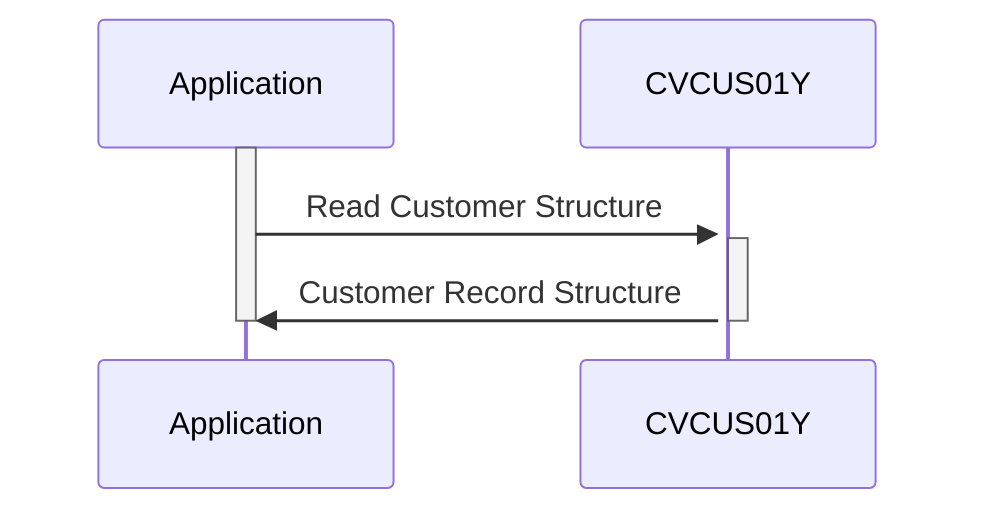

Gerado em: 2 de outubro de 2024

**Título do Documento: Especificação da Estrutura de Dados do Cliente**

**Descrição Resumida:**
Este documento descreve a estrutura dos registros de clientes dentro de um sistema, provavelmente um Sistema de Gestão de Relacionamento com o Cliente (CRM) ou um aplicativo semelhante. Ele define os campos, tipos de dados e comprimentos usados para armazenar informações do cliente. Esta especificação é crucial para manter a consistência dos dados e facilitar a interoperabilidade entre diferentes componentes do sistema que interagem com os dados do cliente.

**Histórias do Usuário:**
Como analista de dados, preciso de um formato padronizado para os dados do cliente para que eu possa realizar análises e gerar relatórios com precisão.

**Épico Relacionado:** 8 - Gestão de Dados do Cliente

**Requisitos Técnicos:**
Este código define uma estrutura de dados COBOL, `CUSTOMER-RECORD`, representando uma entidade de cliente. Esta estrutura se destina ao uso em um programa COBOL maior, provavelmente relacionado à gestão de dados do cliente. Ele descreve os campos e seus formatos para armazenar vários detalhes do cliente.

- `Customer Data Structure`: Define o layout de um registro de cliente.
  - Entrada: Nenhuma (definição de estrutura).
  - Processamento: Define campos para dados do cliente:
    - `CUST-ID` (`Numeric(9)`): Identificador único do cliente.
    - `CUST-FIRST-NAME`, `CUST-MIDDLE-NAME`, `CUST-LAST-NAME` (`Alphanumeric(25)`): Nome do cliente.
    - `CUST-ADDR-LINE-1`, `CUST-ADDR-LINE-2`, `CUST-ADDR-LINE-3` (`Alphanumeric(50)`): Linhas de endereço do cliente.
    - `CUST-ADDR-STATE-CD` (`Alphanumeric(2)`): Código do estado do cliente.
    - `CUST-ADDR-COUNTRY-CD` (`Alphanumeric(3)`): Código do país do cliente.
    - `CUST-ADDR-ZIP` (`Alphanumeric(10)`): CEP do cliente.
    - `CUST-PHONE-NUM-1`, `CUST-PHONE-NUM-2` (`Alphanumeric(15)`): Números de telefone do cliente.
    - `CUST-SSN` (`Numeric(9)`): Número de Segurança Social do cliente.
    - `CUST-GOVT-ISSUED-ID` (`Alphanumeric(20)`): Outro ID emitido pelo governo.
    - `CUST-DOB-YYYY-MM-DD` (`Alphanumeric(10)`): Data de nascimento do cliente.
    - `CUST-EFT-ACCOUNT-ID` (`Alphanumeric(10)`): ID da conta de Transferência Eletrônica de Fundos do cliente.
    - `CUST-PRI-CARD-HOLDER-IND` (`Alphanumeric(1)`): Indicador de status de titular do cartão principal.
    - `CUST-FICO-CREDIT-SCORE` (`Numeric(3)`): Pontuação de crédito FICO do cliente.
    - `FILLER` (`Alphanumeric(168)`: Espaço não utilizado para expansão futura.
  - Saída: Nenhuma (definição de estrutura).

**Modelos Relacionados**
- Customer: Representa um cliente no sistema.
  - `CUST-ID` `Integer`: Identificador único para cada cliente.
  - `CUST-FIRST-NAME` `String`: Primeiro nome do cliente.
  - `CUST-MIDDLE-NAME` `String`: Nome do meio do cliente (se aplicável).
  - `CUST-LAST-NAME` `String`: Sobrenome do cliente.
  - `CUST-ADDR-LINE-1` `String`: Primeira linha do endereço do cliente.
  - `CUST-ADDR-LINE-2` `String`: Segunda linha do endereço do cliente (se aplicável).
  - `CUST-ADDR-LINE-3` `String`: Terceira linha do endereço do cliente (se aplicável).
  - `CUST-ADDR-STATE-CD` `String`: Código do estado do cliente (por exemplo, CA, NY).
  - `CUST-ADDR-COUNTRY-CD` `String`: Código do país do cliente (por exemplo, EUA, CAN).
  - `CUST-ADDR-ZIP` `String`: CEP ou código postal do cliente.
  - `CUST-PHONE-NUM-1` `String`: Número de telefone principal do cliente.
  - `CUST-PHONE-NUM-2` `String`: Número de telefone secundário do cliente (se aplicável).
  - `CUST-SSN` `String`: Número de Segurança Social do cliente (sujeito a regulamentações de privacidade).
  - `CUST-GOVT-ISSUED-ID` `String`: Outra identificação emitida pelo governo.
  - `CUST-DOB-YYYY-MM-DD` `Date`: Data de nascimento do cliente.
  - `CUST-EFT-ACCOUNT-ID` `String`: Identificador para a conta de transferência eletrônica de fundos do cliente (provavelmente vinculado a um sistema bancário).
  - `CUST-PRI-CARD-HOLDER-IND` `Boolean`: Indica se o cliente é o titular principal de um cartão.
  - `CUST-FICO-CREDIT-SCORE` `Integer`: Pontuação de crédito do cliente.

**Configurações:**
- Valores Constantes
  - `CUSTOMER-RECORD-L`: `500`
	- Descrição: Comprimento total do registro do cliente, indicando que cada registro do cliente ocupa 500 caracteres de espaço de armazenamento.

**Melhorias no Código:**

- **Especificidade do Tipo de Dados:** Use tipos de dados mais específicos para validação aprimorada e integridade de dados. Por exemplo, use `PIC 9(9)` para campos numéricos e `PIC X(n)` para campos alfanuméricos, especificando o comprimento apropriado `n`.
- **Formato de Data:** Armazene datas em um formato numérico (por exemplo, AAAAMMDD) em vez de texto para simplificar os cálculos e comparações de datas.
- **Considerações sobre o Tamanho do Campo:** Revise e ajuste o comprimento dos campos para acomodar possíveis variações nos dados do mundo real (por exemplo, endereços mais longos, números de telefone internacionais).
- **Comentários:** Adicione comentários mais descritivos para explicar o propósito e o uso de cada campo, aprimorando a legibilidade e a manutenção do código.

**Melhorias na Segurança:**

- **Criptografia de Dados:** Criptografe dados confidenciais do cliente (por exemplo, SSN, ID da conta EFT) em repouso e em trânsito para proteger contra acesso não autorizado.
- **Controle de Acesso:** Implemente medidas rígidas de controle de acesso para restringir o acesso aos dados apenas ao pessoal autorizado.
- **Mascaramento de Dados:** Considere mascarar ou tokenizar dados confidenciais quando exibidos ou usados em operações não críticas para minimizar a exposição.
- **Auditorias de Segurança Regulares:** Realize auditorias de segurança e testes de penetração regulares para identificar e solucionar vulnerabilidades.

**Diagrama Conceitual:**

--Made by "Smart Engineering" (by Compass.UOL)--