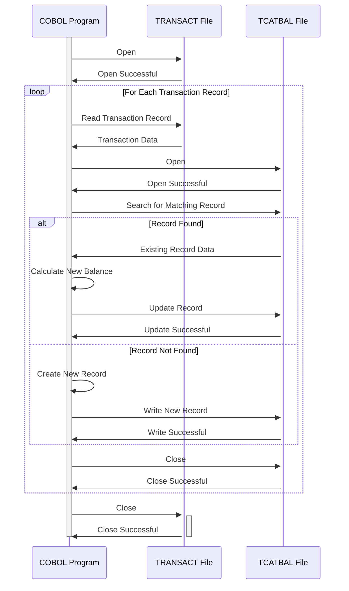

Gerado em: 2 de Outubro de 2024

**Título do Documento:** Especificação de Registro de Saldo de Categoria de Transação

**Descrição Resumida:**
Este documento detalha a estrutura e os elementos de dados do `TRAN-CAT-BAL-RECORD`, usado no aplicativo CardDemo. Este registro é crucial para armazenar e rastrear saldos para várias categorias de transações, essencial para relatórios financeiros e análise.

**Histórias do Usuário:**
Como analista financeiro, preciso analisar padrões de transações e saldos para diferentes categorias, a fim de identificar tendências e gerar relatórios financeiros precisos.

**Épico Relacionado:**
4 - Processamento de Transações

**Requisitos Técnicos:**

- **Cálculo do Saldo da Categoria de Transação:** Este processo calcula e atualiza o saldo da categoria de transação com base nos dados de transações recebidas.
  - Entrada: `TRANCAT-ACCT-ID` `{Numeric(11)}`, `TRANCAT-TYPE-CD` `{Text(2)}`, `TRANCAT-CD` `{Numeric(4)}` e valor da transação `{Decimal(9,2)}` do arquivo `TRANSACT`.
  - Cálculo: Se um `TRAN-CAT-BAL-RECORD` correspondente existir, adicione o valor da transação a `TRAN-CAT-BAL`. Caso contrário, crie um novo `TRAN-CAT-BAL-RECORD` com o saldo inicial definido como o valor da transação.
  - Saída: `TRAN-CAT-BAL-RECORD` atualizado ou recém-criado no arquivo `TCATBAL`.

**Modelos Relacionados**
- `TRAN-CAT-BAL-RECORD`: Estrutura para armazenar saldos de categorias de transações.
  - `TRANCAT-ACCT-ID` `{Numeric(11)}`: Identificador da conta.
  - `TRANCAT-TYPE-CD` `{Text(2)}`: Código do tipo de conta.
  - `TRANCAT-CD` `{Numeric(4)}`: Código da categoria de transação.
  - `TRAN-CAT-BAL` `{Decimal(9,2)}`: Saldo para a categoria de transação específica.

**Configurações:**
- `CVTRA01Y.cpy`
  - `TCATBAL-RECORD-L`: `50`
	- Descrição: Tamanho total do registro de saldo da categoria de transação.

**Melhorias no Código:**
- Adicionar tratamento de erros para operações de arquivo e validação de dados.
- Implementar registro para rastrear atualizações de saldo e erros.
- Considere usar um banco de dados para armazenar e gerenciar saldos de categorias de transações.

**Melhorias na Segurança:**
- Implementar controles de acesso para restringir o acesso não autorizado aos dados de saldo da categoria de transação.
- Criptografar dados confidenciais, como identificadores de contas e saldos, em repouso e em trânsito.
- Auditar regularmente o sistema para vulnerabilidades de segurança e violações de dados.

--Made by "Smart Engineering" (by Compass.UOL)--