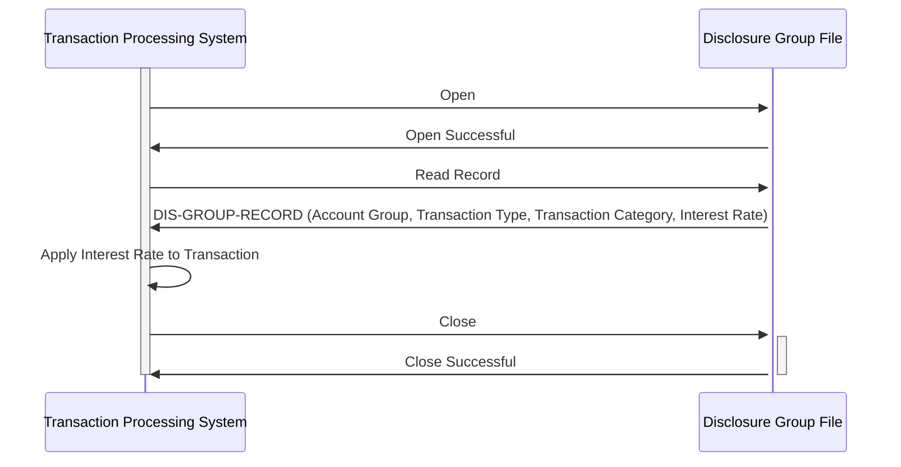

Gerado em: 2 de outubro de 2024

**Título do Documento:** CardDemo - Especificação da Estrutura do Grupo de Divulgação

**Descrição Resumida:**
Este documento define a estrutura de dados para um Grupo de Divulgação dentro do aplicativo CardDemo. Um Grupo de Divulgação é usado para determinar a taxa de juros apropriada para transações com cartão de crédito com base no grupo da conta, tipo de transação e categoria da transação.

**Histórias do Usuário:**
Como administrador do sistema de cartão de crédito, preciso de uma maneira de definir diferentes taxas de juros para vários tipos de transações com base nas características da conta e da transação para garantir o cálculo e o relatório precisos dos juros.

**Épico Relacionado:** 3 - Gestão de Cartão de Crédito

**Requisitos Técnicos:**

- **Definição da Estrutura**: Define uma estrutura de dados COBOL chamada `DIS-GROUP-RECORD` com um comprimento de 50 caracteres. Esta estrutura representa um único Grupo de Divulgação, usado para agrupar transações e aplicar taxas de juros específicas.
  - Entrada: Nenhuma
  - Resultado: `DIS-GROUP-RECORD` (estrutura) contendo:
    - `DIS-GROUP-KEY` (estrutura)
      - `DIS-ACCT-GROUP-ID` `String`: ID do Grupo da Conta (10 caracteres)
      - `DIS-TRAN-TYPE-CD` `String`: Código do Tipo de Transação (2 caracteres)
      - `DIS-TRAN-CAT-CD` `Integer`: Código da Categoria da Transação (4 dígitos)
    - `DIS-INT-RATE` `Decimal`: Taxa de Juros (4 dígitos, 2 casas decimais)
    - `FILLER` `String`: Espaço não utilizado (28 caracteres)

**Modelos Relacionados**

- `DIS-GROUP-RECORD`
  - `DIS-GROUP-KEY` `{estrutura}`: Identifica exclusivamente o Grupo de Divulgação
    - `DIS-ACCT-GROUP-ID` `String`:  Código do grupo da conta (por exemplo, "GOLD", "PREMIER")
    - `DIS-TRAN-TYPE-CD`  `String`: Código do tipo de transação (por exemplo, "01" para Compra, "02" para Adiantamento em Dinheiro)
    - `DIS-TRAN-CAT-CD` `Integer`: Código da categoria da transação (por exemplo, "10001" para Varejo, "10002" para Restaurante)
  - `DIS-INT-RATE` `{Decimal}`: Taxa de juros aplicável a este grupo, buscada com base no código do grupo, provavelmente de `discgrp.txt`.

**Configurações:**

- `CVTRA02Y.cpy`
  - `DIS-GROUP-RECORD`: `RECLN = 50`
	- Descrição: Define o comprimento do registro para a estrutura `DIS-GROUP-RECORD`, indicando que cada registro no arquivo terá 50 caracteres de comprimento.
- `discgrp.txt`
  - `PREMIER 0.0750 0.0000 0.1500`:
	- Descrição: Define taxas de juros para o grupo de contas "PREMIER" para diferentes tipos/categorias de transações.
  - `GOLD 0.0900 0.0000 0.1800`:
	- Descrição: Define taxas de juros para o grupo de contas "GOLD" para diferentes tipos/categorias de transações.
  - `SILVER 0.1050 0.0000 0.2100`:
	- Descrição: Define taxas de juros para o grupo de contas "SILVER" para diferentes tipos/categorias de transações.
  - `DEFAULT 0.1200 0.0000 0.2400`:
	- Descrição: Define taxas de juros padrão para casos em que nenhuma correspondência de grupo específica é encontrada.

**Melhorias de Código:**
- Adicionar validação de dados para garantir que os valores em `DIS-ACCT-GROUP-ID`, `DIS-TRAN-TYPE-CD`, `DIS-TRAN-CAT-CD` e `DIS-INT-RATE` estejam dentro de intervalos aceitáveis e sigam o formato predefinido.
- Implementar tratamento de erros para gerenciar situações em que o comprimento do registro não seja de 50 caracteres ou se os dados de entrada forem inválidos.
- Adicionar comentários ao código para melhorar a legibilidade e o entendimento.

**Melhorias de Segurança:**
- Implementar medidas de controle de acesso para restringir a modificação não autorizada da estrutura e dos dados do Grupo de Divulgação.
- Considere criptografar informações confidenciais dentro da estrutura do Grupo de Divulgação, como a taxa de juros, para protegê-la de acesso não autorizado.

**Diagrama Conceitual:**

--Made by "Smart Engineering" (by Compass.UOL)--