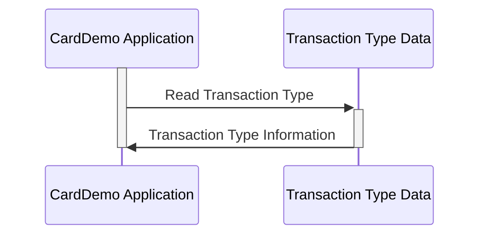

Gerado em: 2 de outubro de 2024

**Título do Documento:** Especificação da Estrutura de Dados do Tipo de Transação CardDemo

**Descrição Resumida:**
Este documento descreve a estrutura de dados `TRAN-TYPE-RECORD` usada no aplicativo CardDemo. Esta estrutura define o formato para armazenar informações sobre diferentes tipos de transações, incluindo um código de dois caracteres e uma descrição de cinquenta caracteres. Essa estrutura é importante para classificar e descrever várias transações com cartão de crédito, o que é crucial para processamento, relatórios e análises precisos.

**Histórias de Usuário:**
Como analista de dados, preciso ser capaz de identificar e entender facilmente os diferentes tipos de transações no sistema para que eu possa realizar análises e relatórios precisos.

**Epic Relacionado:** 4 - Processamento de Transações

**Requisitos Técnicos:**

- Definir Estrutura do Tipo de Transação: Este código define a estrutura `TRAN-TYPE-RECORD` para armazenar informações sobre um tipo de transação.
  - Entrada: Nenhuma
  - Resultado `TRAN-TYPE-RECORD`: Estrutura contendo os campos `TRAN-TYPE` e `TRAN-TYPE-DESC`.

**Modelos Relacionados**
- `TRAN-TYPE-RECORD`
  - `TRAN-TYPE` `String`: Representa o tipo de transação com um código de dois caracteres.
  - `TRAN-TYPE-DESC` `String`: Um rótulo descritivo para o tipo de transação, fornecendo uma explicação clara do seu significado.

**Configurações:**
- N/A

**Melhorias de Código:**
- Adicionar comentários inline para esclarecer o propósito e o uso do campo de preenchimento.
- Considere o uso de um dicionário de dados ou arquivo de configuração externo para armazenar os códigos e descrições dos tipos de transação. Isso permitiria uma modificação e manutenção mais fáceis dos tipos de transação sem a necessidade de alterações no código.

**Melhorias de Segurança:**
- N/A

**Diagrama Conceitual:**

--Made by "Smart Engineering" (by Compass.UOL)--