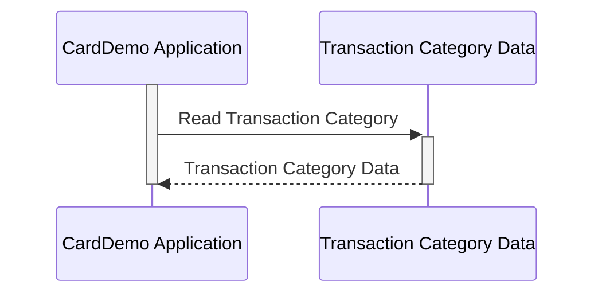

Gerado em: 2 de outubro de 2024

**Título do Documento:** Especificação da Estrutura de Dados da Categoria de Transação CardDemo

**Descrição Resumida:**
Este documento define a estrutura para armazenar dados de categoria de transação no aplicativo CardDemo, especificando o layout e os tipos de dados para cada campo em um registro de categoria de transação.

**Histórias do Usuário:**
Como analista de dados, preciso garantir que todas as transações sejam categorizadas de forma consistente para gerar relatórios precisos e obter insights significativos dos dados.

**Épico Relacionado:**
4 - Processamento de Transações

**Requisitos Técnicos:**

- **Estrutura de Dados da Categoria de Transação**: Este código define uma estrutura para armazenar informações de categoria de transação.
  - Entrada: Nenhuma.
  - Resultado `TRAN-CAT-RECORD`: Estrutura de dados que representa uma categoria de transação com seu identificador exclusivo e descrição.

**Modelos Relacionados:**

- **`TRAN-CAT-RECORD`**
  - `TRAN-TYPE-CD` `String(2)`: Representa o tipo geral de transação.
  - `TRAN-CAT-CD` `String(4)`: Representa uma subcategoria específica dentro do tipo de transação.
  - `TRAN-CAT-TYPE-DESC` `String(50)`: Um nome descritivo para a categoria de transação.

**Configurações:**

- Não disponível

**Melhorias de Código:**
- **Adicionar validação de dados**: Implementar verificações para `TRAN-TYPE-CD` e `TRAN-CAT-CD` para garantir que estejam em conformidade com os valores predefinidos.
- **Tratamento de Erros**: Incorporar mecanismos de tratamento de erros para gerenciar situações como encontros de dados inválidos.
- **Documentação**: Adicionar comentários mais abrangentes explicando a finalidade e o uso de cada campo na estrutura de dados.

**Melhorias de Segurança:**
- **Controle de Acesso**: Implementar medidas de controle de acesso para restringir a modificação de categorias de transação apenas ao pessoal autorizado.
- **Trilha de Auditoria**: Manter uma trilha de auditoria de quaisquer alterações feitas nos dados da categoria de transação, incluindo quem fez a alteração e quando.

**Diagrama Conceitual:**

--Made by "Smart Engineering" (by Compass.UOL)--