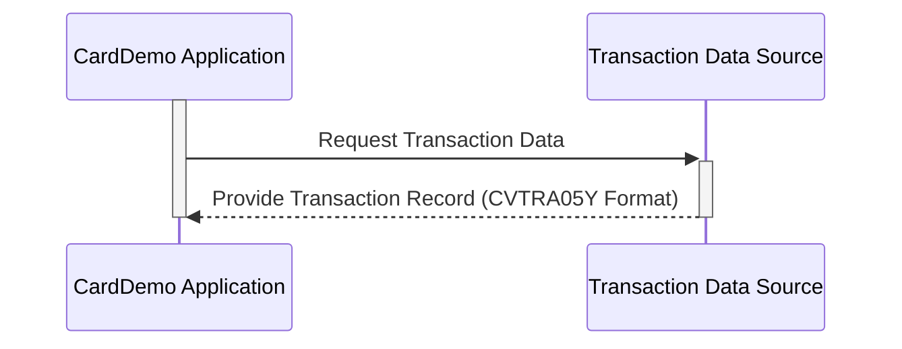

Gerado em: 2 de outubro de 2024

**Título do Documento: Especificação da Estrutura de Registro de Transação de Cartão de Crédito**

**Descrição Resumida:**
Este documento detalha a estrutura de um registro de transação dentro de um sistema de processamento de cartão de crédito COBOL, descrevendo os pontos de dados específicos capturados para cada transação financeira.

**Histórias do Usuário:**
Como analista financeiro, preciso de uma maneira padronizada de acessar e analisar dados de transações para gerar relatórios precisos e obter insights sobre os padrões de gastos dos clientes.

**Épico Relacionado:**
4 - Processamento de Transações

**Requisitos Técnicos:**

- **Definição do Registro de Transação**: Este código define o layout de um registro de transação dentro do aplicativo CardDemo.
  - Entrada: Nenhuma. Esta estrutura define um formato de dados, não recebe entrada.
  - Processamento: Nenhum processamento é realizado na própria definição da estrutura de dados. Ele atua como um modelo de como os dados da transação devem ser organizados.
  - Saída: Nenhuma. A estrutura em si não produz saída; ele dita como os dados da transação devem ser armazenados e interpretados.

**Modelos Relacionados**

- **`TRAN-RECORD`**: Representa uma única transação dentro do aplicativo CardDemo.
    - `TRAN-ID` `Alphanumeric (X) 16 Characters`: Identificador único para a transação.
    - `TRAN-TYPE-CD` `Alphanumeric (X) 2 Characters`: Código que indica o tipo de transação (por exemplo, "SA" para Venda).
    - `TRAN-CAT-CD` `Numeric (9) 4 Digits`:  Código que categoriza a transação (por exemplo, "5010" para Mercearia).
    - `TRAN-SOURCE` `Alphanumeric (X) 10 Characters`: Origem da transação (por exemplo, "Terminal POS").
    - `TRAN-DESC` `Alphanumeric (X) 100 Characters`: Breve descrição da transação.
    - `TRAN-AMT` `Numeric (S9V99) 9 Digits, 2 Decimal Places`: Valor monetário da transação.
    - `TRAN-MERCHANT-ID` `Numeric (9) 9 Digits`: Identificador único para o comerciante.
    - `TRAN-MERCHANT-NAME` `Alphanumeric (X) 50 Characters`: Nome do comerciante.
    - `TRAN-MERCHANT-CITY` `Alphanumeric (X) 50 Characters`:  Cidade do comerciante.
    - `TRAN-MERCHANT-ZIP` `Alphanumeric (X) 10 Characters`: CEP do comerciante.
    - `TRAN-CARD-NUM` `Alphanumeric (X) 16 Characters`: Número do cartão de crédito usado.
    - `TRAN-ORIG-TS` `Alphanumeric (X) 26 Characters`: Timestamp da transação original.
    - `TRAN-PROC-TS` `Alphanumeric (X) 26 Characters`: Timestamp de quando a transação foi processada.

**Configurações:**
- N/A

**Melhorias de Código:**
- **Adicionar Comentários In-Line**: Embora o código atual tenha um comentário de cabeçalho, adicionar comentários in-line mais detalhados ao lado de cada definição de campo melhoraria muito a legibilidade e a compreensão da estrutura de dados.
- **Considere um Dicionário de Dados**: Para sistemas maiores, manter um dicionário de dados centralizado que documente cada elemento de dado, sua finalidade, formato e uso pode ser benéfico para a manutenção de longo prazo.
- **Controle de Versão**:  Utilize um sistema de controle de versão (como o Git) para rastrear as alterações feitas no copybook, fornecendo um registro de auditoria e facilitando a colaboração se vários desenvolvedores estiverem envolvidos.

**Melhorias de Segurança:**
- **Criptografia de Dados**: Se os dados da transação incluírem informações confidenciais, como números de cartão de crédito, implemente mecanismos de criptografia para proteger esses dados em trânsito e em repouso.
- **Log Seguro**:  Garanta que os logs de transações, se gerados, sejam armazenados com segurança e sigam as melhores práticas para registrar informações confidenciais (por exemplo, mascarar números de cartão de crédito).
- **Controle de Acesso**: Implemente medidas rígidas de controle de acesso para limitar quem pode visualizar, modificar ou excluir dados de transações.

**Diagrama Conceitual:**

--Made by "Smart Engineering" (by Compass.UOL)--