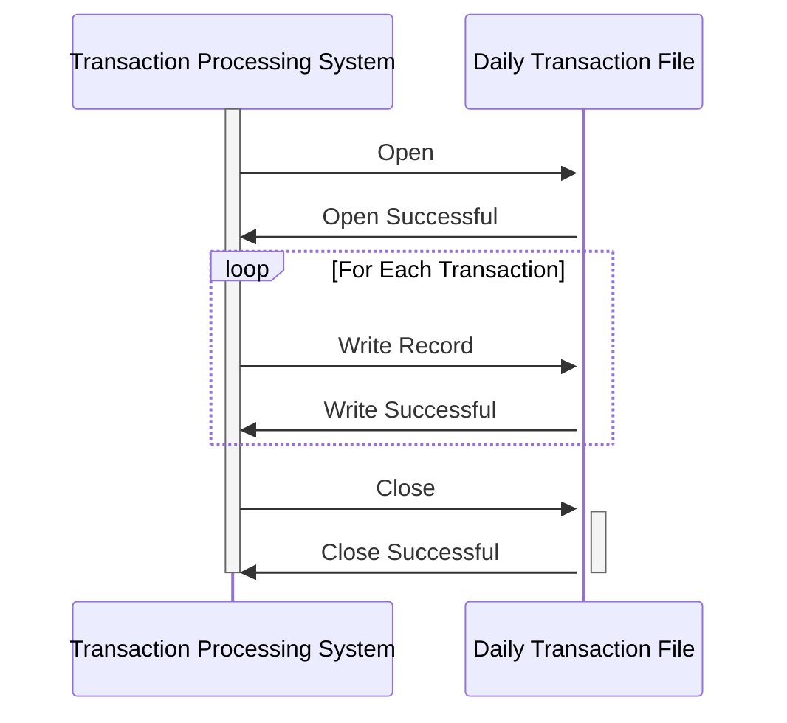

Gerado em: 2 de outubro de 2024

**Título do Documento:** CardDemo Application - Especificação de Registro de Transação Diária

**Descrição Resumida:**
Este documento descreve a estrutura de um registro de transação diária usado no aplicativo CardDemo. Ele define os campos de dados e seus formatos para capturar e armazenar informações sobre cada transação de cartão de crédito. Essas informações são cruciais para vários aspectos do gerenciamento de cartão de crédito, incluindo processamento de transações, relatórios e análise. 

**Histórias do Usuário:**
Como analista de dados, preciso ter acesso a registros detalhados de transações para poder analisar padrões de gastos, identificar tendências e gerar relatórios.

**Épico Relacionado:**
4 - Processamento de Transações

**Requisitos Técnicos:**
Este código define uma estrutura de dados COBOL chamada `DALYTRAN-RECORD` para representar uma transação diária. Cada registro consiste em campos contendo informações sobre uma transação específica de cartão de crédito.

- `Process Daily Transaction Record`: Esta estrutura de dados define o layout de um registro de transação diária.
  - Entrada: Nenhuma. Esta é uma definição de estrutura de dados, não um método.
  - Resultado `DALYTRAN-RECORD`: Um registro estruturado contendo detalhes sobre uma única transação de cartão de crédito.

**Modelos Relacionados**
- `DALYTRAN-RECORD`
  - `DALYTRAN-ID` `PIC X(16)`: Um identificador único atribuído a cada transação.
  - `DALYTRAN-TYPE-CD` `PIC X(02)`: Um código que significa o tipo de transação, como uma compra ou um reembolso.
  - `DALYTRAN-CAT-CD` `PIC 9(04)`: Um código numérico que classifica a transação em categorias como mantimentos, combustível ou entretenimento.
  - `DALYTRAN-SOURCE` `PIC X(10)`: Indica a origem da transação, como online, em loja ou caixa eletrônico.
  - `DALYTRAN-DESC` `PIC X(100)`: Uma breve descrição fornecendo contexto adicional sobre a transação.
  - `DALYTRAN-AMT` `PIC S9(09)V99`: O valor monetário da transação.
  - `DALYTRAN-MERCHANT-ID` `PIC 9(09)`: Um identificador único para o comerciante envolvido na transação.
  - `DALYTRAN-MERCHANT-NAME` `PIC X(50)`: O nome do comerciante onde a transação ocorreu.
  - `DALYTRAN-MERCHANT-CITY` `PIC X(50)`: A cidade onde o comerciante está localizado.
  - `DALYTRAN-MERCHANT-ZIP` `PIC X(10)`: O CEP do local do comerciante.
  - `DALYTRAN-CARD-NUM` `PIC X(16)`: O número do cartão de crédito usado para a transação.
  - `DALYTRAN-ORIG-TS` `PIC X(26)`: Um registro de data e hora indicando quando a transação foi iniciada.
  - `DALYTRAN-PROC-TS` `PIC X(26)`: Um registro de data e hora registrando quando a transação foi processada.

**Configurações:**
- N/A

**Melhorias de Código:**
- **Validação de Campo:** Implemente verificações de validação de dados para cada campo no `DALYTRAN-RECORD` para garantir a integridade dos dados. Por exemplo:
    - Validar o código do tipo de transação em relação a uma lista de códigos válidos.
    - Verifique se o valor da transação é um número positivo.
    - Verificar o formato dos registros de data e hora.
- **Tratamento de Erros:** Inclua rotinas de tratamento de erros para gerenciar normalmente os problemas encontrados durante o processamento de registros. Isso pode envolver:
    - Registrar erros em um arquivo para depuração.
    - Gerando mensagens de erro apropriadas.
- **Documentação:** Adicione comentários abrangentes ao código para explicar o propósito da estrutura de dados e de cada campo, bem como quaisquer regras de validação ou lógica de processamento. 

**Melhorias de Segurança:**
- **Criptografia de Dados:** Criptografe dados confidenciais dentro do `DALYTRAN-RECORD`, particularmente o número do cartão de crédito (`DALYTRAN-CARD-NUM`), para protegê-lo de acesso não autorizado. A criptografia deve ser aplicada durante o armazenamento e a transmissão de dados.
- **Controle de Acesso:** Implemente medidas rígidas de controle de acesso para restringir o acesso aos registros de transações e garantir que apenas pessoal autorizado possa visualizar ou modificar essas informações confidenciais.

**Diagrama Conceitual:**

--Made by "Smart Engineering" (by Compass.UOL)--