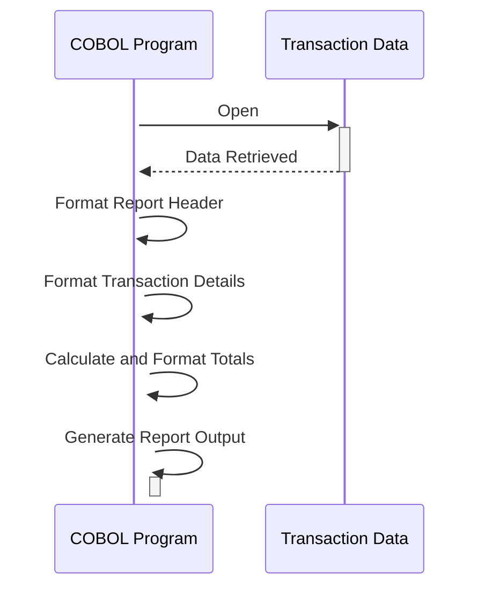

Gerado em: 2 de outubro de 2024

**Título do Documento: Especificação da Estrutura de Dados do Relatório de Transações de Cartão**

**Descrição Resumida:**
Este documento define a estrutura de dados para um relatório de transações em um programa COBOL, delineando o layout e a formatação das informações apresentadas em um resumo diário de transações.

**Histórias do Usuário:**
Como analista de dados, preciso de um relatório de transações padronizado para analisar padrões de transações diárias, identificar tendências e gerar insights para decisões de negócios.

**Épico Relacionado:** 5 - Relatórios e Análise

**Requisitos Técnicos:**

- **Geração de Relatório de Transações:** Este processo define o layout para um relatório contendo detalhes da transação dentro de um intervalo de datas especificado.
  - Entrada: Dados de transação de `dailytran.txt`.
  - Processamento: Organiza os dados de transação em um formato de relatório estruturado com cabeçalhos, detalhes e totais.
  - Saída: Gera um relatório formatado adequado para impressão ou exibição, aderindo à estrutura definida.

**Modelos Relacionados**

- `REPORT-NAME-HEADER`
  - `REPT-SHORT-NAME` `String`: Nome curto/código para o relatório. 
  - `REPT-LONG-NAME` `String`: Nome descritivo completo do relatório. 
  - `REPT-DATE-HEADER` `String`:  Cabeçalho para a seção de intervalo de datas.
  - `REPT-START-DATE` `Date`: Data de início para transações incluídas no relatório. 
  - `REPT-END-DATE` `Date`: Data final para transações incluídas no relatório. 
- `TRANSACTION-DETAIL-REPORT`
  - `TRAN-REPORT-TRANS-ID` `String`: Identificador único para cada transação. 
  - `TRAN-REPORT-ACCOUNT-ID` `String`: Identificador da conta associada à transação. 
  - `TRAN-REPORT-TYPE-CD` `String`: Código que representa o tipo de transação. 
  - `TRAN-REPORT-TYPE-DESC` `String`: Descrição do tipo de transação. 
  - `TRAN-REPORT-CAT-CD` `String`: Código que representa a categoria da transação. 
  - `TRAN-REPORT-CAT-DESC` `String`: Descrição da categoria da transação. 
  - `TRAN-REPORT-SOURCE` `String`: Fonte ou canal da transação. 
  - `TRAN-REPORT-AMT` `Decimal`: Valor da transação. 
- `REPORT-PAGE-TOTALS`
  - `REPT-PAGE-TOTAL` `Decimal`: Valor total das transações em uma página. 
- `REPORT-ACCOUNT-TOTALS`
  - `REPT-ACCOUNT-TOTAL` `Decimal`: Valor total das transações para uma conta. 
- `REPORT-GRAND-TOTALS`
  - `REPT-GRAND-TOTAL` `Decimal`: Valor total geral de todas as transações. 

**Configurações:**

- Valores Constantes
  - `REPORT-NAME-HEADER`
    - `REPT-SHORT-NAME`: `"DALYREPT"`
	    - Descrição: Nome curto para o relatório de transações diárias.
    - `REPT-LONG-NAME`: `"Daily Transaction Report"`
	    - Descrição: Nome descritivo para o relatório.
    - `REPT-DATE-HEADER`: `"Date Range: "`
	    - Descrição: Texto do cabeçalho para a seção de intervalo de datas.
- `dailytran.txt`
  - {Transaction ID}: {Transaction Details}
    - Descrição: Contém detalhes para cada transação, incluindo o tipo de transação, local e registro de data e hora.

**Melhorias de Código:**
- Implementar uma rotina de validação de data mais robusta para garantir a precisão do intervalo de datas do relatório.
- Considere adicionar uma seção de resumo que forneça estatísticas importantes, como o número total de transações, valor médio da transação e contagem de transações por tipo ou categoria.
- Explore o uso de uma ferramenta ou biblioteca de geração de relatórios para simplificar a formatação e potencialmente oferecer recursos de relatórios mais avançados.

**Melhorias de Segurança:**
- Implementar controles de acesso para restringir a geração e visualização de relatórios apenas ao pessoal autorizado.
- Se o relatório contiver dados confidenciais, considere incorporar técnicas de mascaramento ou redução de dados para proteger a privacidade do cliente.

**Diagrama Conceitual:**

--Made by "Smart Engineering" (by Compass.UOL)--