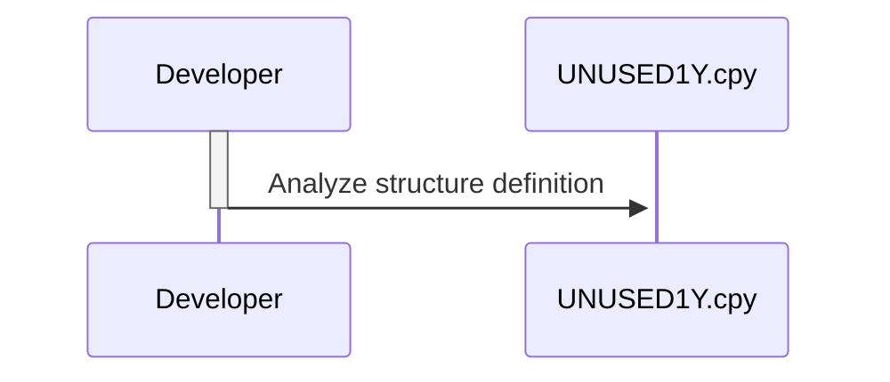

Gerado em: 2 de outubro de 2024

**Título do Documento: Especificação da Estrutura UNUSED-DATA**

**Descrição Resumida:**
Este documento descreve a estrutura `UNUSED-DATA`, que parece ser um remanescente de uma versão anterior do sistema e não está atualmente em uso. Ele descreve os campos da estrutura e seus propósitos pretendidos com base em suas convenções de nomenclatura. No entanto, devido à falta de uso ativo e contexto, o propósito exato e a funcionalidade desta estrutura permanecem obscuros.

**Histórias do Usuário:**
Como desenvolvedor, preciso entender o propósito e a estrutura da estrutura de dados `UNUSED-DATA` para determinar se ela pode ser removida ou reutilizada com segurança, garantindo a clareza e a manutenção da base de código.

**Épico Relacionado:**
9 - Utilitários do Sistema: Fornecer um conjunto de funções utilitárias para dar suporte à manutenção do sistema, gerenciamento de dados e outras tarefas operacionais.

**Requisitos Técnicos:**
Este código define uma estrutura de dados COBOL chamada `UNUSED-DATA`. A estrutura é definida dentro de um copybook, conforme indicado pela extensão de arquivo `.cpy`.
Esta estrutura de dados não é referenciada na documentação fornecida, sugerindo que não é usada ativamente no sistema atual.

**Modelos Relacionados**
- `UNUSED-DATA`
  - `UNUSED-ID` `PIC X(08)`: Número de identificação, potencialmente relacionado a um usuário ou entidade.
  - `UNUSED-FNAME` `PIC X(20)`: Potencialmente um primeiro nome.
  - `UNUSED-LNAME` `PIC X(20)`: Potencialmente um sobrenome.
  - `UNUSED-PWD` `PIC X(08)`: Potencialmente uma senha.
  - `UNUSED-TYPE` `PIC X(01)`: Pode ter sido usado para indicar um tipo ou categoria.
  - `UNUSED-FILLER` `PIC X(23)`: Campo de espaço reservado para dados futuros em potencial.

**Configurações:**
N/A - Nenhuma configuração encontrada.

**Melhorias de Código:**
- **Investigar e Remover:** Se a estrutura for confirmada como não utilizada após investigação completa, é recomendável removê-la da base de código para reduzir a desordem e melhorar a manutenção.
- **Documentação:** Se a estrutura for mantida por qualquer motivo, adicione uma documentação clara e detalhada explicando seu histórico, o motivo de ser marcada como não utilizada e quaisquer casos de uso futuro em potencial. Isso ajudará futuros desenvolvedores a entender seu propósito e evitar confusão.

**Melhorias de Segurança:**
- **Remover Informações Confidenciais:** Se a estrutura `UNUSED-DATA` contiver alguma informação confidencial, como senhas ou dados pessoais, certifique-se de que seja tratada adequadamente ou removida da base de código para evitar potenciais riscos de segurança.

**Diagrama Conceitual:**

--Made by "Smart Engineering" (by Compass.UOL)--