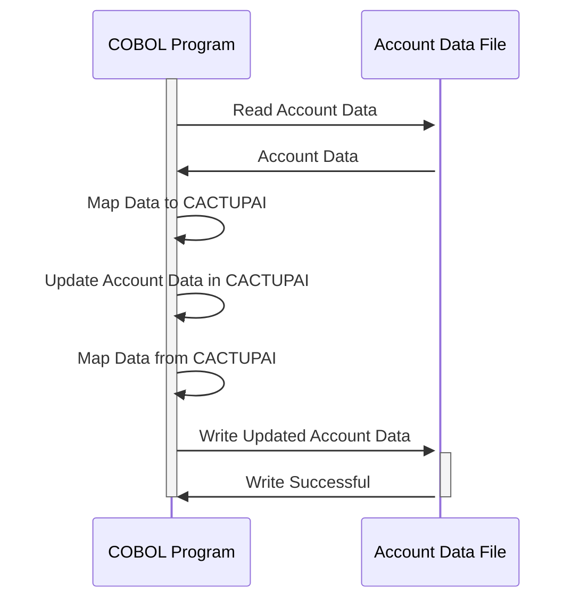

Gerado em: 2 de outubro de 2024

**Título do Documento:** Especificação da Estrutura de Dados para Atualização de Conta

**Descrição Resumida:**
Este documento define a estrutura de dados para atualização de informações de contas de cartão de crédito em um sistema baseado em COBOL. O copybook `COACTUP.CPY` serve como um modelo, descrevendo os campos obrigatórios e o formato para atualizações de contas, garantindo a consistência e integridade dos dados em diferentes programas.

**Histórias do Usuário:**
Como administrador do sistema, preciso de uma estrutura de dados padronizada para atualizar as informações da conta do cliente para garantir a consistência e a precisão dos dados em diferentes programas.

**Épico Relacionado:**
2 - Gestão de Contas

**Requisitos Técnicos:**
- **Estrutura de Dados para Atualização de Conta:** Esta estrutura define o layout para atualização de informações de contas de cartão de crédito. Inclui campos para vários atributos de conta e detalhes do cliente.
  - Entrada: Dados para atualização de uma conta de cartão de crédito.
  - Saída: Os dados atualizados da conta de cartão de crédito.

**Modelos Relacionados**
- `CACTUPAI`: Define a área de entrada para dados de atualização de conta.
  - `ACCTSIDI` `Alphanumeric (11)`: Identificador Único da Conta.
  - `ACSTTUSI` `Alphanumeric (1)`: Código de Status da Conta.
  - `ACRDLIMI` `Numeric (15)`: Limite de Crédito.
  - `ACURBALI` `Numeric (15)`: Saldo Atual.
  - `ACSFNAMI` `Alphanumeric (25)`: Primeiro Nome.
  - `ACSMNAMI` `Alphanumeric (25)`: Nome do Meio.
  - `ACSLNAMI` `Alphanumeric (25)`: Sobrenome.
  - `ACSADL1I` `Alphanumeric (50)`: Linha de Endereço 1.
  - `ACSSTTEI` `Alphanumeric (2)`: Código do Estado.
  - `ACSADL2I` `Alphanumeric (50)`: Linha de Endereço 2.
  - `ACSZIPCI` `Alphanumeric (5)`: CEP.
  - `ACSCITYI` `Alphanumeric (50)`: Cidade.
  - `ACSCTRYI` `Alphanumeric (3)`: Código do País.
  - `ACSPH1AI` `Alphanumeric (3)`: Código de Área do Telefone.
  - `ACSPH1BI` `Alphanumeric (3)`: Prefixo do Telefone.
  - `ACSPH1CI` `Alphanumeric (4)`: Número da Linha Telefônica.
  - `OPNYEARI` `Numeric (4)`: Ano de Abertura da Conta.
  - `OPNMONI` `Numeric (2)`: Mês de Abertura da Conta.
  - `OPNDAYI` `Numeric (2)`: Dia de Abertura da Conta.
  - `EXPYEARI` `Numeric (4)`: Ano de Vencimento do Cartão.
  - `EXPMONI` `Numeric (2)`: Mês de Vencimento do Cartão.
  - `EXPDAYI` `Numeric (2)`: Dia de Vencimento do Cartão.
- `CACTUPAO`: Redefine `CACTUPAI` para fornecer uma visão diferente dos dados, potencialmente para fins de saída ou mapeamento.
  - `ACCTSIDI` `Alphanumeric (11)`: Identificador Único da Conta.
  - `ACSTTUSI` `Alphanumeric (1)`: Código de Status da Conta.
  - `ACRDLIMI` `Numeric (15)`: Limite de Crédito.
  - `ACURBALI` `Numeric (15)`: Saldo Atual.
  - `ACSFNAMI` `Alphanumeric (25)`: Primeiro Nome.
  - `ACSMNAMI` `Alphanumeric (25)`: Nome do Meio.
  - `ACSLNAMI` `Alphanumeric (25)`: Sobrenome.
  - `ACSADL1I` `Alphanumeric (50)`: Linha de Endereço 1.
  - `ACSSTTEI` `Alphanumeric (2)`: Código do Estado.
  - `ACSADL2I` `Alphanumeric (50)`: Linha de Endereço 2.
  - `ACSZIPCI` `Alphanumeric (5)`: CEP.
  - `ACSCITYI` `Alphanumeric (50)`: Cidade.
  - `ACSCTRYI` `Alphanumeric (3)`: Código do País.
  - `ACSPH1AI` `Alphanumeric (3)`: Código de Área do Telefone.
  - `ACSPH1BI` `Alphanumeric (3)`: Prefixo do Telefone.
  - `ACSPH1CI` `Alphanumeric (4)`: Número da Linha Telefônica.
  - `OPNYEARI` `Numeric (4)`: Ano de Abertura da Conta.
  - `OPNMONI` `Numeric (2)`: Mês de Abertura da Conta.
  - `OPNDAYI` `Numeric (2)`: Dia de Abertura da Conta.
  - `EXPYEARI` `Numeric (4)`: Ano de Vencimento do Cartão.
  - `EXPMONI` `Numeric (2)`: Mês de Vencimento do Cartão.
  - `EXPDAYI` `Numeric (2)`: Dia de Vencimento do Cartão.

**Configurações:**
- `COACTUP.CPY`
  - `ACCTSIDI`: `""`
	- Descrição: Identificador da conta.
  - `ACSTTUSI`: `""`
	- Descrição: Status da conta (por exemplo, 'A' para Ativo, 'C' para Cancelado).
  - `ACRDLIMI`: `""`
	- Descrição: Limite de Crédito.
  - `ACURBALI`: `""`
	- Descrição: Saldo Atual da Conta.
  - `ACSFNAMI`: `""`
	- Descrição: Primeiro Nome do titular da conta.
  - `ACSMNAMI`: `""`
	- Descrição: Nome do Meio do titular da conta.
  - `ACSLNAMI`: `""`
	- Descrição: Sobrenome do titular da conta.
  - `ACSADL1I`: `""`
	- Descrição: Linha de Endereço 1 do titular da conta.
  - `ACSSTTEI`: `""`
	- Descrição: Código do Estado do titular da conta.
  - `ACSADL2I`: `""`
	- Descrição: Linha de Endereço 2 do titular da conta.
  - `ACSZIPCI`: `""`
	- Descrição: CEP do titular da conta.
  - `ACSCITYI`: `""`
	- Descrição: Cidade do titular da conta.
  - `ACSCTRYI`: `""`
	- Descrição: Código do País do titular da conta.
  - `ACSPH1AI`: `""`
	- Descrição: Número de Telefone do titular da conta (Código de Área).
  - `ACSPH1BI`: `""`
	- Descrição: Número de Telefone do titular da conta (Prefixo).
  - `ACSPH1CI`: `""`
	- Descrição: Número de Telefone do titular da conta (Linha).
  - `OPNYEARI`: `""`
	- Descrição: Ano de Abertura da Conta.
  - `OPNMONI`: `""`
	- Descrição: Mês de Abertura da Conta.
  - `OPNDAYI`: `""`
	- Descrição: Dia de Abertura da Conta.
  - `EXPYEARI`: `""`
	- Descrição: Ano de Vencimento do Cartão.
  - `EXPMONI`: `""`
	- Descrição: Mês de Vencimento do Cartão.
  - `EXPDAYI`: `""`
	- Descrição: Dia de Vencimento do Cartão.

**Melhorias de Código:**
- Adicionar comentários para explicar o propósito e o uso de cada campo de dados no copybook.
- Implementar verificações de validação de dados para cada campo para garantir a integridade dos dados.
- Considere usar um dicionário de dados para gerenciar os elementos de dados e suas definições.

**Melhorias de Segurança:**
- Criptografar campos de dados confidenciais, como números de conta e números de segurança social.
- Implementar medidas de controle de acesso para restringir o acesso não autorizado ao copybook e seus dados.
- Registrar todas as transações de atualização de contas para fins de auditoria.

**Diagrama Conceitual:**

--Made by "Smart Engineering" (by Compass.UOL)--