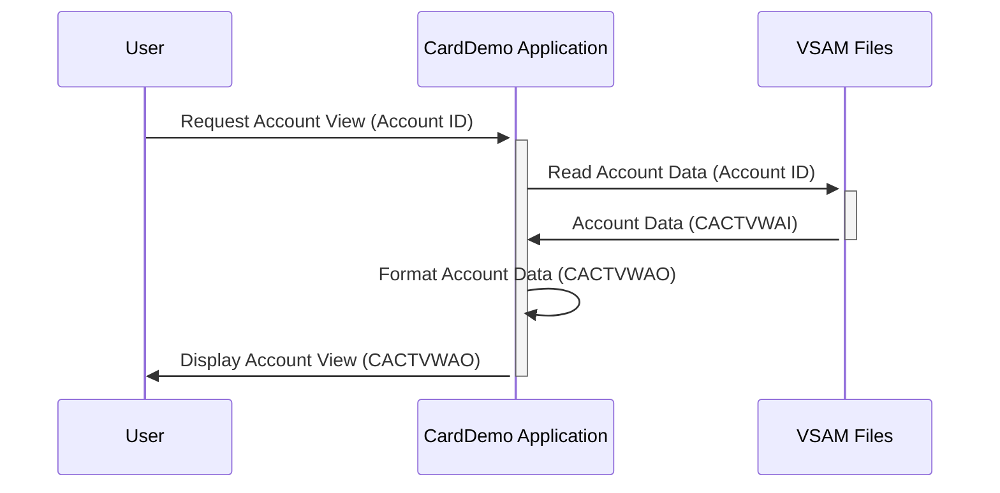

Gerado em: 2 de outubro de 2024

**Título do Documento:** Especificação da Estrutura de Dados da Visualização da Conta do Cartão

**Descrição Resumida:**
Este documento descreve a estrutura de dados usada para visualizar os detalhes da conta no aplicativo CardDemo. O copybook `COACTVW.CPY` define duas estruturas de dados, `CACTVWAI` e `CACTVWAO`, que representam uma "Visualização da Conta" contendo informações abrangentes sobre a conta de um cliente. `CACTVWAI` é projetado para recuperação de dados do armazenamento, enquanto `CACTVWAO` se concentra em apresentar as mesmas informações em um formato amigável para exibição ou fins de saída.

**Histórias do Usuário:**
Como usuário do sistema, preciso visualizar informações abrangentes da conta, incluindo saldos, limites, detalhes do cliente e mensagens do sistema, em um formato claro e consistente.

**Épico Relacionado:** 2 - Gerenciamento de Conta

**Requisitos Técnicos:**

- Recuperação de Informações da Conta: Este método recupera informações da conta dos arquivos VSAM com base no ID da conta fornecido.
  - Entrada: `ACCTSIDI` `Alphanumeric`.
  - Resultado `CACTVWAI`: Uma estrutura de dados contendo todas as informações brutas da conta.

- Formatação de Informações da Conta: Este método formata as informações da conta recuperadas em um layout amigável usando a estrutura `CACTVWAO`.
  - Entrada: `CACTVWAI`.
  - Resultado `CACTVWAO`: Uma estrutura de dados com informações formatadas da conta para exibição.

**Modelos Relacionados**

- `CACTVWAI`
  - `ACCTSIDI` `Alphanumeric`: ID da conta exclusiva.
  - `ACSTTUSI` `Alphanumeric`: Status da conta (por exemplo, 'A' para Ativo, 'C' para Fechado).
  - `ACRDLIMI` `Alphanumeric`: Limite de crédito (formatado como texto).
  - `ACURBALI` `Alphanumeric`: Saldo atual da conta (formatado como texto).
  - `ACSFNAMI` `Alphanumeric`: Primeiro nome do cliente.
  - `ACSMNAMI` `Alphanumeric`: Nome do meio do cliente.
  - `ACSLNAMI` `Alphanumeric`: Sobrenome do cliente.
  - `ACSADL1I` `Alphanumeric`: Linha de endereço 1 do cliente.
  - `ACSSTTEI` `Alphanumeric`: Código do estado do endereço do cliente.
  - `ACSADL2I` `Alphanumeric`: Linha de endereço 2 do cliente.
  - `ACSZIPCI` `Alphanumeric`: CEP do endereço do cliente.
  - `ACSCITYI` `Alphanumeric`: Cidade do cliente.
  - `ACSCTRYI` `Alphanumeric`: Código do país do cliente.
  - `ACSPHN1I` `Alphanumeric`: Número de telefone 1 do cliente.
  - `ACSGOVTI` `Alphanumeric`: Número de identificação governamental do cliente (por exemplo, Número do Seguro Social).
  - `ACSPHN2I` `Alphanumeric`: Número de telefone 2 do cliente.
  - `ACSEFTCI` `Alphanumeric`: Data efetiva do cliente (data em que as informações do cliente entraram em vigor).
  - `ACSPFLGI` `Alphanumeric`: Sinalizador de perfil do cliente (indica atributos ou sinalizadores específicos do cliente).
  - `INFOMSGI` `Alphanumeric`: Mensagens informativas relacionadas à conta.
  - `ERRMSGI` `Alphanumeric`: Mensagens de erro relacionadas à conta.
  - `ADTOPENI` `Alphanumeric`: Data de abertura da conta.
  - `AEXPDTI` `Alphanumeric`: Data de expiração da conta.
  - `ACSHLIMI` `Alphanumeric`: Limite de dinheiro da conta.
  - `AREISDTI` `Alphanumeric`: Data de reemissão da conta.
  - `ACRCYCRI` `Alphanumeric`: Moeda da conta.
  - `AADDGRPI` `Alphanumeric`: Grupo de endereço da conta.
  - `ACRCYDBI` `Alphanumeric`: Débito em moeda da conta.
  - `ACSTNUMI` `Alphanumeric`: Número do extrato da conta.
  - `ACSTSSNI` `Alphanumeric`: Temporada do extrato da conta.
  - `ACSTDOBI` `Alphanumeric`: Data de abertura do extrato da conta.
  - `ACSTFCOI` `Alphanumeric`: Primeiro contato do extrato da conta.
  - `TRNNAMEI` `Alphanumeric`: Nome da transação.
  - `TITLE01I` `Alphanumeric`: Título 01.
  - `CURDATEI` `Alphanumeric`: Data atual.
  - `PGMNAMEI` `Alphanumeric`: Nome do programa.
  - `TITLE02I` `Alphanumeric`: Título 02.
  - `CURTIMEI` `Alphanumeric`: Hora atual.

- `CACTVWAO`
  - `ACCTSIDO` `Alphanumeric`: ID da conta exclusiva.
  - `ACSTTUSO` `Alphanumeric`: Status da conta (por exemplo, 'A' para Ativo, 'C' para Fechado).
  - `ACRDLIMO` `Alphanumeric`: Limite de crédito (formatado com vírgulas e pontos decimais).
  - `ACURBALO` `Alphanumeric`: Saldo atual da conta (formatado com vírgulas e pontos decimais).
  - `ACSFNAMO` `Alphanumeric`: Primeiro nome do cliente.
  - `ACSMNAMO` `Alphanumeric`: Nome do meio do cliente.
  - `ACSLNAMO` `Alphanumeric`: Sobrenome do cliente.
  - `ACSADL1O` `Alphanumeric`: Linha de endereço 1 do cliente.
  - `ACSSTTEO` `Alphanumeric`: Código do estado do endereço do cliente.
  - `ACSADL2O` `Alphanumeric`: Linha de endereço 2 do cliente.
  - `ACSZIPCO` `Alphanumeric`: CEP do endereço do cliente.
  - `ACSCITYO` `Alphanumeric`: Cidade do cliente.
  - `ACSCTRYO` `Alphanumeric`: Código do país do cliente.
  - `ACSPHN1O` `Alphanumeric`: Número de telefone 1 do cliente.
  - `ACSGOVTO` `Alphanumeric`: Número de identificação governamental do cliente (por exemplo, Número do Seguro Social).
  - `ACSPHN2O` `Alphanumeric`: Número de telefone 2 do cliente.
  - `ACSEFTCO` `Alphanumeric`: Data efetiva do cliente (data em que as informações do cliente entraram em vigor).
  - `ACSPFLGO` `Alphanumeric`: Sinalizador de perfil do cliente (indica atributos ou sinalizadores específicos do cliente).
  - `INFOMSGO` `Alphanumeric`: Mensagens informativas relacionadas à conta.
  - `ERRMSGO` `Alphanumeric`: Mensagens de erro relacionadas à conta.
  - `ADTOPENO` `Alphanumeric`: Data de abertura da conta.
  - `AEXPDTO` `Alphanumeric`: Data de expiração da conta.
  - `ACSHLIMO` `Alphanumeric`: Limite de dinheiro da conta.
  - `AREISDTO` `Alphanumeric`: Data de reemissão da conta.
  - `ACRCYCRO` `Alphanumeric`: Moeda da conta.
  - `AADDGRPO` `Alphanumeric`: Grupo de endereço da conta.
  - `ACRCYDBO` `Alphanumeric`: Débito em moeda da conta.
  - `ACSTNUMO` `Alphanumeric`: Número do extrato da conta.
  - `ACSTSSNO` `Alphanumeric`: Temporada do extrato da conta.
  - `ACSTDOBO` `Alphanumeric`: Data de abertura do extrato da conta.
  - `ACSTFCOO` `Alphanumeric`: Primeiro contato do extrato da conta.
  - `TRNNAMEO` `Alphanumeric`: Nome da transação.
  - `TITLE01O` `Alphanumeric`: Título 01.
  - `CURDATEO` `Alphanumeric`: Data atual.
  - `PGMNAMEO` `Alphanumeric`: Nome do programa.
  - `TITLE02O` `Alphanumeric`: Título 02.
  - `CURTIMEO` `Alphanumeric`: Hora atual.

**Configurações:**
Nenhuma configuração ou constante específica foi encontrada no código fornecido.

**Melhorias de Código:**
- **Documentação:** Adicione comentários detalhados para explicar o propósito e o uso de cada campo de dados dentro das estruturas `CACTVWAI` e `CACTVWAO`.
- **Validação de Dados:** Implemente verificações de validação de dados dentro do módulo para garantir a integridade das informações da conta recuperadas.
- **Tratamento de Erros:** Incorpore mecanismos robustos de tratamento de erros para lidar com quaisquer problemas encontrados durante a recuperação ou formatação de dados.

**Melhorias de Segurança:**
- **Controle de Acesso:** Implemente medidas de controle de acesso para restringir o acesso não autorizado a informações confidenciais da conta.
- **Criptografia de Dados:** Considere criptografar campos de dados confidenciais, como números de identificação governamental do cliente, para aumentar a segurança dos dados.
- **Log de Auditoria:** Implemente o log de auditoria para rastrear todo o acesso e modificações nas informações da conta para fins de segurança e conformidade.

**Diagrama Conceitual:**

--Made by "Smart Engineering" (by Compass.UOL)--