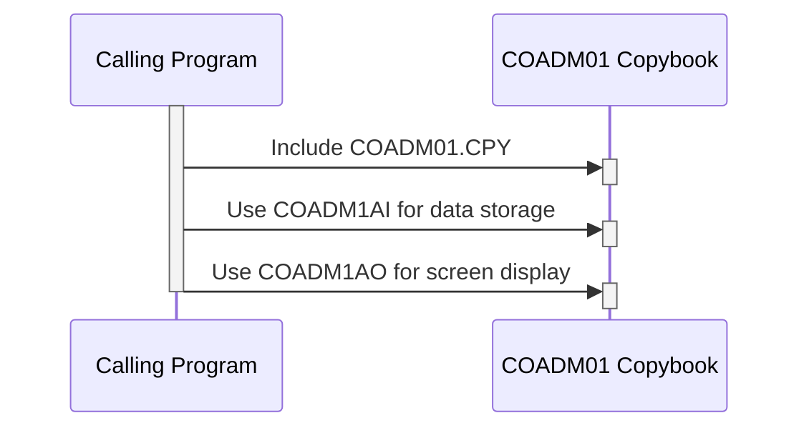

Gerado em: 2 de Outubro de 2024

**Título do Documento: COADM01.CPY - Estrutura de Dados Administrativos**

**Descrição Resumida:**
O copybook COBOL `COADM01.CPY` define uma estrutura padronizada para armazenar e apresentar dados administrativos dentro da aplicação CardDemo. Esses dados incluem elementos como títulos de tela, nomes de transações, data/hora atuais, nomes de programas, opções de menu, seleções do usuário e mensagens de erro. Ele garante a consistência na exibição dessas informações em várias telas e relatórios, aprimorando a experiência do usuário e a manutenção do sistema.

**Histórias do Usuário:**
Como desenvolvedor, preciso de uma maneira padronizada de armazenar e exibir informações administrativas em telas e relatórios para que a interface do usuário seja consistente e amigável.

**Épico Relacionado:**
6 - Gerenciamento de Usuários e Segurança

**Requisitos Técnicos:**

- **Gerenciamento de Dados Administrativos**: Este copybook define duas estruturas de dados: `COADM1AI` para armazenamento interno em um formato numérico compacto e `COADM1AO` para fins de exibição usando campos baseados em caracteres.
  - Definir Estrutura de Dados `COADM1AI`:
    - Armazena dados administrativos em um formato numérico compacto (`COMP`).
    - Campos:
      - `TRNNAMEL`: Nome da transação.
      - `TITLE01L`: Primeiro título da tela.
      - `CURDATEL`: Data atual.
      - `PGMNAMEL`: Nome do programa.
      - `TITLE02L`: Segundo título da tela.
      - `CURTIMEL`: Hora atual.
      - `OPTN001L` a `OPTN012L`: Opções do menu.
      - `OPTIONL`: Opção selecionada.
      - `ERRMSGL`: Mensagem de erro.
  - Definir Estrutura de Dados `COADM1AO`:
    - Redefine `COADM1AI` para mapear dados numéricos para campos baseados em caracteres.
    - Campos:
      - `TRNNAMEI`, `TRNNAMEA`: Nome da transação.
      - `TITLE01I`, `TITLE01A`: Primeiro título da tela.
      - `CURDATEI`, `CURDATEA`: Data atual.
      - `PGMNAMEI`, `PGMNAMEA`: Nome do programa.
      - `TITLE02I`, `TITLE02A`: Segundo título da tela.
      - `CURTIMEI`, `CURTIMEA`: Hora atual.
      - `OPTN001I` a `OPTN012I`, `OPTN001A` a `OPTN012A`: Opções do menu.
      - `OPTIONI`, `OPTIONA`: Opção selecionada.
      - `ERRMSGI`, `ERRMSGA`: Mensagem de erro.
      - Campos terminando com `C`, `P`, `H`, `V`, `O`: Controlam os atributos visuais dos dados na tela.
  - Resultado:
    - `COADM1AI`: Fornece uma estrutura compacta para armazenamento eficiente de dados.
    - `COADM1AO`: Oferece uma representação amigável de dados administrativos para exibição.

**Modelos Relacionados:**

- `COADM1AI`:
  - `TRNNAMEL` `COMP`: Nome da transação em formato interno.
  - `TITLE01L` `COMP`: Primeiro título da tela em formato interno.
  - `CURDATEL` `COMP`: Data atual em formato interno.
  - `PGMNAMEL` `COMP`: Nome do programa em formato interno.
  - `TITLE02L` `COMP`: Segundo título da tela em formato interno.
  - `CURTIMEL` `COMP`: Hora atual em formato interno.
  - `OPTN001L` a `OPTN012L` `COMP`: Opções do menu em formato interno.
  - `OPTIONL` `COMP`: Opção selecionada em formato interno.
  - `ERRMSGL` `COMP`: Mensagem de erro em formato interno.
- `COADM1AO`:
  - `TRNNAMEI` `Alfanumérico`: Nome da transação em formato de exibição.
  - `TRNNAMEA` `Alfanumérico`: Nome da transação em formato de exibição.
  - `TITLE01I` `Alfanumérico`: Primeiro título da tela em formato de exibição.
  - `TITLE01A` `Alfanumérico`: Primeiro título da tela em formato de exibição.
  - `CURDATEI` `Alfanumérico`: Data atual em formato de exibição (AAAAAMMDD).
  - `CURDATEA` `Alfanumérico`: Data atual em formato de exibição (AAAAAMMDD).
  - `PGMNAMEI` `Alfanumérico`: Nome do programa em formato de exibição.
  - `PGMNAMEA` `Alfanumérico`: Nome do programa em formato de exibição.
  - `TITLE02I` `Alfanumérico`: Segundo título da tela em formato de exibição.
  - `TITLE02A` `Alfanumérico`: Segundo título da tela em formato de exibição.
  - `CURTIMEI` `Alfanumérico`: Hora atual em formato de exibição (HHMMSS).
  - `CURTIMEA` `Alfanumérico`: Hora atual em formato de exibição (HHMMSS).
  - `OPTN001I` a `OPTN012I` `Alfanumérico`: Opções do menu em formato de exibição.
  - `OPTN001A` a `OPTN012A` `Alfanumérico`: Opções do menu em formato de exibição.
  - `OPTIONI` `Alfanumérico`: Opção selecionada em formato de exibição.
  - `OPTIONA` `Alfanumérico`: Opção selecionada em formato de exibição.
  - `ERRMSGI` `Alfanumérico`: Mensagem de erro em formato de exibição.
  - `ERRMSGA` `Alfanumérico`: Mensagem de erro em formato de exibição.
  - Campos terminando com `C`, `P`, `H`, `V`, `O` `Alfanumérico`: Controlam os atributos visuais dos dados na tela.

**Configurações:**
Nenhuma configuração específica foi encontrada no trecho de código fornecido. No entanto, os atributos visuais dos dados na tela são provavelmente controlados por campos terminando com `C`, `P`, `H`, `V`, `O` na estrutura de dados `COADM1AO`. Os valores específicos para esses atributos precisariam ser determinados a partir do contexto do programa que utiliza este copybook.

**Melhorias de Código:**
- **Documentação:** Adicione comentários para esclarecer o propósito e o uso das estruturas de dados e campos.
- **Convenções de Nomenclatura:**  Considere usar nomes mais descritivos para os campos para melhorar a legibilidade.
- **Validação de Dados:** Implemente verificações de validação de dados em campos como `OPTIONI` para garantir a entrada válida do usuário.

**Melhorias de Segurança:**
- **Dados Sensíveis:** Se algum dado administrativo puder ser considerado sensível (por exemplo, nomes de transações relacionadas a operações financeiras específicas), considere adicionar medidas de segurança como criptografia ou controle de acesso.
- **Registro de Auditoria:** Implemente o registro de auditoria para rastrear as alterações feitas nos dados administrativos para fins de segurança e responsabilidade.

**Diagrama Conceitual:**

--Made by "Smart Engineering" (by Compass.UOL)--