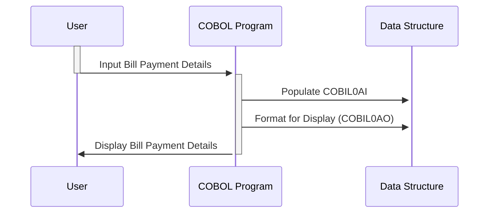

Gerado em: 2 de outubro de 2024

**Título do Documento:** Especificação da Estrutura de Dados para Pagamento de Contas

**Descrição Resumida:**
Este documento descreve a estrutura de dados utilizada em um programa COBOL para gerenciar transações de pagamento de contas. Abrange o layout das informações trocadas entre o programa e uma interface de usuário, com foco em aspectos como formatação de exibição, entrada do usuário e lógica de apresentação. Notavelmente, a estrutura acomoda formatos de processamento interno e de exibição amigável ao usuário.

**Histórias do Usuário:**
Como caixa de banco, preciso inserir e visualizar os detalhes do pagamento da conta com precisão na interface do sistema para processar os pagamentos do cliente com eficiência.

**Épico Relacionado:** 4 - Processamento de Transações

**Requisitos Técnicos:**
Este código define uma estrutura de dados para operações de pagamento de contas, com foco em sua representação para processamento interno e exibição na interface do usuário.

- **Estrutura de Dados de Pagamento de Conta:** Define o layout para informações de pagamento de conta.
  - Entrada: Nenhuma (definição de estrutura, não um processo).
  - Resultado `Estrutura de Dados COBOL`: Um formato estruturado contendo detalhes da transação, informações da conta, status de confirmação e possíveis mensagens de erro.

**Modelos Relacionados**

- **COBIL0AI:** Representação interna dos dados de pagamento da conta.
  - `TRNNAMEL` `Alphanumeric`: Nome da transação (por exemplo, "BILLPAY").
  - `CURDATEL` `Numeric`: Data da transação (por exemplo, 20241002 para 2 de outubro de 2024).
  - `CURTIMEL` `Numeric`: Hora da transação (por exemplo, 143015 para 14h30min15s).
  - `PGMNAMEL` `Alphanumeric`: Nome do programa que processa a transação.
  - `ACTIDINL` `Numeric`: ID da conta que está sendo debitada para o pagamento da conta.
  - `CURBALL` `Numeric`: Saldo atual da conta.
  - `CONFIRML` `Numeric`: Sinalizador (normalmente 0 ou 1) indicando processamento bem-sucedido (1) ou falha (0).
  - `ERRMSGL` `Alphanumeric`: Mensagem descrevendo quaisquer erros durante o processamento.

- **COBIL0AO:** Visão focada na interface do usuário dos dados de pagamento da conta.
  - `TRNNAME[C,P,H,V,O]` `Character`: Nome da transação, potencialmente com atributos de exibição (cor, proteção, etc.).
  - `CURDATE[C,P,H,V,O]` `Character`: Data formatada da transação para exibição (por exemplo, "02/10/2024").
  - `CURTIME[C,P,H,V,O]` `Character`: Hora formatada da transação para exibição (por exemplo, "14h30min15s").
  - `PGMNAME[C,P,H,V,O]` `Character`: Nome do programa, potencialmente formatado para exibição.
  - `ACTIDIN[C,P,H,V,O]` `Character`: ID da conta, potencialmente formatado para exibição.
  - `CURBAL[C,P,H,V,O]` `Character`: Saldo atual formatado para exibição (por exemplo, com símbolos de moeda, vírgulas).
  - `CONFIRM[C,P,H,V,O]` `Character`: Status de confirmação, potencialmente exibido como "S" (bem-sucedido) ou "N" (falha).
  - `ERRMSG[C,P,H,V,O]` `Character`: Mensagem de erro formatada para legibilidade do usuário.

**Configurações:**
- Nenhum arquivo de configuração externo encontrado.

**Melhorias de Código:**

1. **Tratamento de Erros:** Implemente códigos de erro padronizados e mecanismos de registro em `ERRMSGL` para facilitar a solução de problemas.
2. **Validação de Dados:** Adicione verificações de validade de dados (por exemplo, intervalos de datas válidos, formatos de número de conta) além de verificações básicas de tipo.
3. **Documentação:** Inclua comentários para esclarecer o propósito e o uso de cada campo, especialmente os atributos de exibição em `COBIL0AO`.
4. **Considerações sobre a Interface do Usuário:** Se possível, use uma estrutura de interface do usuário mais moderna do que exibições baseadas em caracteres para uma melhor experiência do usuário.

**Melhorias de Segurança:**

1. **Mascaramento de Dados:** Mascare informações confidenciais, como números de conta, parcialmente na interface do usuário (`ACTIDIN[C,P,H,V,O]`) para aumentar a segurança.
2. **Validação de Entrada:** Limpe a entrada do usuário para evitar vulnerabilidades como injeção de SQL ou cross-site scripting (XSS), especialmente para `ACTIDINL`.
3. **Registro Seguro:** Registre as atividades de pagamento de contas com segurança, incluindo IDs de usuário e timestamps, para fins de auditoria e rastreamento.

**Diagrama Conceitual:**

--Made by "Smart Engineering" (by Compass.UOL)--