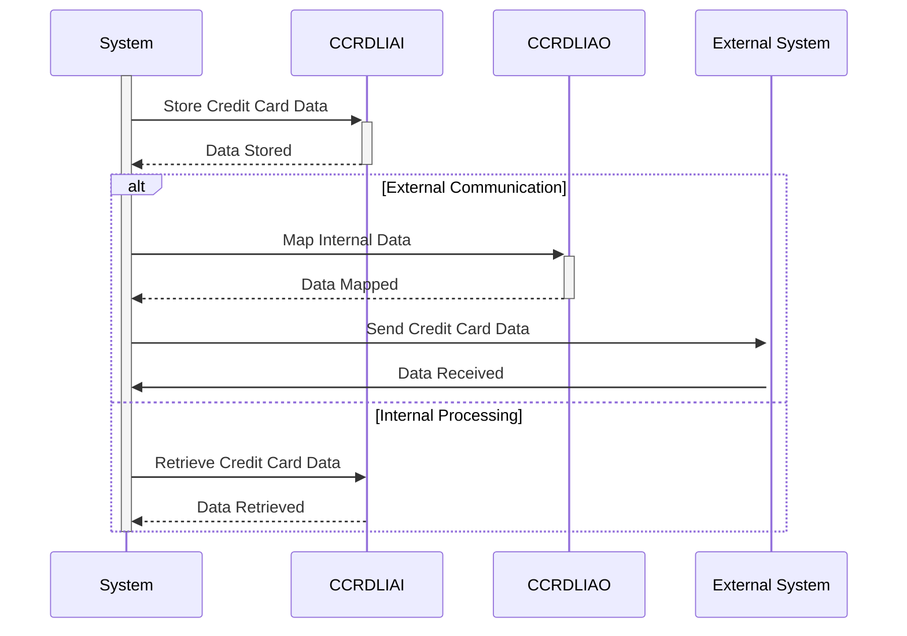

Gerado em: 2 de outubro de 2024

**Título do Documento:** Especificação de Layout de Dados de Cartão de Crédito

**Descrição Resumida:**
Este documento descreve a estrutura das informações de cartão de crédito (CCRDL) usadas no sistema CardDemo. Ele define dois layouts - `CCRDLIAI` (interno) e `CCRDLIAO` (externo) - para lidar com dados de forma consistente e segura em diferentes partes do sistema e durante a comunicação com entidades externas.

**Histórias do Usuário:**
Como administrador do sistema de cartão de crédito, preciso de uma maneira padronizada de armazenar e gerenciar informações de cartão de crédito para garantir a consistência, segurança e processamento eficiente dos dados.

**Epic Relacionado:**
3 - Gestão de Cartão de Crédito

**Requisitos Técnicos:**

- Definição da Estrutura de Dados do Cartão de Crédito: Este código define duas estruturas de dados, `CCRDLIAI` para representação interna e `CCRDLIAO` para comunicação externa. Ambas as estruturas contêm vários campos relacionados às informações do cartão de crédito.
  - Entrada: N/A
  - Cálculo: N/A
  - Saída: Define a estrutura para informações de cartão de crédito, incluindo `TRNNAME`, `TITLE01`, `CURDATE`, `PGMNAME`, `TITLE02`, `CURTIME`, `PAGENO`, `ACCTSID`, `CARDSID`, `CRDSEL[1-7]`, `CRDSTP[1-7]`, `ACCTNO[1-7]`, `CRDNUM[1-7]`, `CRDSTS[1-7]`, `INFOMSG` e `ERRMSG`.

**Modelos Relacionados**

- `CCRDLIAI`
  - `TRNNAME` `Alfanumérico`: Nome ou identificador da transação
  - `TITLE01` `Alfanumérico`: Título descritivo ou cabeçalho para as informações do cartão de crédito
  - `CURDATE` `Data`: Data atual
  - `PGMNAME` `Alfanumérico`: Nome do programa
  - `TITLE02` `Alfanumérico`: Segundo título descritivo ou cabeçalho
  - `CURTIME` `Hora`: Hora atual
  - `PAGENO` `Numérico`: Número da página
  - `ACCTSID` `Alfanumérico`: Identificador da conta
  - `CARDSID` `Alfanumérico`: Identificador do cartão
  - `CRDSEL` `Alfanumérico`: Sinalizador de seleção do cartão de crédito
  - `CRDSTP` `Alfanumérico`: Sinalizador de status ou tipo do cartão de crédito
  - `ACCTNO` `Alfanumérico`: Número da conta
  - `CRDNUM` `Alfanumérico`: Número do cartão de crédito
  - `CRDSTS` `Alfanumérico`: Status do cartão de crédito
  - `INFOMSG` `Alfanumérico`: Mensagem informativa
  - `ERRMSG` `Alfanumérico`: Mensagem de erro

- `CCRDLIAO`
  - `TRNNAME` `Alfanumérico`: Nome ou identificador da transação
  - `TITLE01` `Alfanumérico`: Título descritivo ou cabeçalho para as informações do cartão de crédito
  - `CURDATE` `Data`: Data atual
  - `PGMNAME` `Alfanumérico`: Nome do programa
  - `TITLE02` `Alfanumérico`: Segundo título descritivo ou cabeçalho
  - `CURTIME` `Hora`: Hora atual
  - `PAGENO` `Numérico`: Número da página
  - `ACCTSID` `Alfanumérico`: Identificador da conta
  - `CARDSID` `Alfanumérico`: Identificador do cartão
  - `CRDSEL` `Alfanumérico`: Sinalizador de seleção do cartão de crédito
  - `CRDSTP` `Alfanumérico`: Sinalizador de status ou tipo do cartão de crédito
  - `ACCTNO` `Alfanumérico`: Número da conta
  - `CRDNUM` `Alfanumérico`: Número do cartão de crédito
  - `CRDSTS` `Alfanumérico`: Status do cartão de crédito
  - `INFOMSG` `Alfanumérico`: Mensagem informativa
  - `ERRMSG` `Alfanumérico`: Mensagem de erro

**Configurações:**
N/A

**Melhorias de Código:**
- Adicionar comentários explicando a finalidade de cada campo e estrutura de dados.
- Considere o uso de um dicionário de dados para documentar os elementos de dados e suas definições.
- Implementar regras de validação de dados para garantir a integridade dos dados.
- Usar nomes significativos para variáveis e estruturas de dados.

**Melhorias de Segurança:**
- Criptografar informações confidenciais do cartão de crédito durante o armazenamento e transmissão.
- Implementar medidas de controle de acesso para restringir o acesso não autorizado aos dados do cartão de crédito.
- Realizar auditorias de segurança regulares para identificar e mitigar possíveis vulnerabilidades.
- Seguir as melhores práticas do setor para codificação segura e tratamento de dados.

**Diagrama Conceitual:**

--Made by "Smart Engineering" (by Compass.UOL)--