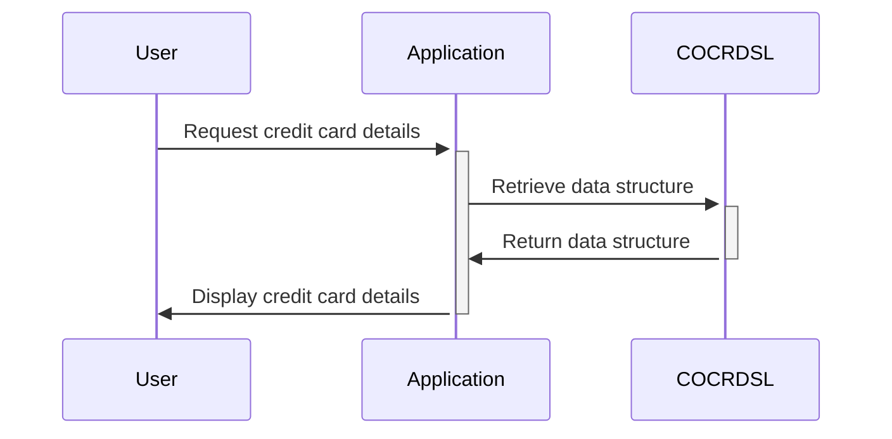

Gerado em: 2 de outubro de 2024

# **Título do Documento:** Estrutura de Dados para Exibição de Cartão de Crédito

**Descrição Resumida:**
Esta especificação define uma estrutura padronizada para armazenar e exibir informações de cartão de crédito em um sistema baseado em COBOL. Ela descreve duas estruturas de dados, `CCRDSLAI` e `CCRDSLAO`, para lidar com dados brutos de cartão de crédito e sua apresentação visual em uma interface de usuário.

**Histórias do Usuário:**
Como desenvolvedor de sistema, preciso de uma maneira padronizada de armazenar e exibir informações de cartão de crédito para garantir a consistência dos dados e uma interface amigável.

**Épico Relacionado:** 
3 - Gestão de Cartão de Crédito

**Requisitos Técnicos:**

- Estrutura de Dados do Cartão de Crédito: Define a estrutura para armazenar informações brutas do cartão de crédito.
  - Entrada: Nenhuma
  - Processamento: Define campos para `TRNNAME`, `TITLE01`, `TITLE02`, `CURDATE`, `CURTIME`, `PGMNAME`, `ACCTSID`, `CARDSID`, `CRDNAME`, `CRDSTCD`, `EXPMON`, `EXPYEAR`, `INFOMSG`, `ERRMSG` e `FKEYS`.
  - Saída: Nenhuma

- Estrutura de Exibição do Cartão de Crédito: Estende a estrutura de dados do cartão de crédito adicionando atributos de exibição para cada campo.
  - Entrada: `CCRDSLAI`
  - Processamento: Define atributos de exibição (`C`, `P`, `H`, `V`, `O`) para cada campo em `CCRDSLAI`, provavelmente representando cor, proteção, status oculto, validação e posição de saída.
  - Saída: Nenhuma

**Modelos Relacionados:**

- `CCRDSLAI`
  - `TRNNAME` `String`: Nome da transação.
  - `TITLE01` `String`: Primeiro título ou cabeçalho.
  - `TITLE02` `String`: Segundo título ou cabeçalho.
  - `CURDATE` `String`: Data atual.
  - `CURTIME` `String`: Hora atual.
  - `PGMNAME` `String`: Nome do programa.
  - `ACCTSID` `String`: Identificador da conta.
  - `CARDSID` `String`: Número do cartão de crédito.
  - `CRDNAME` `String`: Nome do titular do cartão.
  - `CRDSTCD` `String`: Código do tipo de cartão de crédito.
  - `EXPMON` `String`: Mês de expiração.
  - `EXPYEAR` `String`: Ano de expiração.
  - `INFOMSG` `String`: Mensagem informativa.
  - `ERRMSG` `String`: Mensagem de erro.
  - `FKEYS` `String`: Teclas de função.

- `CCRDSLAO`
  - `TRNNAME` `String`: Nome da transação com atributos de exibição.
  - `TITLE01` `String`: Primeiro título ou cabeçalho com atributos de exibição.
  - `TITLE02` `String`: Segundo título ou cabeçalho com atributos de exibição.
  - `CURDATE` `String`: Data atual com atributos de exibição.
  - `CURTIME` `String`: Hora atual com atributos de exibição.
  - `PGMNAME` `String`: Nome do programa com atributos de exibição.
  - `ACCTSID` `String`: Identificador da conta com atributos de exibição.
  - `CARDSID` `String`: Número do cartão de crédito com atributos de exibição.
  - `CRDNAME` `String`: Nome do titular do cartão com atributos de exibição.
  - `CRDSTCD` `String`: Código do tipo de cartão de crédito com atributos de exibição.
  - `EXPMON` `String`: Mês de expiração com atributos de exibição.
  - `EXPYEAR` `String`: Ano de expiração com atributos de exibição.
  - `INFOMSG` `String`: Mensagem informativa com atributos de exibição.
  - `ERRMSG` `String`: Mensagem de erro com atributos de exibição.
  - `FKEYS` `String`: Teclas de função com atributos de exibição.

**Configurações:**
Nenhuma configuração encontrada.

**Melhorias de Código:**

- Adicionar comentários para esclarecer o propósito e o uso de cada campo de dados e atributo de exibição.
- Implementar verificações de validação de dados para números de cartão de crédito, datas de expiração e outros campos relevantes para garantir a integridade dos dados.
- Considerar o uso de uma técnica de mascaramento de dados para ocultar informações confidenciais do cartão de crédito, como os dígitos do meio do número do cartão de crédito, durante a exibição.

**Melhorias de Segurança:**

- Criptografar informações confidenciais do cartão de crédito durante o armazenamento e transmissão.
- Implementar medidas de controle de acesso para restringir o acesso não autorizado a dados de cartão de crédito.
- Registrar todos os acessos às informações do cartão de crédito para fins de auditoria.

**Diagrama Conceitual:**

--Made by "Smart Engineering" (by Compass.UOL)--