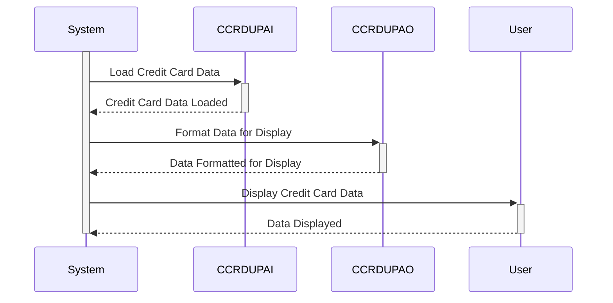

Gerado em: 2 de outubro de 2024

**Título do Documento: Especificação da Estrutura de Dados para Verificação de Duplicidade de Cartão de Crédito**

**Descrição Resumida:**
Esta especificação define as estruturas de dados usadas para verificações de duplicidade de cartão de crédito em um sistema COBOL. Descreve a organização das informações do cartão de crédito para processamento interno e exibição ao usuário, garantindo a integridade dos dados e facilitando a detecção de registros duplicados. A especificação inclui detalhes sobre os campos de dados, seus formatos e a finalidade de cada estrutura, com o objetivo de fornecer uma compreensão clara de como os dados do cartão de crédito são tratados para verificações de duplicidade.

**Histórias do Usuário:**
Como analista de dados, preciso ter certeza de que apenas registros de cartão de crédito válidos e exclusivos sejam usados ​​para análise, para manter a precisão dos dados e evitar problemas decorrentes de entradas duplicadas.

**Épico Relacionado:**
3 - Gestão de Cartão de Crédito

**Requisitos Técnicos:**

- Verificação de Duplicidade de Cartão de Crédito: Este método define duas estruturas de dados, `CCRDUPAI` e `CCRDUPAO`, para organizar as informações do cartão de crédito para verificações de duplicidade. 
  - `CCRDUPAI`: Projetada para processamento interno, esta estrutura usa uma combinação de `COMP PIC S9(n)` para dados numéricos decimais compactados e `PICTURE X(n)` para dados alfanuméricos. `REDEFINES` é usado para fornecer interpretações alternativas de dados.
  - `CCRDUPAO`: Projetada para exibição ao usuário, esta estrutura usa `PICTURE X` para caracteres alfanuméricos únicos e sufixos como `C` (Cor), `P` (Protegido), `H` (Oculto), `V` (Validado) e `O` (Saída) para denotar atributos de apresentação.

**Modelos Relacionados**

- `CCRDUPAI`
  - `TRNNAME` `String`: Nome da transação.
  - `TITLE01` `String`: Título ou cabeçalho para a primeira seção de informações.
  - `CURDATE` `Date`: Data atual.
  - `PGMNAME` `String`: Nome do programa.
  - `TITLE02` `String`: Título ou cabeçalho para a segunda seção de informações.
  - `CURTIME` `Time`: Hora atual.
  - `ACCTSID` `String`: ID da conta.
  - `CARDSID` `String`: Número do cartão de crédito.
  - `CRDNAME` `String`: Nome do titular do cartão.
  - `CRDSTCD` `String`: Código de status do cartão.
  - `EXPMON` `Integer`: Mês de expiração.
  - `EXPYEAR` `Integer`: Ano de expiração.
  - `EXPDAY` `Integer`: Dia de expiração.
  - `INFOMSG` `String`: Mensagens informativas.
  - `ERRMSG` `String`: Mensagens de erro.
  - `FKEYS` `String`: Teclas de função.
  - `FKEYSC` `String`: Descrições das teclas de função.
- `CCRDUPAO`
  - `TRNNAMEO` `String`: Nome da transação.
  - `TITLE01O` `String`: Título ou cabeçalho para a primeira seção de informações.
  - `CURDATEO` `Date`: Data atual.
  - `PGMNAMEO` `String`: Nome do programa.
  - `TITLE02O` `String`: Título ou cabeçalho para a segunda seção de informações.
  - `CURTIMEO` `Time`: Hora atual.
  - `ACCTSIDO` `String`: ID da conta.
  - `CARDSIDO` `String`: Número do cartão de crédito.
  - `CRDNAMEO` `String`: Nome do titular do cartão.
  - `CRDSTCDO` `String`: Código de status do cartão.
  - `EXPMONO` `Integer`: Mês de expiração.
  - `EXPYEARO` `Integer`: Ano de expiração.
  - `EXPDAYO` `Integer`: Dia de expiração.
  - `INFOMSGO` `String`: Mensagens informativas.
  - `ERRMSGO` `String`: Mensagens de erro.
  - `FKEYSO` `String`: Teclas de função.
  - `FKEYSCO` `String`: Descrições das teclas de função.

**Configurações:**
- `COCRDUP.CPY`
  - `TRNNAMEA`: `"Account Update   "`
	- Descrição: Título da tela para a função de atualização de conta.
  - `TITLE01A`: `"Credit Card Detail Update"`
	- Descrição: Título da tela de atualização de detalhes do cartão de crédito.
  - `PGMNAMEA`: `"COCRDUPC"`
	- Descrição: Nome do programa para atualização de detalhes do cartão de crédito.
  - `TITLE02A`: `"Enter All Fields"`
	- Descrição: Instrução para o usuário inserir todos os campos.
  - `INFOMSGA`: `"Enter all data and press ENTER"`
	- Descrição: Mensagem exibida ao usuário, solicitando que ele insira os dados e pressione Enter.
  - `ERRMSGA`: `"Invalid Input, please re-enter"`
	- Descrição: Mensagem de erro exibida ao usuário em caso de entrada inválida.

**Melhorias de Código:**
- **Adicionar Comentários:** Inclua comentários dentro das estruturas de dados para explicar o propósito de cada campo e seu formato.
- **Validação de Dados:** Implemente verificações de validação de dados na lógica do programa para garantir que os números de cartão de crédito, datas de expiração e outros campos estejam em conformidade com os formatos e intervalos esperados.
- **Tratamento de Erros:** Aprimore o tratamento de erros para fornecer mensagens de erro mais específicas e potencialmente permitir a recuperação de erros ou intervenção do usuário.
- **Log:** Implemente o log para rastrear verificações de duplicidade, incluindo os números de cartão de crédito verificados, o resultado da verificação e quaisquer erros encontrados.

**Melhorias de Segurança:**
- **Criptografia:** Criptografe as informações confidenciais do cartão de crédito, tanto no armazenamento quanto durante a transmissão, para protegê-las de acesso não autorizado.
- **Controle de Acesso:** Implemente mecanismos de controle de acesso para restringir o acesso aos dados do cartão de crédito com base nas funções e permissões do usuário.
- **Auditorias de Segurança Regulares:** Conduza auditorias de segurança regulares para identificar e resolver possíveis vulnerabilidades no sistema.
- **Práticas de Codificação Segura:** Siga práticas de codificação segura para minimizar o risco de violações de segurança.

**Diagrama Conceitual:**

--Made by "Smart Engineering" (by Compass.UOL)--