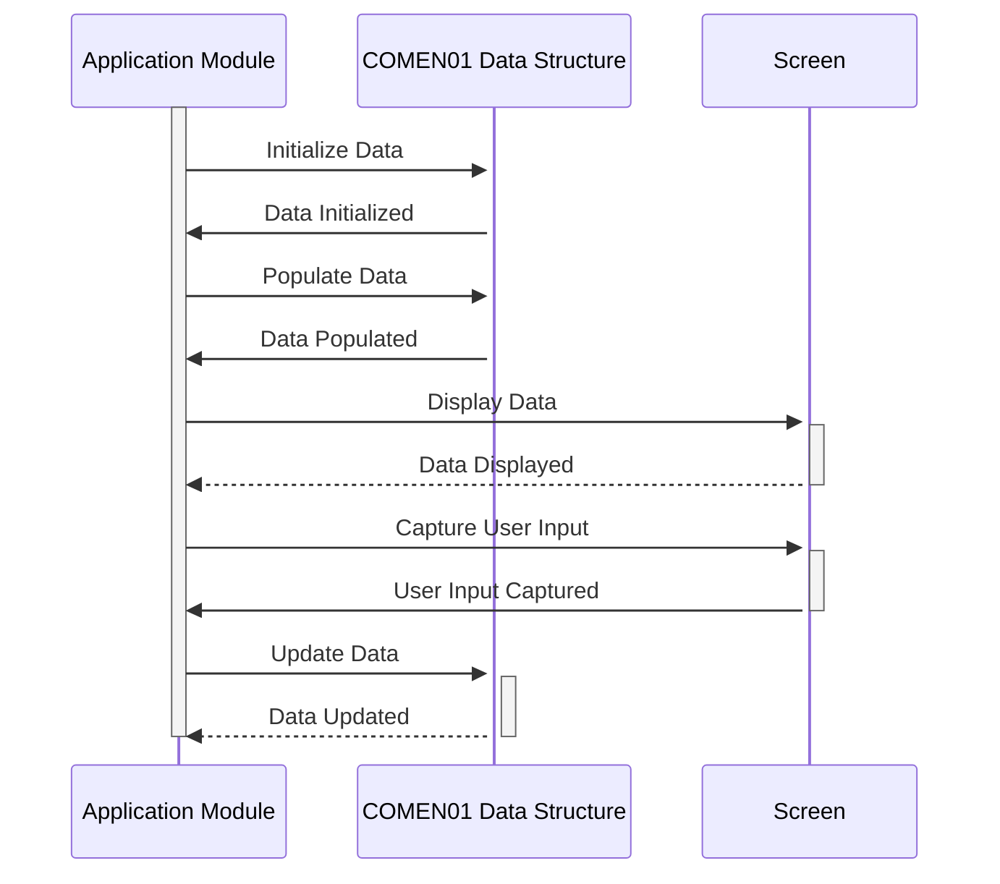

Gerado em: 2 de outubro de 2024

**Título do Documento: COMEN01.CPY - Especificação da Estrutura de Dados Comum**

**Descrição Resumida:**
O copybook COBOL `COMEN01.CPY` define uma estrutura de dados comum para uma aplicação orientada por menus. Ele atua como um contêiner padronizado para informações como nomes de transações, títulos de telas, variáveis do sistema (data e hora atuais), opções de menu, seleções do usuário e mensagens de erro, garantindo consistência entre vários módulos e interações do usuário.

**Histórias do Usuário:**
Como desenvolvedor de aplicações, preciso de uma maneira padronizada de lidar com elementos de dados comuns em diferentes módulos da aplicação para que a troca de dados e as exibições de tela sejam consistentes e fáceis de manter.

**Épico Relacionado:** 9 - Utilitários do Sistema

**Requisitos Técnicos:**

- Inicialização da Estrutura de Dados: Este método inicializa a estrutura de dados com valores padrão.
  - Entrada: Nenhuma
  - Saída: `COMEN1AI` inicializado com valores em branco para campos alfanuméricos e zeros para campos numéricos.

- Mapeamento de Dados de Tela: Este método mapeia os campos da estrutura de dados para os campos de tela correspondentes, facilitando a exibição de dados e a entrada do usuário.
  - Entrada: `COMEN1AO`
  - Saída: Campos de tela preenchidos com dados de `COMEN1AO`.

**Modelos Relacionados**

- `COMEN1AI`: Representa o formato de entrada para elementos de dados comuns.
  - `TRNNAMEI` `String`: Nome da transação.
  - `TITLE01I` `String`: Título ou cabeçalho da tela principal.
  - `CURDATEI` `String`: Data atual.
  - `PGMNAMEI` `String`: Nome do programa ou módulo.
  - `TITLE02I` `String`: Título ou cabeçalho secundário da tela.
  - `CURTIMEI` `String`: Hora atual.
  - `OPTN001I` - `OPTN012I` `String`: Opções do menu.
  - `OPTIONI` `String`: Opção selecionada pelo usuário.
  - `ERRMSGI` `String`: Mensagem de erro.

- `COMEN1AO`: Representa o formato de saída para elementos de dados comuns, incluindo atributos de exibição de tela.
  - `TRNNAMEC` `String`: Atributo de cor para o nome da transação.
  - `TRNNAMEP` `String`: Atributo de proteção para o nome da transação.
  - `TRNNAMEH` `String`: Atributo oculto para o nome da transação.
  - `TRNNAMEV` `String`: Atributo de validação para o nome da transação.
  - `TRNNAMEO` `String`: Posição de saída para o nome da transação.
  - `TITLE01C` `String`: Atributo de cor para o título principal.
  - `TITLE01P` `String`: Atributo de proteção para o título principal.
  - `TITLE01H` `String`: Atributo oculto para o título principal.
  - `TITLE01V` `String`: Atributo de validação para o título principal.
  - `TITLE01O` `String`: Posição de saída para o título principal.
  - `CURDATEC` `String`: Atributo de cor para a data atual.
  - `CURDATEP` `String`: Atributo de proteção para a data atual.
  - `CURDATEH` `String`: Atributo oculto para a data atual.
  - `CURDATEV` `String`: Atributo de validação para a data atual.
  - `CURDATEO` `String`: Posição de saída para a data atual.
  - `PGMNAMEC` `String`: Atributo de cor para o nome do programa.
  - `PGMNAMEP` `String`: Atributo de proteção para o nome do programa.
  - `PGMNAMEH` `String`: Atributo oculto para o nome do programa.
  - `PGMNAMEV` `String`: Atributo de validação para o nome do programa.
  - `PGMNAMEO` `String`: Posição de saída para o nome do programa.
  - `TITLE02C` `String`: Atributo de cor para o título secundário.
  - `TITLE02P` `String`: Atributo de proteção para o título secundário.
  - `TITLE02H` `String`: Atributo oculto para o título secundário.
  - `TITLE02V` `String`: Atributo de validação para o título secundário.
  - `TITLE02O` `String`: Posição de saída para o título secundário.
  - `CURTIMEC` `String`: Atributo de cor para a hora atual.
  - `CURTIMEP` `String`: Atributo de proteção para a hora atual.
  - `CURTIMEH` `String`: Atributo oculto para a hora atual.
  - `CURTIMEV` `String`: Atributo de validação para a hora atual.
  - `CURTIMEO` `String`: Posição de saída para a hora atual.
  - `OPTN001C` - `OPTN012C` `String`: Atributos de cor para as opções do menu.
  - `OPTN001P` - `OPTN012P` `String`: Atributos de proteção para as opções do menu.
  - `OPTN001H` - `OPTN012H` `String`: Atributos ocultos para as opções do menu.
  - `OPTN001V` - `OPTN012V` `String`: Atributos de validação para as opções do menu.
  - `OPTN001O` - `OPTN012O` `String`: Posições de saída para as opções do menu.
  - `OPTIONC` `String`: Atributo de cor para a seleção do usuário.
  - `OPTIONP` `String`: Atributo de proteção para a seleção do usuário.
  - `OPTIONH` `String`: Atributo oculto para a seleção do usuário.
  - `OPTIONV` `String`: Atributo de validação para a seleção do usuário.
  - `OPTIONO` `String`: Posição de saída para a seleção do usuário.
  - `ERRMSGC` `String`: Atributo de cor para a mensagem de erro.
  - `ERRMSGP` `String`: Atributo de proteção para a mensagem de erro.
  - `ERRMSGH` `String`: Atributo oculto para a mensagem de erro.
  - `ERRMSGV` `String`: Atributo de validação para a mensagem de erro.
  - `ERRMSGO` `String`: Posição de saída para a mensagem de erro.

**Configurações:**
Nenhuma configuração específica foi encontrada no trecho de código fornecido. No entanto, o copybook assume a existência de um mecanismo de tratamento de tela (por exemplo, mapas BMS) que usa os atributos de cor, proteção, oculto e validação definidos em `COMEN1AO` para controlar a exibição e interação do usuário com os elementos da tela.

**Melhorias no Código:**

- Adicionar comentários para esclarecer o propósito e o uso de cada campo dentro da estrutura de dados.
- Considerar definir um copybook separado para atributos de exibição de tela para melhorar a organização do código.
- Implementar um mecanismo de tratamento de erros mais robusto, possivelmente incluindo códigos de erro específicos e funcionalidades de registro.

**Melhorias na Segurança:**

- Se a estrutura de dados for usada para lidar com informações confidenciais, considere incorporar técnicas de criptografia ou mascaramento de dados.
- Implementar mecanismos de controle de acesso para restringir modificações não autorizadas na estrutura de dados.
- Adicionar trilhas de auditoria para rastrear alterações feitas na estrutura de dados para fins de segurança e responsabilidade.

**Diagrama Conceitual:**

--Made by "Smart Engineering" (by Compass.UOL)--