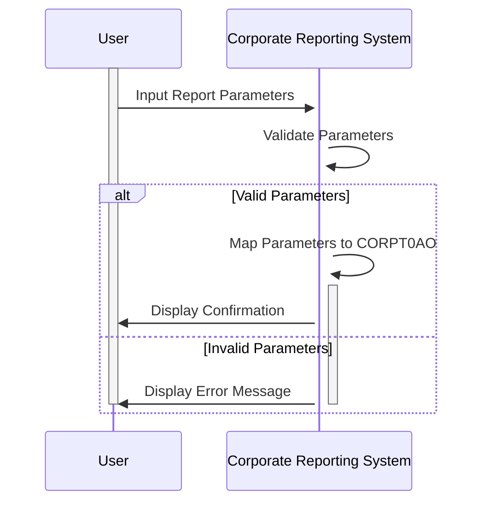

Gerado em: 2 de outubro de 2024

**Título do Documento:** Especificação de Entrada de Parâmetros de Relatório Corporativo

**Descrição Resumida:**
Este documento descreve as especificações para um processo de entrada de parâmetros dentro de um sistema de relatórios corporativos. Ele se concentra em duas estruturas de dados principais, `CORPT0AI` e `CORPT0AO`, responsáveis por lidar com os parâmetros de entrada para gerar vários relatórios corporativos.

**Histórias do Usuário:**
Como usuário de relatório, preciso inserir parâmetros específicos para gerar relatórios corporativos precisos e personalizados.

**Épico Relacionado:**
5 - Relatórios e Análise

**Requisitos Técnicos:**

- Recebimento de Parâmetros de Relatório: Este método recebe parâmetros do usuário por meio de uma interface (provavelmente uma tela ou um formulário).
  - Entrada: Parâmetros fornecidos pelo usuário, como `TRNNAMEx`, `TITLE01x`, `TITLE02x`, `MONTHLYx`, `YEARLYx`, `CUSTOMx`, `SDTMMx`, `SDTDDx`, `SDTYYYx`, `EDTMMx`, `EDTDDx`, `EDTYYYx` e `CONFIRMx`.
  - Saída: Preenche a estrutura de dados `CORPT0AI` com os valores fornecidos pelo usuário.

- Validação de Parâmetros de Relatório: Este método valida os parâmetros recebidos para garantir a integridade dos dados antes da geração do relatório.
  - Entrada: Valores de parâmetro armazenados na estrutura de dados `CORPT0AI`.
  - Validações:
    - Verifique se `TRNNAMEx` é fornecido (campo obrigatório).
    - Valide o tipo de dados de cada parâmetro (numérico, alfanumérico, sinalizador).
    - Certifique-se de que as datas inseridas sejam lógicas e sigam o formato MMDDYYYY.
    - Se o sinalizador `CUSTOMx` for 'Y', certifique-se de que a data de início (`SDTMMx`, `SDTDDx`, `SDTYYYx`) seja anterior à data de término (`EDTMMx`, `EDTDDx`, `EDTYYYx`).
  - Saída: Define `ERRMSGx` em `CORPT0AI` se alguma validação falhar. Se todas as validações forem aprovadas, ele mapeia os dados de `CORPT0AI` para `CORPT0AO`, potencialmente convertendo os dados para um formato adequado para o mecanismo de geração de relatórios.

**Modelos Relacionados**

- `CORPT0AI`
  - `TRNNAMEI` `String`: Nome ou Código do Relatório (por exemplo, "SALESREPORT", "INV001")
  - `TITLE01I` `String`: Título ou Descrição 1 do Relatório Definido pelo Usuário
  - `TITLE02I` `String`: Título ou Descrição 2 do Relatório Definido pelo Usuário
  - `CURDATEI` `Data`: Data Atual (Gerada pelo Sistema) (Formato: MMDDYYYY)
  - `CURTIMEI` `Tempo`: Hora Atual (Gerada pelo Sistema)
  - `MONTHLYI` `Char`: Indica se o relatório é para o período Mensal ('Y' ou 'N')
  - `YEARLYI` `Char`: Indica se o relatório é para o período Anual ('Y' ou 'N')
  - `CUSTOMI` `Char`: Indica se o relatório é para um intervalo de datas personalizado ('Y' ou 'N')
  - `SDTMMI` `Numérico`: Mês Inicial (MM)
  - `SDTDDI` `Numérico`: Dia Inicial (DD)
  - `SDTYYYYI` `Numérico`: Ano Inicial (AAAA)
  - `EDTMMI` `Numérico`: Mês Final (MM)
  - `EDTDDI` `Numérico`: Dia Final (DD)
  - `EDTYYYYI` `Numérico`: Ano Final (AAAA)
  - `CONFIRMI` `Char`: Confirmação do Usuário (por exemplo, "Y" - Sim, prossiga com a geração do relatório)
  - `ERRMSGI` `String`: Campo de Mensagem de Erro (por exemplo, "Intervalo de Datas Inválido", "Nome do Relatório Ausente")
- `CORPT0AO`
  - `TRNNAMEO` `String`: Nome ou Código do Relatório (por exemplo, "SALESREPORT", "INV001")
  - `TITLE01O` `String`: Título ou Descrição 1 do Relatório Definido pelo Usuário
  - `TITLE02O` `String`: Título ou Descrição 2 do Relatório Definido pelo Usuário
  - `CURDATEO` `Data`: Data Atual (Gerada pelo Sistema) (Formato: MMDDYYYY)
  - `CURTIMEO` `Tempo`: Hora Atual (Gerada pelo Sistema)
  - `MONTHLYO` `Char`: Indica se o relatório é para o período Mensal ('Y' ou 'N')
  - `YEARLYO` `Char`: Indica se o relatório é para o período Anual ('Y' ou 'N')
  - `CUSTOMO` `Char`: Indica se o relatório é para um intervalo de datas personalizado ('Y' ou 'N')
  - `SDTMMO` `Numérico`: Mês Inicial (MM)
  - `SDTDDO` `Numérico`: Dia Inicial (DD)
  - `SDTYYYYO` `Numérico`: Ano Inicial (AAAA)
  - `EDTMMO` `Numérico`: Mês Final (MM)
  - `EDTDDO` `Numérico`: Dia Final (DD)
  - `EDTYYYYO` `Numérico`: Ano Final (AAAA)
  - `CONFIRMO` `Char`: Confirmação do Usuário (por exemplo, "Y" - Sim, prossiga com a geração do relatório)
  - `ERRMSGO` `String`: Campo de Mensagem de Erro (por exemplo, "Intervalo de Datas Inválido", "Nome do Relatório Ausente")

**Configurações:**
- Valores Constantes
  - `TRNNAMEI`: `"CORPT"`
	- Descrição: Nome constante para o nome da transação.
  - `TITLE01I`: `"CREDIT CARD DEMO APPLICATION"`
	- Descrição: Nome constante para o título 1.
  - `TITLE02I`: `"CORPORATE PARAMETER INPUT"`
	- Descrição: Nome constante para o título 2.
  - `PGMNAMEI`: `"CORPT00C"`
	- Descrição: Nome constante para o nome do programa.
  - `CONFIRMI`: `"CONFIRM (Y/N)"`
	- Descrição: Nome constante para a mensagem de confirmação.
  - `ERRMSGI`: `"ERROR MESSAGE"`
	- Descrição: Nome constante para a mensagem de erro.

**Melhorias no Código:**
- Melhorar a validação de dados: Implementar verificações mais robustas para intervalos de datas, garantindo que as datas de início sejam anteriores às datas de término e que as datas estejam dentro de limites aceitáveis.
- Aprimorar o tratamento de erros: Fornecer mensagens de erro mais específicas aos usuários, indicando a natureza exata do erro e como corrigi-lo.
- Adicionar registro: Registrar todas as entradas do usuário e ações do sistema para fins de auditoria e solução de problemas.
- Armazenamento de parâmetros: Implementar um mecanismo para armazenar parâmetros de relatório definidos pelo usuário para uso futuro, permitindo que os usuários regenerem facilmente relatórios semelhantes.

**Melhorias de Segurança:**
- Controle de acesso: Implementar controle de acesso baseado em função para restringir o acesso ao processo de entrada de parâmetros com base em funções e permissões do usuário.
- Limpeza de entrada: Limpar todas as entradas do usuário para evitar vulnerabilidades como injeção de SQL.
- Registro de auditoria: Registrar todas as ações do usuário, incluindo entradas de parâmetros, para rastreamento e responsabilidade.

**Diagrama Conceitual:**

--Made by "Smart Engineering" (by Compass.UOL)--