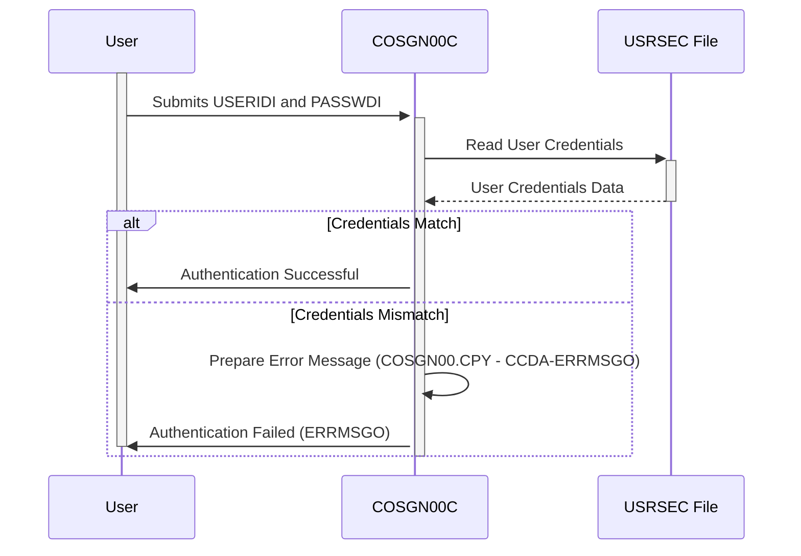

Gerado em: 2 de outubro de 2024

# **Título do Documento:** Autenticação de Usuário do CardDemo

**Descrição Resumida:**
Este documento descreve o processo de Autenticação de Usuário dentro da aplicação CardDemo. Ele detalha como as credenciais do usuário são recebidas, validadas e processadas para acesso seguro ao sistema.

**Histórias do Usuário:**
Como usuário, desejo poder me conectar ao sistema com segurança para que eu possa acessar as informações da minha conta.

**Épico Relacionado:** 6 - Gerenciamento de Usuários e Segurança

**Requisitos Técnicos:**

- **Receber Credenciais do Usuário:**
  - Entrada: Usuário fornece `USERIDI` e `PASSWDI`.
  - Resultado: O sistema recebe `USERIDI` - `{Alfanumérico}` e `PASSWDI` - `{Alfanumérico}`.
- **Validar Credenciais do Usuário:**
  - Entrada: `USERIDI` e `PASSWDI` recebidos.
  - Processo: Comparar as credenciais recebidas com os dados armazenados no arquivo de segurança do usuário (`USRSEC`).
  - Saída: `TRUE` se as credenciais corresponderem, `FALSE` caso contrário.
- **Resposta de Autenticação:**
  - Entrada: Resultado da validação (`TRUE`/`FALSE`).
  - Processo: Se `TRUE`, conceder acesso ao sistema. Se `FALSE`, exibir uma mensagem de erro `COSGN00.CPY - CCDA-ERRMSGO` no campo `ERRMSGO`.
  - Saída: O usuário está conectado ou recebe uma mensagem de erro - `COSGN00.CPY - CCDA-ERRMSGO`.

**Modelos Relacionados**
- `COSGN0AI`
  - `TRNNAMEI` `{Alfanumérico}`: Nome da transação (por exemplo, COSGN).
  - `TITLE01I` `{Alfanumérico}`: Título da tela principal.
  - `CURDATEI` `{Numérico}`: Data atual.
  - `PGMNAMEI` `{Alfanumérico}`: Nome do programa.
  - `TITLE02I` `{Alfanumérico}`: Título secundário da tela.
  - `CURTIMEI` `{Alfanumérico}`: Hora atual.
  - `USERIDI` `{Alfanumérico}`: ID do usuário.
  - `PASSWDI` `{Alfanumérico}`: Senha.
  - `ERRMSGI` `{Alfanumérico}`: Mensagem de erro.
- `COSGN0AO`
  - `TRNNAMEC` `{Alfanumérico}`: Nome da transação (por exemplo, COSGN).
  - `TITLE01O` `{Alfanumérico}`: Título da tela principal.
  - `CURDATEO` `{Numérico}`: Data atual.
  - `PGMNAMEO` `{Alfanumérico}`: Nome do programa.
  - `TITLE02O` `{Alfanumérico}`: Título secundário da tela.
  - `CURTIMEO` `{Alfanumérico}`: Hora atual.
  - `USERIDO` `{Alfanumérico}`: ID do usuário.
  - `PASSWDO` `{Alfanumérico}`: Senha.
  - `ERRMSGO` `{Alfanumérico}`: Mensagem de erro.

**Configurações:**
- `COSGN00.CPY`
  - `CCDA-TRNNAMEI`: `"COSGN"`
	- Descrição: Nome da transação para a tela de login.
  - `CCDA-TITLE01I`: `"CREDIT CARD DEMO APPLICATION"`
	- Descrição: Título principal exibido na tela de login.
  - `CCDA-TITLE02I`: `"SIGN ON"`
	- Descrição: Subtítulo indicando a finalidade da tela.
  - `CCDA-PGMNAMEX`: `"COSGN00C"`
	- Descrição: Nome do programa COBOL que manipula a tela de login.
  - `CCDA-USERIDI`: `"USERID"`
	- Descrição: Rótulo ou prompt para o campo de entrada do ID do usuário.
  - `CCDA-PASSWDI`: `"PASSWORD"`
	- Descrição: Rótulo ou prompt para o campo de entrada da senha.
  - `CCDA-ERRMSGI`: `"ERROR MESSAGE"`
	- Descrição: Rótulo ou área designada para exibir mensagens de erro.
  - `CCDA-TRNNAMEO`: `"COSGN"`
	- Descrição: Nome da transação para a tela de login.
  - `CCDA-TITLE01O`: `"CREDIT CARD DEMO APPLICATION"`
	- Descrição: Título principal exibido na tela de login.
  - `CCDA-TITLE02O`: `"SIGN ON"`
	- Descrição: Subtítulo indicando a finalidade da tela.
  - `CCDA-PGMNAMEO`: `"COSGN00C"`
	- Descrição: Nome do programa COBOL que manipula a tela de login.
  - `CCDA-USERIDO`: `"USERID"`
	- Descrição: Rótulo ou prompt para o campo de entrada do ID do usuário.
  - `CCDA-PASSWDO`: `"PASSWORD"`
	- Descrição: Rótulo ou prompt para o campo de entrada da senha.
  - `CCDA-ERRMSGO`: `"ERROR MESSAGE"`
	- Descrição: Rótulo ou área designada para exibir mensagens de erro.

**Melhorias de Código:**
- Implementar um mecanismo de autenticação mais robusto, como um sistema de desafio-resposta ou autenticação multifator.
- Usar um algoritmo de hash seguro para armazenar senhas em vez de texto simples.
- Implementar políticas de bloqueio de conta após um certo número de tentativas de login malsucedidas.

**Melhorias de Segurança:**
- Criptografar dados confidenciais em repouso e em trânsito.
- Implementar políticas de senha forte.
- Auditar regularmente o sistema em busca de vulnerabilidades de segurança.

**Diagrama Conceitual:**

--Made by "Smart Engineering" (by Compass.UOL)--