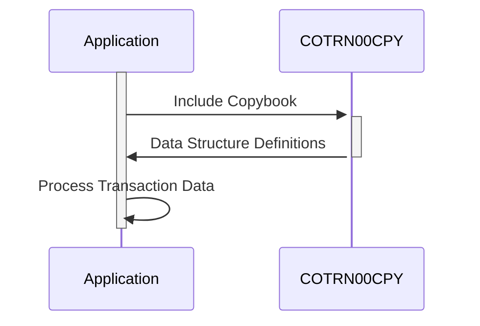

Gerado em: 2 de Outubro de 2024

**Título do Documento:** Especificação da Estrutura de Dados de Transações

**Descrição Resumida:**
Este copybook COBOL, `COTRN00.CPY`, define uma estrutura de dados padronizada para representar informações de transações financeiras. Ele inclui dois layouts: `COTRN0AI` para processamento interno e `COTRN0AO` para formatação de saída, ambos contendo campos como ID da transação, data, descrição, valor e sinalizadores de seleção. Essa estrutura garante consistência e integridade de dados no tratamento de operações financeiras em diferentes partes do sistema.

**Histórias do Usuário:**
Como analista de dados, preciso de um formato padronizado para dados de transações para que eu possa analisar facilmente o histórico de transações, gerar relatórios e identificar tendências.

**Épico Relacionado:**
4 - Processamento de Transações

**Requisitos Técnicos:**
- **Definição da Estrutura de Dados de Transação:** O código define duas estruturas de dados, `COTRN0AI` e `COTRN0AO`, para representar informações de transações.
- **Campos de Dados:** Ambas as estruturas incluem campos comuns como `TRNID`, `TDATE`, `TDESC`, `TAMT` e `SEL####`.
- **Tipos de Dados e Tamanhos:** Cada campo é definido com um tipo de dados e tamanho específicos, garantindo a integridade e a consistência dos dados.
- **Reutilização:** O copybook foi projetado para ser incluído em outros programas, promovendo a reutilização de código e a padronização.

**Modelos Relacionados**
- `COTRN0AI`
  - `TRNID` `String (16)`: ID exclusivo da transação
  - `TDATE` `Date`: Data da transação (AAAA-MM-DD)
  - `TDESC` `String (26)`: Descrição da transação
  - `TAMT` `Decimal (12)`: Valor da transação
  - `SEL####` `Flag (1)`: Sinalizador de seleção (S/N)
- `COTRN0AO`
  - `TRNID` `String (16)`: ID exclusivo da transação
  - `TDATE` `Date`: Data da transação (AAAA-MM-DD)
  - `TDESC` `String (26)`: Descrição da transação
  - `TAMT` `Decimal (12)`: Valor da transação
  - `SEL####` `Flag (1)`: Sinalizador de seleção (S/N)

**Configurações:**
- Valores Constantes
  - `COTRN0AI`: `{Nome da Estrutura}`
	- Descrição: Estrutura de dados para processamento interno.
  - `COTRN0AO`: `{Nome da Estrutura}`
	- Descrição: Estrutura de dados para formatação de saída.

**Melhorias de Código:**
- **Documentação:** Adicione comentários para esclarecer o propósito e o uso de cada campo nas estruturas de dados.
- **Tratamento de Erros:** Implemente rotinas de tratamento de erros para lidar com dados inválidos ou condições inesperadas durante o processamento de dados.
- **Controle de Versão:** Use um sistema de controle de versão para rastrear alterações no copybook e garantir a consistência entre os diferentes programas.

**Melhorias de Segurança:**
- **Controle de Acesso:** Implemente mecanismos de controle de acesso para restringir o acesso não autorizado a dados confidenciais de transações.
- **Criptografia de Dados:** Considere criptografar dados confidenciais de transações, como números de contas e valores de transações, para protegê-los contra acesso não autorizado.
- **Auditoria:** Implemente mecanismos de auditoria para rastrear as alterações feitas no copybook e nos dados de transações, garantindo a responsabilidade e a rastreabilidade.

**Diagrama Conceitual:**

--Made by "Smart Engineering" (by Compass.UOL)--