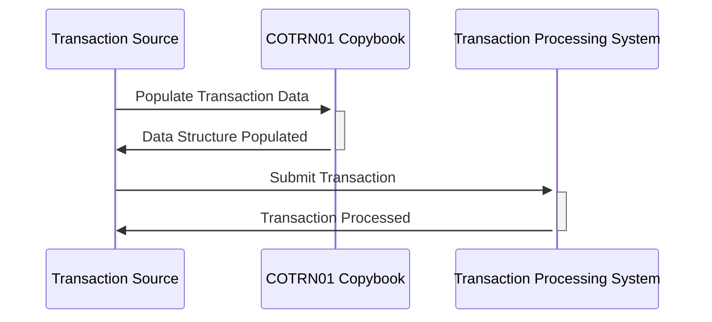

Gerado em: 2 de outubro de 2024

**Título do Documento:** Registro de Transação de Cartão de Crédito - Especificação da Estrutura de Dados

**Descrição Resumida:**
Este documento define a estrutura de dados para armazenar detalhes de transações de cartão de crédito em um aplicativo COBOL. Ele inclui campos para ID da transação, número do cartão, detalhes do comerciante, timestamps e mensagens de erro. A estrutura foi projetada para ser usada em formatos baseados em caracteres e decimais compactados.

**Histórias de Usuário:**
Como analista de dados, preciso de um formato padronizado para registros de transações de cartão de crédito para que eu possa realizar análises e relatórios de dados de transações de forma consistente e precisa.

**Épico Relacionado:**
4 - Processamento de Transações

**Requisitos Técnicos:**
- **Definição da Estrutura de Dados da Transação:** Este método define a estrutura de um registro de transação de cartão de crédito.
  - Etapa: Defina dois layouts para o registro de transação, `COTRN1AI` e `COTRN1AO`.
  - Etapa: Defina campos para detalhes da transação, informações do cartão, detalhes do comerciante, timestamps e mensagens de erro.
  - Resultado: Uma estrutura de dados padronizada para armazenar e trocar informações de transações.

**Modelos Relacionados**
- `COTRN1AI`
  - `TRNIDINI` `Alphanumeric`: Identificador único para a transação. 
  - `CARDNUMI` `Alphanumeric`: Número do cartão de crédito usado na transação.
  - `TTYPCDI` `Alphanumeric`: Código que indica o tipo de transação (por exemplo, compra, reembolso).
  - `TRNSRCI` `Alphanumeric`: Origem da transação (por exemplo, online, terminal POS).
  - `TDESCI` `Alphanumeric`: Descrição da transação.
  - `TRNAMTI` `Alphanumeric`: Valor da transação.
  - `MIDI` `Alphanumeric`: Identificador único do comerciante envolvido.
  - `MNAMEI` `Alphanumeric`: Nome do comerciante.
  - `ERRMSGI` `Alphanumeric`: Mensagem indicando quaisquer erros encontrados durante a transação.
  - `TRNNAMEI` `Alphanumeric`: Nome da transação.
  - `TITLE01I` `Alphanumeric`: Primeiro título da transação.
  - `CURDATEI` `Alphanumeric`: Data da transação.
  - `PGMNAMEI` `Alphanumeric`: Nome do programa associado à transação.
  - `TITLE02I` `Alphanumeric`: Segundo título da transação.
  - `CURTIMEI` `Alphanumeric`: Hora da transação.
  - `TRNIDI` `Alphanumeric`: ID secundário da transação.
  - `TCATCDI` `Alphanumeric`: Código da categoria da transação.
  - `TORIGDTI` `Alphanumeric`: Data e hora de origem da transação.
  - `TPROCDTI` `Alphanumeric`: Data e hora de processamento da transação.
  - `MCITYI` `Alphanumeric`: Cidade do comerciante.
  - `MZIPI` `Alphanumeric`: Código postal do comerciante.

**Configurações:**
- Não disponível.

**Melhorias de Código:**
- Adicionar verificações de validação de dados para cada campo para garantir a integridade dos dados.
- Implementar tratamento de erros para lidar normalmente com dados inválidos ou ausentes.
- Documentar o propósito e o uso de cada campo na estrutura de dados.
- Considere usar um dicionário de dados para gerenciar centralmente as definições de dados.

**Melhorias de Segurança:**
- Criptografar campos de dados confidenciais, como o número do cartão de crédito, para proteger as informações do cliente.
- Implementar mecanismos de controle de acesso para restringir o acesso não autorizado aos dados da transação.
- Registrar todos os acessos e modificações de dados para fins de auditoria.

**Diagrama Conceitual:**

--Made by "Smart Engineering" (by Compass.UOL)--