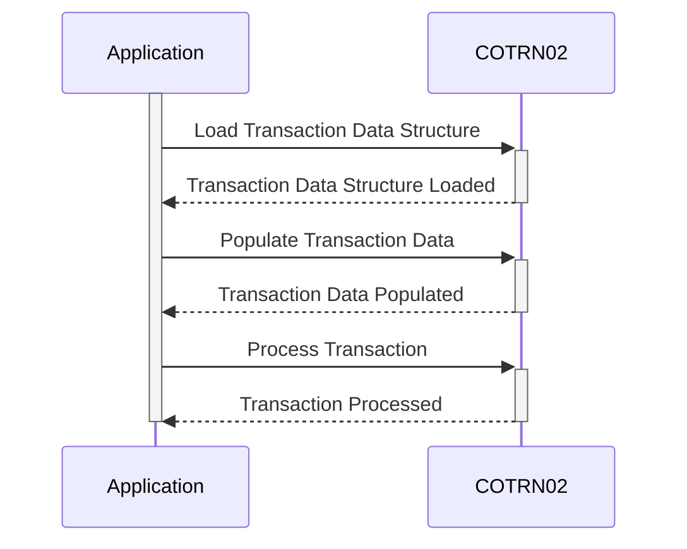

Gerado em: 2 de outubro de 2024

**Título do Documento: CardDemo Application - Especificação da Estrutura de Dados de Transação**

**Descrição Resumida:**
Este documento especifica a estrutura de dados para transações com cartão de crédito no aplicativo CardDemo. Ele define um formato padronizado para capturar e armazenar os principais detalhes da transação, permitindo processamento e análise consistentes.

**Histórias do Usuário:**
Como analista de dados, preciso de uma estrutura de dados padronizada para transações com cartão de crédito para que eu possa realizar análises de dados de transações com precisão e eficiência.

**Épico Relacionado:**
4 - Processamento de Transações

**Requisitos Técnicos:**

- Gerenciamento de Dados de Transação: este método define a estrutura de dados para entrada e saída relacionadas a transações no aplicativo CardDemo.
  - Entrada: recebe dados sobre uma transação, incluindo `TRNNAME`, `CURDATE`, `CURTIME`, `ACTIDIN`, `CARDNIN`, `TTYPCD`, `TCATCD`, `TRNSRC`, `TDESC`, `TRNAMT`, `TORIGDT`, `TPROCDT`, `MID`, `MNAME`, `MCITY`, `MZIP`, `CONFIRM` e `ERRMSG`.
  - Saída: envia dados sobre a transação, incluindo `TRNNAME`, `CURDATE`, `CURTIME`, `ACTIDIN`, `CARDNIN`, `TTYPCD`, `TCATCD`, `TRNSRC`, `TDESC`, `TRNAMT`, `TORIGDT`, `TPROCDT`, `MID`, `MNAME`, `MCITY`, `MZIP`, `CONFIRM` e `ERRMSG`.

**Modelos Relacionados**
- Dados de Transação
  - `TRNNAME` `String`: Nome da Transação (por exemplo, compra, reembolso).
  - `CURDATE` `Data`: Data da transação.
  - `CURTIME` `Hora`: Hora da transação.
  - `ACTIDIN` `String`: ID da Atividade (identificador exclusivo para a transação).
  - `CARDNIN` `String`: Número do Cartão de Crédito.
  - `TTYPCD` `String`: Código do Tipo de Transação.
  - `TCATCD` `String`: Código da Categoria da Transação.
  - `TRNSRC` `String`: Origem da Transação (por exemplo, online, POS).
  - `TDESC` `String`: Descrição da Transação.
  - `TRNAMT` `Numérico`: Valor da Transação.
  - `TORIGDT` `Data`: Data de Origem da Transação.
  - `TPROCDT` `Data`: Data de Processamento da Transação.
  - `MID` `String`: ID do Comerciante.
  - `MNAME` `String`: Nome do Comerciante.
  - `MCITY` `String`: Cidade do Comerciante.
  - `MZIP` `String`: CEP do Comerciante.
  - `CONFIRM` `String`: Status de Confirmação (por exemplo, aprovado, recusado).
  - `ERRMSG` `String`: Mensagem de Erro (se houver).

**Configurações:**
- `COTRN02.CPY`
  - `COTRN2AI`: `{Data Structure}`
	- Descrição: Define a estrutura para dados de transação de entrada.
  - `COTRN2AO`: `{Data Structure}`
	- Descrição: Define a estrutura para dados de transação de saída.

**Melhorias de Código:**
- Implementar verificações de validação de dados para cada campo na estrutura de dados para garantir a integridade dos dados.
- Adicionar comentários ao copybook para explicar a finalidade e o uso de cada campo.
- Considere o uso de um dicionário de dados para documentar a estrutura de dados e seus campos em um local centralizado.

**Melhorias de Segurança:**
- Se a estrutura de dados contiver informações confidenciais, como números de cartão de crédito, implemente mecanismos de criptografia apropriados para proteger os dados em repouso e em trânsito.
- Certifique-se de que o acesso à estrutura de dados seja restrito apenas ao pessoal autorizado.
- Implementar trilhas de auditoria para rastrear quaisquer modificações feitas na estrutura de dados.

**Diagrama Conceitual:**

--Made by "Smart Engineering" (by Compass.UOL)--