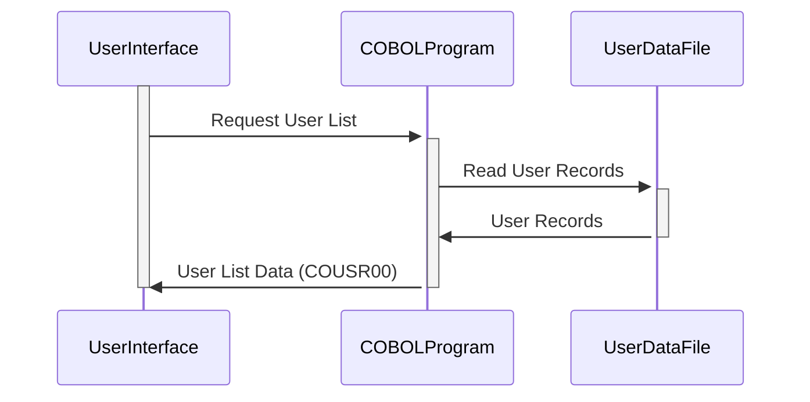

Gerado em: 2 de outubro de 2024

**Título do Documento: Especificação do Copybook COUSR00**

**Descrição Resumida:**
Este documento detalha a estrutura e o uso do copybook `COUSR00.CPY`, que define estruturas de dados para exibição e manipulação de informações do usuário em uma aplicação COBOL. Ele descreve os campos usados para representar detalhes do usuário, informações do sistema e sinalizadores de seleção para operações de gerenciamento de usuários.

**Histórias de Usuário:**
Como administrador, preciso de uma maneira de visualizar uma lista de usuários no sistema para que eu possa gerenciar suas contas e permissões.

**Épico Relacionado:**
6 - Gerenciamento de Usuários e Segurança

**Requisitos Técnicos:**

- **Definição da Estrutura de Dados do Usuário:** Define duas estruturas de dados, `COUSR0AI` (entrada) e `COUSR0AO` (saída), usando a cláusula `REDEFINES` para permitir diferentes interpretações dos mesmos dados.
  - Entrada: N/A
  - Resultado `COUSR0AI` e `COUSR0AO`: Estruturas de dados contendo informações do usuário, detalhes do sistema e sinalizadores de seleção.

**Modelos Relacionados**

- **`COUSR00`**
  - `TRNNAM` `String`: Nome da transação.
  - `PGMNAM` `String`: Nome do programa.
  - `CURDAT` `Date`: Data atual.
  - `CURTIM` `Time`: Hora atual.
  - `PAGENU` `Integer`: Número da página.
  - `USRID` `String`: ID exclusivo do usuário.
  - `FNAME` `String`: Primeiro nome do usuário.
  - `LNAME` `String`: Sobrenome do usuário.
  - `UTYPE` `String`: Código do tipo de usuário.
  - `SEL####` `Boolean`: Sinalizador de seleção para cada linha de usuário (por exemplo, `SEL0001`, `SEL0002`).

**Configurações:**

- N/A - Nenhum valor de configuração específico é definido diretamente no copybook.

**Melhorias de Código:**

- **Documentação:** Adicione comentários para esclarecer o propósito e o uso de cada campo dentro das estruturas de dados.
- **Padronização:** Considere usar uma convenção de nomenclatura consistente para campos (por exemplo, usando sublinhados para separar palavras) para melhorar a legibilidade.
- **Validação de Dados:** Implemente verificações de validação de dados dentro do programa que usa este copybook para garantir a integridade dos dados (por exemplo, verificando se há tipos de usuário válidos, IDs de usuário não vazios).

**Melhorias de Segurança:**

- **Manuseio de Dados Confidenciais:** Se a estrutura `COUSR00` contiver informações confidenciais (por exemplo, senhas), considere criptografar esses dados ou armazená-los separadamente em um local mais seguro.
- **Controle de Acesso:** Implemente mecanismos de controle de acesso para restringir o acesso às informações do usuário com base em funções e permissões do usuário.

**Diagrama Conceitual:**

--Made by "Smart Engineering" (by Compass.UOL)--