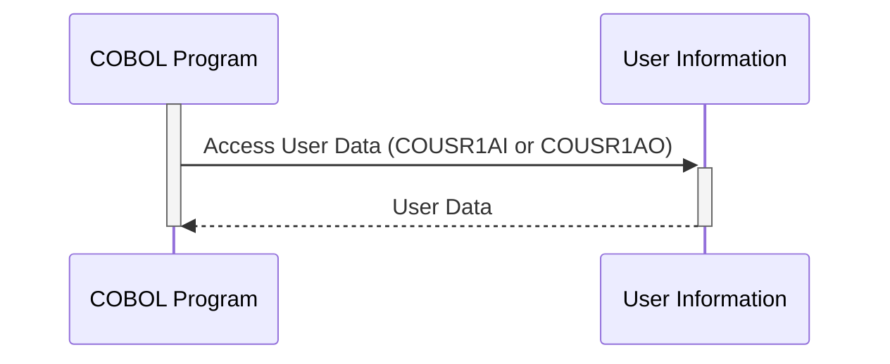

Gerado em: 2 de Outubro de 2024

**Título do Documento: COUSR01 - Especificação do Copybook de Informações do Usuário**

**Descrição Resumida:**
O copybook `COUSR01` define uma estrutura padronizada para armazenar e acessar informações do usuário dentro de um sistema baseado em COBOL. Ele fornece duas visualizações diferentes dos mesmos dados do usuário, atendendo a potenciais variações no acesso e apresentação de dados.

**Histórias do Usuário:**
Como administrador do sistema, preciso de uma maneira confiável e estruturada para gerenciar as informações do usuário, incluindo suas credenciais, detalhes pessoais e níveis de acesso ao sistema. Isso garante autenticação segura, recuperação eficiente de dados e operações consistentes de gerenciamento de usuários.

**Épico Relacionado:**
6 - Gerenciamento de Usuários e Segurança

**Requisitos Técnicos:**
- **Estrutura de Informação do Usuário:**
  - O copybook define duas estruturas de dados (`COUSR1AI` e `COUSR1AO`) para representar as informações do usuário.
  - Ambas as estruturas contêm campos para armazenar dados relacionados ao usuário, como nomes de transações, títulos, datas, horários, primeiro nome, sobrenome, ID do usuário, senha, tipo de usuário e mensagens de erro.
  - `COUSR1AO` redefine `COUSR1AI` para fornecer uma visão alternativa dos mesmos dados, potencialmente para fins de exibição ou comunicação.
- **Tipos de Dados e Comprimentos:**
  - Cada campo nas estruturas de dados tem um tipo de dado definido (por exemplo, `COMP`, `PICTURE X`, `PIC X(n)`) e comprimento.
  - Isso garante que o sistema aloque a quantidade correta de armazenamento para cada informação e a trate adequadamente.
- **Validação de Dados (Não Implementado no Copybook):**
  - O próprio copybook não implementa regras de validação de dados.
  - É crucial implementar rotinas de validação de dados nos programas COBOL que usam este copybook para manter a integridade dos dados.
  - As validações devem incluir verificações para:
    - Formatos válidos de ID de usuário.
    - Requisitos de complexidade de senha.
    - Caracteres permitidos em nomes e outros campos.
    - Compatibilidade de tipo de dados (por exemplo, valores numéricos em campos numéricos).
- **Tratamento de Erros (Parcialmente Abordado):**
  - O copybook inclui um campo `ERRMSGI` para armazenar mensagens de erro relacionadas aos dados do usuário.
  - No entanto, ele não define códigos de erro específicos ou mecanismos de tratamento.
  - Os programas COBOL que usam este copybook devem implementar um tratamento de erros robusto, incluindo:
    - Definir códigos de erro específicos para diferentes situações (por exemplo, ID de usuário inválido, senha incorreta).
    - Registrar detalhes do erro para auditoria e solução de problemas.
    - Exibir mensagens de erro amigáveis ao usuário.
- **Considerações de Segurança:**
  - **Armazenamento de Senha:**
    - O copybook não especifica como as senhas são armazenadas.
    - É crucial **NÃO** armazenar senhas em texto simples.
    - Implementar algoritmos seguros de hash de senha (por exemplo, bcrypt, scrypt) para proteger as senhas contra acesso não autorizado.
  - **Controle de Acesso:**
    - O campo `USRTYPEI` provavelmente indica funções e níveis de permissão do usuário.
    - Aproveite este campo para impor o controle de acesso baseado em funções (RBAC) dentro do sistema.
    - Certifique-se de que os usuários só possam acessar e modificar dados de acordo com suas funções e permissões atribuídas.

**Modelos Relacionados**
- `User`: Representa um usuário no sistema.
  - `TRNNAMEI` `String`: Nome da transação.
  - `TITLE01I` `String`: Primeiro título.
  - `CURDATEI` `String`: Data atual.
  - `PGMNAMEI` `String`: Nome do programa.
  - `TITLE02I` `String`: Segundo título.
  - `CURTIMEI` `String`: Hora atual.
  - `FNAMEI` `String`: Primeiro nome.
  - `LNAMEI` `String`: Sobrenome.
  - `USERIDI` `String`: ID do usuário.
  - `PASSWDI` `String`: Senha (deve ser criptografada com hash).
  - `USRTYPEI` `String`: Tipo de usuário (por exemplo, 'A' para administrador, 'U' para usuário regular).
  - `ERRMSGI` `String`: Mensagem de erro relacionada aos dados do usuário.

**Configurações:**
- Nenhuma configuração encontrada.

**Melhorias de Código:**
- **Validação de Dados:** Implemente regras abrangentes de validação de dados dentro dos programas COBOL que usam este copybook para garantir a precisão e integridade dos dados.
- **Tratamento de Erros:** Aprimore o tratamento de erros definindo códigos de erro específicos, registrando detalhes do erro e apresentando mensagens amigáveis ao usuário.
- **Segurança de Senha:** Nunca armazene senhas em texto simples. Use algoritmos de hash unidirecionais fortes para proteger as senhas.
- **Documentação:** Adicione comentários ao copybook para explicar a finalidade de cada campo e quaisquer regras de negócios associadas.
- **Padrões de Codificação:** Aplique padrões de codificação consistentes para melhorar a legibilidade e a manutenção.

**Melhorias de Segurança:**
- **Hash de Senha:** Implemente um mecanismo seguro de hash de senha para proteger as senhas do usuário contra acesso não autorizado.
- **Controle de Acesso:** Imponha medidas rígidas de controle de acesso com base nas funções e permissões do usuário para evitar acesso não autorizado e modificações de dados.
- **Criptografia de Dados:** Considere criptografar informações confidenciais do usuário, tanto em trânsito quanto em repouso, para proteger contra violações de dados.
- **Trilhas de Auditoria:** Implemente trilhas de auditoria para rastrear eventos relacionados ao usuário, como tentativas de login, atualizações de perfil e alterações de dados, para fins de segurança e conformidade.

**Diagrama Conceitual:**

--Made by "Smart Engineering" (by Compass.UOL)--