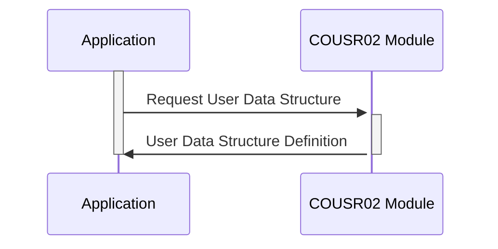

Gerado em: 2 de outubro de 2024

**Título do Documento: COUSR02.CPY - Estrutura de Dados do Usuário para Acesso Seguro**

**Descrição Resumida:**
Este código define a estrutura para armazenar e acessar informações do usuário, incluindo dados confidenciais como senhas, de forma segura e organizada. Ele garante a consistência dos dados e estabelece a base para autenticação e autorização do usuário dentro de um sistema maior.

**Histórias de Usuário:**
Como administrador do sistema, preciso de uma maneira segura de armazenar e gerenciar informações da conta do usuário, incluindo senhas e níveis de acesso, para garantir que apenas pessoal autorizado possa acessar dados e funcionalidades confidenciais.

**Épico Relacionado:**
6 - Gerenciamento de Usuários e Segurança

**Requisitos Técnicos:**

- **Definição da Estrutura de Dados do Usuário:** Este código define a estrutura de como as informações do usuário são organizadas e armazenadas.
  - Entrada: Nenhuma.
  - Processamento: Define dois layouts de dados, `COUSR2AI` e `COUSR2AO`, para representar as informações do usuário. Cada layout contém campos para ID do usuário (`USRIDIN`), senha (`PASSWD`), primeiro nome (`FNAME`), sobrenome (`LNAME`), tipo de usuário (`USRTYPE`), nome da transação (`TRNNAME`), data atual (`CURDATE`), hora atual (`CURTIME`), nome do programa (`PGMNAME`), títulos (`TITLE01`, `TITLE02`) e mensagens de erro (`ERRMSG`).
  - Resultado: Duas estruturas de dados são definidas para armazenar informações do usuário.

**Modelos Relacionados:**

- **Usuário:** Representa uma conta de usuário dentro do sistema.
  - `USRIDIN` `String`: Identificador exclusivo para o usuário.
  - `PASSWD` `String`: Senha do usuário, deve ser armazenada com segurança usando hashing.
  - `FNAME` `String`: Primeiro nome do usuário.
  - `LNAME` `String`: Sobrenome do usuário.
  - `USRTYPE` `String`: Função e nível de acesso do usuário (por exemplo, 'A' para administrador, 'U' para usuário regular).

**Configurações:**

- **COUSR02.CPY:**
  - Nenhuma

**Melhorias de Código:**

- **Segurança de Senha:** O código menciona um campo de senha (`PASSWD`) mas não especifica como ele é armazenado. **Implemente um algoritmo robusto de hash de senha (por exemplo, bcrypt, scrypt) para armazenar senhas com segurança.** Nunca armazene senhas em texto simples.
- **Validação de Dados:**  Adicione verificações de validação de dados para campos como `USRIDIN`, `FNAME`, `LNAME` e `USRTYPE` para garantir a integridade dos dados e evitar problemas potenciais de entrada malformada.
- **Tratamento de Erros:**  Incorpore mecanismos de tratamento de erros para lidar normalmente com cenários como IDs de usuário inválidos, senhas incorretas ou erros de acesso a dados.
- **Documentação:** Adicione comentários para explicar o propósito de cada campo e a funcionalidade geral do código. Isso torna o código mais fácil de entender e manter.

**Melhorias de Segurança:**

- **Criptografia de Dados:** Considere criptografar toda a estrutura de dados do usuário, especialmente ao armazená-la em disco ou transmiti-la por uma rede.
- **Controle de Acesso:** Implemente medidas rígidas de controle de acesso para restringir o acesso a este código e aos dados que ele manipula. Somente pessoal autorizado deve poder modificar as informações do usuário.
- **Auditoria:** Registre todas as alterações de conta de usuário, incluindo criação, modificação e exclusão. Isso fornece um registro de auditoria para fins de segurança e responsabilidade.

**Diagrama Conceitual:**

--Made by "Smart Engineering" (by Compass.UOL)--