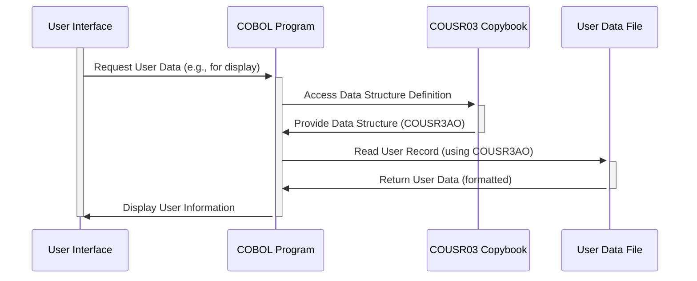

Gerado em: 2 de outubro de 2024

**Título do Documento:** Gerenciamento de Informações do Usuário - Especificação do Copybook COUSR03

**Descrição Resumida:**
Este copybook COBOL define uma estrutura de dados padronizada para informações do usuário dentro do aplicativo CardDemo, delineando campos para identificação, atributos, detalhes de interação do sistema e comunicação. Ele facilita o tratamento consistente de dados do usuário em diferentes programas e funcionalidades, suportando atividades como autenticação do usuário, autorização, rastreamento e mensagens.

**Histórias do Usuário:**
Como administrador do sistema, preciso de uma maneira padronizada de definir e gerenciar informações do usuário, incluindo suas credenciais, funções e detalhes de interação com o sistema, para que eu possa controlar efetivamente o acesso, monitorar atividades e me comunicar com os usuários dentro do aplicativo CardDemo.

**Épico Relacionado:**
6 - Gerenciamento de Usuários e Segurança

**Requisitos Técnicos:**
- **Definição da Estrutura de Dados do Usuário:**
  - Objetivo: Definir uma estrutura consistente para armazenar e acessar informações do usuário dentro do aplicativo CardDemo.
  - Entrada: Nenhuma. A estrutura de dados é definida dentro do próprio copybook.
  - Processamento: O copybook utiliza a sintaxe de definição de dados COBOL para definir campos para `USRIDINI` (ID do Usuário), `FNAMEI` (Primeiro Nome), `LNAMEI` (Sobrenome), `USRTYPEI` (Tipo de Usuário), `TRNNAMEI` (Nome da Transação), `PGMNAMEI` (Nome do Programa), `CURDATEI` (Data Atual), `CURTIMEI` (Hora Atual) e `ERRMSGI` (Mensagem de Erro).
  - Saída: Fornece um modelo padronizado (`COUSR3AI` e `COUSR3AO`) para representar dados do usuário, garantindo consistência entre os diferentes programas que usam este copybook.
- **Aplicação de Tipo de Dados e Comprimento:**
  - Objetivo: Garantir a integridade dos dados especificando o tipo e o comprimento máximo para cada campo na estrutura de informações do usuário.
  - Entrada: Dados atribuídos aos campos das estruturas de dados `COUSR3AI` ou `COUSR3AO`.
  - Processamento: O mecanismo inerente de tipagem de dados do COBOL (cláusula `PIC`) aplica os tipos e comprimentos de dados especificados. Por exemplo, `USRIDINI PIC X(8)` restringe o ID do Usuário a 8 caracteres alfanuméricos.
  - Saída: Informações do usuário armazenadas e processadas de acordo com os tipos e comprimentos de dados definidos, evitando potencial truncamento ou corrupção de dados.
- **Identificação e Exclusividade do Usuário:**
  - Objetivo: Fornecer um mecanismo para identificar exclusivamente cada usuário dentro do sistema CardDemo.
  - Entrada: ID do Usuário (`USRIDINI`) fornecido durante a criação ou modificação do usuário.
  - Processamento: Os programas que usam este copybook são responsáveis por garantir a exclusividade do campo `USRIDINI`, potencialmente verificando se há duplicatas antes de criar um novo registro de usuário.
  - Saída: Cada registro de usuário é identificável por um ID de Usuário exclusivo, facilitando o gerenciamento individual do usuário, rastreamento e comunicação. 

**Modelos Relacionados**

- **`COUSR3AI`:** Representação interna dos dados do usuário.
  - `USRIDINI` `PIC X(8)`: Identificador exclusivo do usuário.
  - `FNAMEI` `PIC X(20)`: Primeiro nome do usuário.
  - `LNAMEI` `PIC X(20)`: Sobrenome do usuário.
  - `USRTYPEI` `PIC X(1)`: Função ou nível de acesso do usuário (por exemplo, 'A' para Administrador, 'U' para Usuário Regular).
  - `TRNNAMEI` `PIC X(4)`: Código que representa a transação ou operação específica que está sendo executada.
  - `PGMNAMEI` `PIC X(8)`: Nome do programa ou módulo com o qual o usuário está interagindo.
  - `CURDATEI` `PIC X(8)`: Data atual no formato AAAAMMDD.
  - `CURTIMEI` `PIC X(8)`: Hora atual no formato HHMMSS.
  - `ERRMSGI` `PIC X(78)`: Mensagens geradas pelo sistema ou notificações de erro para o usuário.
- **`COUSR3AO`:** Representação orientada à saída dos dados do usuário (redefine `COUSR3AI`).
  - A estrutura e os campos são essencialmente os mesmos de `COUSR3AI`, mas organizados para fins de exibição, potencialmente incluindo atributos de formatação ou apresentação.

**Configurações:**

- Nenhuma configuração específica foi encontrada no trecho de código fornecido.

**Melhorias de Código:**

- **Tratamento de Erros:** Embora o campo `ERRMSGI` esteja presente, o código não possui rotinas explícitas de tratamento de erros. Implementar o tratamento de erros padronizado, incluindo registro e mensagens de erro amigáveis ao usuário, melhoraria a robustez e a capacidade de manutenção do sistema.
- **Validação de Dados:** Considere adicionar verificações de validação de dados para campos como `USRTYPEI` para garantir que apenas tipos de usuário válidos sejam permitidos. 
- **Documentação:** Inclua comentários abrangentes no copybook para explicar a finalidade de cada campo, os valores permitidos e quaisquer dependências de outras partes do sistema.

**Melhorias de Segurança:**

- **Gerenciamento de Senha:** O copybook não inclui um campo para armazenar senhas de usuário. Se as senhas forem tratadas dentro do sistema, implemente o armazenamento seguro de senha usando técnicas de hashing e salting. Nunca armazene senhas em texto simples.
- **Controle de Acesso:**  Garanta que o acesso às informações do usuário, particularmente campos confidenciais como tipo de usuário e mensagens de erro, seja restrito com base nas funções e permissões do usuário.

**Diagrama Conceitual:**

--Made by "Smart Engineering" (by Compass.UOL)--