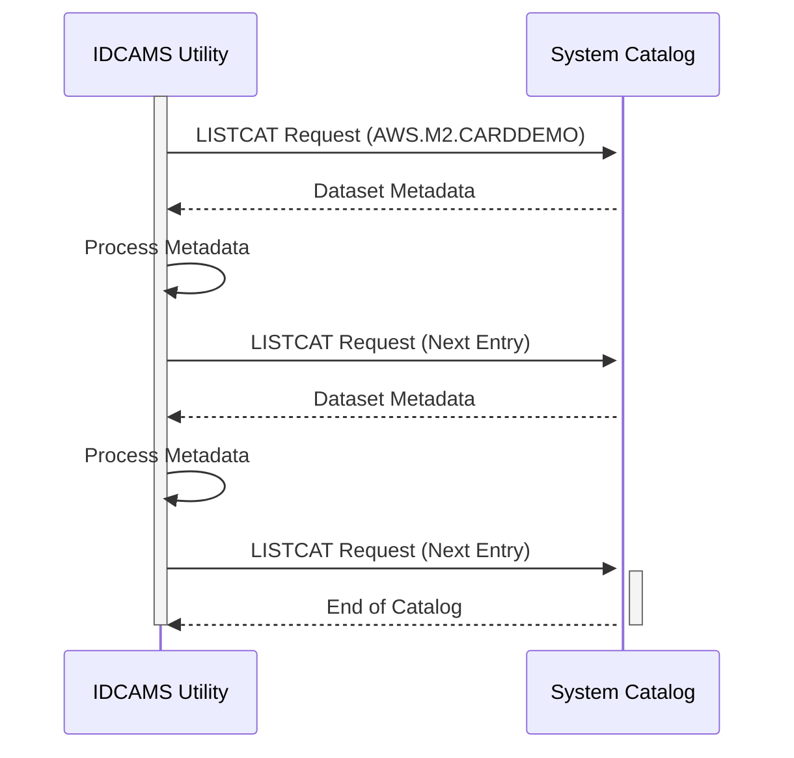

Gerado em: 2 de outubro de 2024

**Título do Documento:** Aplicativo CardDemo - Análise de Armazenamento de Dados

**Descrição Resumida:**
Este documento analisa o arquivo `LISTCAT.txt`, que fornece um inventário abrangente dos arquivos de dados usados ​​pelo aplicativo CardDemo, um sistema baseado em mainframe para gerenciar contas de cartão de crédito. A análise detalha a organização, os tipos, o armazenamento e os atributos desses arquivos, oferecendo insights sobre o cenário de dados do aplicativo.

**Histórias do Usuário:**
Como administrador do sistema, preciso de uma compreensão clara dos arquivos de dados usados ​​pelo aplicativo CardDemo para garantir processos eficientes de gerenciamento de dados, backup e recuperação.

**Épico Relacionado:** 10 - Gerenciamento de Arquivos de Dados

**Requisitos Técnicos:**

- `Lista de Arquivos de Dados`: Este processo lista todos os arquivos de dados usados ​​pelo aplicativo CardDemo, incluindo arquivos VSAM e não VSAM, fornecendo detalhes sobre sua organização, armazenamento e atributos.
  - `Identificação do Arquivo`: Cada arquivo é identificado por seu nome e tipo (VSAM ou não VSAM).
  - `Detalhes da Organização`: A organização dos dados dentro do arquivo é especificada (por exemplo, KSDS, ESDS, RRDS, AIX).
  - `Informações de Armazenamento`: O volume onde o arquivo está armazenado, junto com suas características físicas, é listado.
  - `Atributos`: Atributos chave do arquivo, como comprimento do registro, comprimento da chave, espaço do buffer e informações de compactação, são apresentados.
  - `Estatísticas`: Dados estatísticos sobre o arquivo, incluindo contagens de registros, divisões, extensões e espaço livre, são fornecidos.
  - `Alocação`: Detalhes sobre a alocação do arquivo, incluindo tipo de espaço, alocação primária e secundária, são mostrados.
  - `Informações do Volume`: Informações sobre o volume onde o arquivo reside, como número de série do volume, tipo de dispositivo e informações de extensão, são listadas.
  - `Associações`: Associações com outros arquivos, como componente de dados, componente de índice e caminhos de índice alternativo, são identificadas.
  - `Histórico`: A data de criação do arquivo, data da última alteração, informações de liberação e data de expiração estão incluídas.
  - `Dados SMS`: Informações relacionadas ao SMS (Storage Management Subsystem), como classe de armazenamento, classe de gerenciamento, classe de dados e informações de backup, são apresentadas.
  - `Dados de Criptografia`: O status de criptografia do arquivo é indicado.
  - `Proteção`: A proteção por senha e o status do RACF (Resource Access Control Facility) são mostrados.
  - `Resultado` `{Estrutura de Dados}`: Uma representação estruturada dos metadados do arquivo, abrangendo todos os detalhes mencionados acima.

**Modelos Relacionados**

- `Arquivo VSAM`
  - `Nome do Arquivo` `String`: O nome do arquivo VSAM.
  - `Tipo de Arquivo` `String`: O tipo de arquivo VSAM (KSDS, ESDS, RRDS, AIX).
  - `Componente de Dados` `String`: O nome do componente de dados do arquivo VSAM.
  - `Componente de Índice` `String`: O nome do componente de índice do arquivo VSAM.
  - `Índice Alternativo` `String`: O nome do índice alternativo, se aplicável.
  - `Volume` `String`: O volume onde o arquivo VSAM está armazenado.
  - `Comprimento do Registro` `Integer`: O comprimento de cada registro no arquivo VSAM.
  - `Comprimento da Chave` `Integer`: O comprimento do campo de chave no arquivo VSAM.
- `Arquivo Não VSAM`
  - `Nome do Arquivo` `String`: O nome do arquivo não VSAM.
  - `Volume` `String`: O volume onde o arquivo não VSAM está armazenado.
- `Base GDG`
  - `Nome Base` `String`: O nome base do GDG (Generation Data Group).
  - `Limite` `Integer`: O número máximo de gerações permitido no GDG.
- `Geração GDG`
  - `Nome da Geração` `String`: O nome da geração GDG.
  - `Base GDG` `String`: O nome base do GDG ao qual esta geração pertence.
  - `Status` `String`: O status da geração GDG (ATIVO, ROLLED-OFF).
- `Volume`
  - `Volser` `String`: O número de série do volume.
  - `Tipo de Dispositivo` `String`: O tipo de dispositivo do volume.

**Configurações:**

- `LISTCAT.txt`
  - `QUALIFICADOR DE ALTO NÍVEL`: `"AWS.M2.CARDDEMO"`
	- Descrição: Qualificador de alto nível para os conjuntos de dados.

**Melhorias de Código:**
- Não aplicável, pois este documento analisa um arquivo de saída em vez de código-fonte.

**Melhorias de Segurança:**
- Controle de Acesso: Implemente medidas rígidas de controle de acesso para restringir o acesso não autorizado ao arquivo `LISTCAT.txt` e ao catálogo do sistema que ele representa.
- Criptografia: Considere criptografar o arquivo `LISTCAT.txt` para proteger informações confidenciais sobre a organização e armazenamento de arquivos de dados.
- Auditoria: Habilite mecanismos de auditoria para rastrear o acesso e as modificações no catálogo do sistema e no arquivo `LISTCAT.txt`.

**Diagrama Conceitual:**

--Made by "Smart Engineering" (by Compass.UOL)--