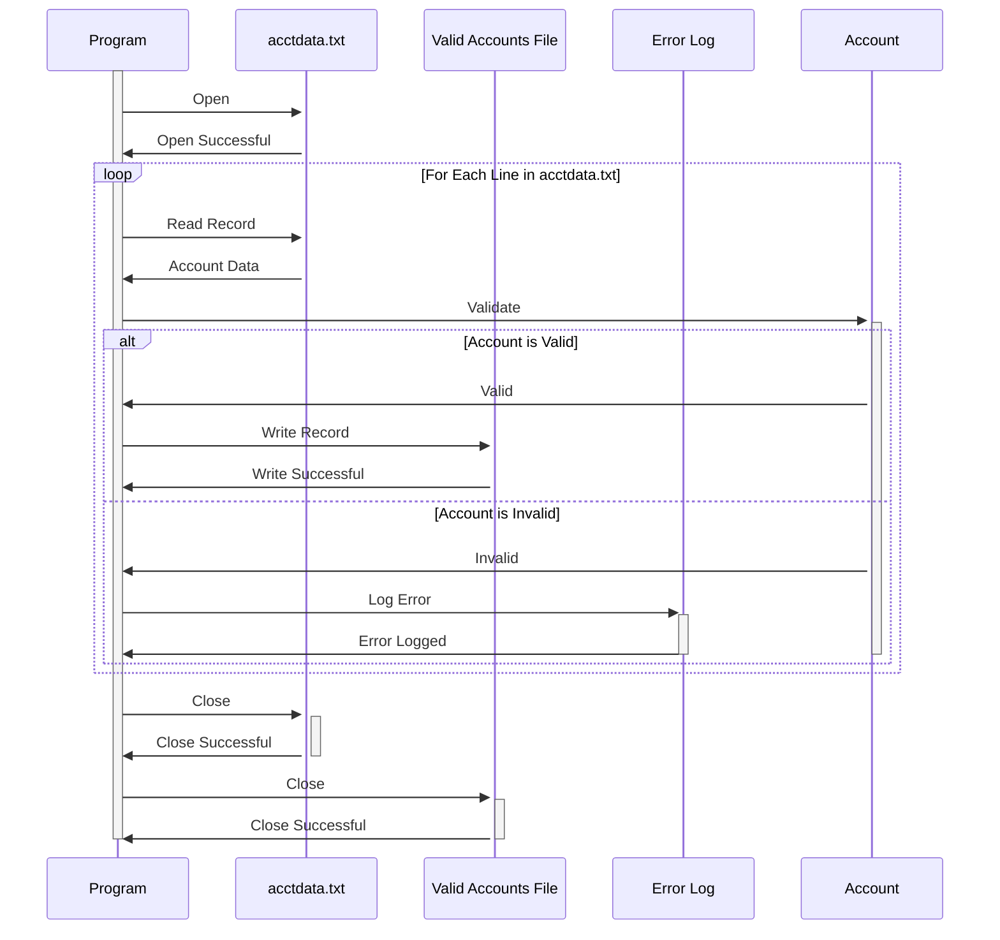

Gerado em: 2 de outubro de 2024

**Título do Documento:** Especificação do Programa de Processamento de Arquivo `acctdata.txt`

**Descrição Resumida:**
Este programa lê e processa dados de contas do arquivo `acctdata.txt`. Cada linha no arquivo representa uma conta de cliente, contendo informações como número da conta, limite de crédito, saldo e status. O programa valida os dados em cada registro, aplicando regras de negócios específicas para identificar contas válidas e inválidas. As contas válidas são gravadas em um arquivo de saída, enquanto as contas inválidas são registradas para investigação posterior.

**Estórias de Usuário:**
Como analista de dados, preciso de um programa para garantir que apenas dados válidos de contas de clientes sejam usados para análise, relatórios e tomada de decisões. O programa deve identificar e separar contas válidas de inválidas com base em critérios predefinidos.

**Épico Relacionado:**
10 - Gerenciamento de Arquivos de Dados

**Requisitos Técnicos:**

- `Read Account Data`: Este método lê e analisa dados de contas do arquivo `acctdata.txt`.
  - Entrada: Registros de dados de contas do arquivo `acctdata.txt`.
  - Processamento: Lê cada linha do arquivo e a divide em campos individuais com base em delimitadores de largura fixa.
  - Saída: Uma lista de objetos `Account`, cada um representando um único registro de conta.
- `Validate Account Data`: Este método aplica regras de negócios para validar os dados em cada objeto `Account`.
  - Entrada: Um objeto `Account` contendo dados da conta.
  - Validação: 
    - Verifica se o número da conta é numérico e está dentro de um intervalo válido.
    - Verifica se o limite de crédito e o saldo são numéricos e não negativos.
    - Garante que o status da conta seja um dos valores permitidos (`A` para Ativo, `C` para Fechado, `S` para Suspenso, etc.).
  - Saída: Um valor booleano indicando se a conta é válida ou inválida.
- `Write Valid Accounts`: Este método grava dados de contas válidas em um arquivo de saída.
  - Entrada: Uma lista de objetos `Account` válidos.
  - Processamento: Formata os dados de cada objeto `Account` em uma representação de string.
  - Saída: Grava os dados formatados da conta em um novo arquivo, um registro por linha.
- `Log Invalid Accounts`: Este método registra detalhes de contas inválidas para investigação posterior.
  - Entrada: Um objeto `Account` inválido e o motivo da invalidez.
  - Processamento: Cria uma entrada de log contendo o número da conta, os campos inválidos e o motivo da invalidez.
  - Saída: Grava a entrada de log em um arquivo de log ou banco de dados.

**Modelos Relacionados**

- `Account`
  - `AccountNumber` `String`: Identificador exclusivo da conta.
  - `CreditLimit` `Decimal`: Crédito máximo disponível na conta.
  - `Balance` `Decimal`: Saldo atual pendente na conta.
  - `Status` `String`: Indica se a conta está ativa, fechada, suspensa, etc.
  - `OpenDate` `Date`: Data em que a conta foi aberta.
  - `LastStatementDate` `Date`: Data da última declaração gerada.
  - `PaymentDueDate` `Date`: Data de vencimento do próximo pagamento.

**Configurações:**

- `acctdata.txt`
  - `RECLN`: `300`
	- Descrição: Tamanho do registro do arquivo de dados da conta.

**Melhorias de Código:**

- Implementar um mecanismo de tratamento de erros mais robusto, incluindo tipos de exceção específicos para diferentes erros de validação.
- Adicionar comentários detalhados ao código para melhorar a legibilidade e a manutenção.
- Considerar o uso de uma estrutura de logging para um logging mais estruturado e configurável.
- Explorar otimizações de desempenho para arquivos de entrada grandes, como processamento paralelo ou técnicas de streaming de dados.

**Melhorias de Segurança:**

- Armazenar o arquivo `acctdata.txt` com segurança com controles de acesso apropriados para evitar acesso não autorizado.
- Criptografar campos de dados confidenciais, como números de contas e saldos em repouso e em trânsito.
- Implementar trilhas de auditoria para rastrear todo acesso a dados e modificações.

**Diagrama Conceitual:**

--Made by "Smart Engineering" (by Compass.UOL)--