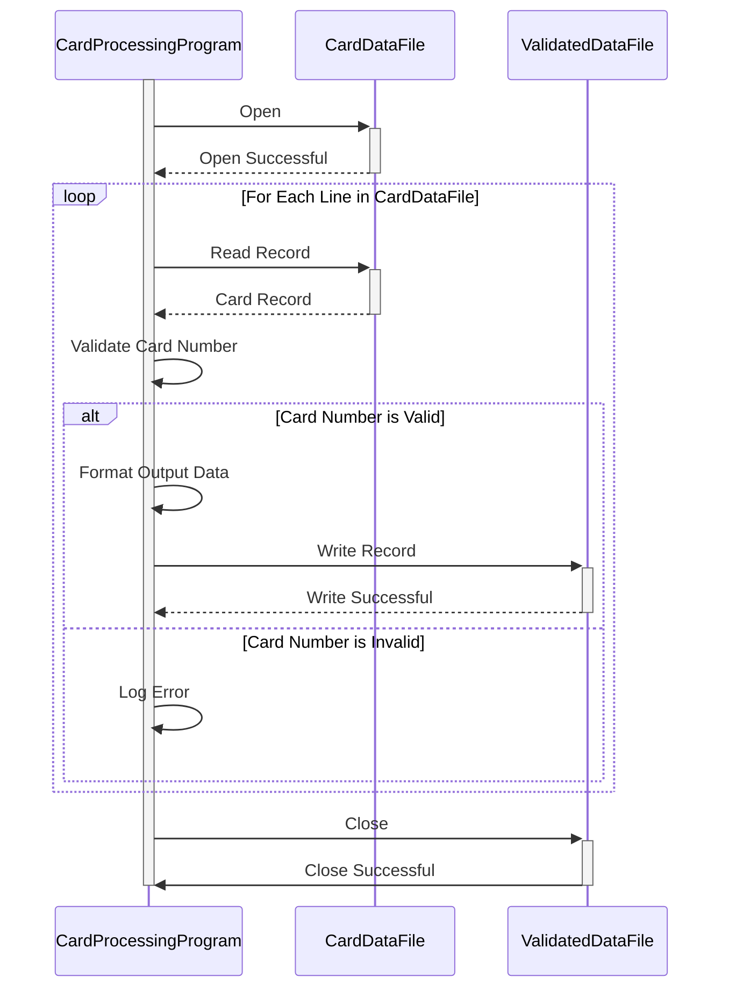

Gerado em: 2 de outubro de 2024

**Título do Documento:** Especificação de Extração, Validação e Transformação de Dados de Cartão de Crédito

**Descrição Resumida:**
Este programa lê dados de cartão de crédito de um arquivo de texto (`carddata.txt`), valida os números de cartão usando o Algoritmo de Luhn e grava os dados validados em um arquivo de saída. O programa garante a integridade dos dados validando os números dos cartões e transformando os dados em um formato padrão, tornando-os adequados para processamento ou análise posterior.

**Histórias do Usuário:**
Como analista de dados, preciso garantir que apenas registros válidos de cartão de crédito sejam usados para análise, portanto, preciso de um programa para validar e extrair informações válidas de cartão de crédito de um arquivo.

**Épico Relacionado:**
8 - Gestão de Dados do Cliente

**Requisitos Técnicos:**

- **Ler Dados do Cartão:** Este método lê e analisa dados de `carddata.txt`.
  - Entrada: Cada linha no arquivo de entrada representa um registro de cartão de crédito com o formato: `card_number, customer_name, expiration_date`.
  - Validação: O número do cartão deve ser uma string numérica.
  - Saída: Uma lista de strings, onde cada string representa um registro de cartão de crédito.
- **Validar Número do Cartão (Algoritmo de Luhn):** Este método valida cada número de cartão usando o Algoritmo de Luhn.
  - Entrada: Uma string representando um número de cartão de crédito.
  - Cálculo: 
    1.	Começando do dígito mais à direita (excluindo o dígito de verificação, se houver), dobre o valor de cada segundo dígito.
    2.	Se dobrar um dígito resultar em um número de dois dígitos, some os dígitos do valor dobrado.
    3.	Some todos os dígitos obtidos nas etapas 1 e 2.
    4.	Se a soma total for um múltiplo de 10, o número do cartão de crédito é válido; caso contrário, é inválido.
  - Saída: Valor booleano indicando se o número do cartão é válido ou não.
- **Formatar Dados de Saída:** Este método formata os dados validados.
  - Entrada: Uma lista de registros de cartão de crédito válidos.
  - Transformação: Formata cada registro como `card_number,customer_name,expiration_date,valid`.
  - Saída: Uma string contendo os dados formatados.
- **Gravar Dados Validados:** Este método grava os dados validados e formatados.
  - Entrada: Uma string contendo os dados validados e formatados.
  - Saída: Grava a string de entrada em um novo arquivo chamado `carddata_processed.txt`.

**Modelos Relacionados**

- CreditCard
  - `card_number` `String`: O número do cartão de crédito.
  - `customer_name` `String`: O nome do cliente.
  - `expiration_date` `String`: A data de validade do cartão de crédito.
  - `valid` `Boolean`: Um indicador informando se o número do cartão de crédito é válido.

**Configurações:**

- `carddata.txt`
  - N/A: `050002445376574000000000050747,Aniya Von,2023-03-09Y`
	- Descrição: Número do Cartão/ID da Conta/Nome/Data de Validade

**Melhorias de Código:**

- Implementar tratamento de erros mais robusto para operações de arquivo, como lidar com casos em que o arquivo de entrada não existe ou não está acessível.
- Adicionar registro para registrar operações bem-sucedidas, erros e avisos.
- Otimizar o desempenho, especialmente se estiver processando arquivos grandes, usando leituras e gravações em buffer.
- Considere adicionar suporte para validar outros atributos do cartão de crédito, como o nome do titular do cartão e o CVV.

**Melhorias de Segurança:**

- Não armazene informações confidenciais do cartão de crédito, como o CVV ou o número completo do cartão, a menos que seja absolutamente necessário.
- Se o armazenamento de dados do cartão de crédito for necessário, use criptografia para proteger os dados em repouso.
- Implemente medidas de controle de acesso para restringir o acesso a dados confidenciais apenas ao pessoal autorizado.

**Diagrama Conceitual:**

--Made by "Smart Engineering" (by Compass.UOL)--