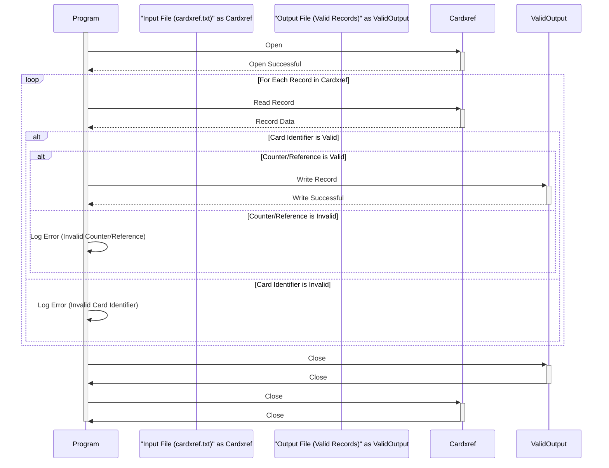

Gerado em: 2 de outubro de 2024

**Título do Documento:** Programa de Validação e Processamento de Referência Cruzada de Cartão de Crédito

**Descrição Resumida:**
Este programa valida registros de referência cruzada de cartão de crédito do arquivo `cardxref.txt`, garantindo a integridade dos dados e gerando um arquivo de saída contendo apenas registros válidos.

**Histórias do Usuário:**
Como analista de dados, preciso garantir que apenas registros de referência cruzada de cartão de crédito válidos sejam usados para análise e geração de relatórios. O programa deve validar cada registro com base em critérios predefinidos e gerar um arquivo de saída contendo apenas os registros válidos.

**Épico Relacionado:** 10 - Gerenciamento de Arquivos de Dados

**Requisitos Técnicos:**

- **Validar e Processar Registros de Referência Cruzada de Cartão:** Lê o arquivo `cardxref.txt`, valida cada registro e grava os registros válidos em um arquivo de saída.
  - Entrada: Registros de referência cruzada de cartão de crédito do arquivo `cardxref.txt`. Cada registro contém um identificador de cartão de 19 dígitos e um contador/referência de 2 dígitos.
  - Validação:
    1. Verifique se o identificador do cartão é numérico e tem 19 dígitos.
    2. Verifique se o contador/referência é numérico e tem 2 dígitos.
  - Saída: Grave os registros válidos em um arquivo de saída, mantendo o mesmo formato do arquivo de entrada.

**Modelos Relacionados**
- Referência Cruzada de Cartão de Crédito
  - CardIdentifier `String(19)`: Identificador exclusivo para um cartão de crédito.
  - CounterReference `String(2)`: Representa a contagem de uso, referência de arquivo ou status do cartão.

**Configurações:**
- `cardxref.txt`
  - Cada linha no arquivo representa um registro de referência cruzada de cartão de crédito.
  - Formato: `{CardIdentifier}{CounterReference}`
  - Exemplo: `411111111111111111101`

**Melhorias de Código:**
- **Tratamento de Erros:** Implemente tratamento de erros específico para diferentes falhas de validação. Registre esses erros com detalhes (por exemplo, registro inválido, tipo de erro, número da linha) para facilitar a depuração.
- **Configuração:** Externalize as regras de validação (por exemplo, comprimento do identificador do cartão, comprimento do contador/referência) para um arquivo de configuração para facilitar a modificação sem alterações no código.
- **Desempenho:** Para arquivos grandes, considere otimizar as operações de leitura e gravação de arquivos (por exemplo, leitura em buffer, gravação assíncrona) para melhorar o desempenho.

**Melhorias de Segurança:**
- **Controle de Acesso:** Restrija o acesso ao arquivo `cardxref.txt` e ao arquivo de saída apenas a usuários e processos autorizados.
- **Log:** Implemente mecanismos de log seguros para registrar todas as atividades de acesso e processamento de arquivos, incluindo carimbos de data/hora, IDs de usuário e ações executadas.

**Diagrama Conceitual:**

--Made by "Smart Engineering" (by Compass.UOL)--