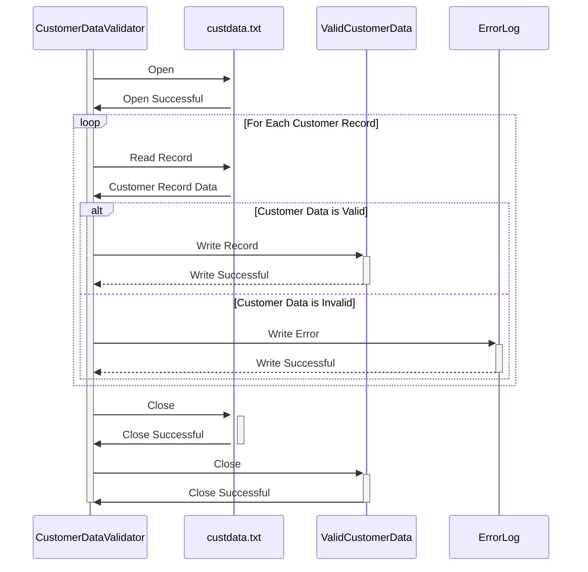

Gerado em: 2 de outubro de 2024

**Título do Documento: Programa de Validação e Processamento de Dados do Cliente**

**Descrição Resumida:**
Este programa foi projetado para validar e processar dados de clientes a partir de um arquivo de texto chamado `custdata.txt`. O principal objetivo é garantir que os registros dos clientes atendam a critérios de validação específicos, incluindo verificações de tipo de dados, comprimento e formato. Os registros de clientes válidos são então gravados em um arquivo de saída, enquanto os registros inválidos são registrados para posterior revisão.

**Histórias do Usuário:**
Como analista de dados, preciso de um programa para validar os dados do cliente a partir de um arquivo de texto para ter certeza de que apenas os registros válidos são usados para análise.

**Épico Relacionado:**
8 - Gestão de Dados do Cliente

**Requisitos Técnicos:**

- **Validação de Registro do Cliente**: Este método lê o arquivo de entrada e processa cada registro para validar os dados do cliente.
  - Entrada: Dados de registro do cliente do arquivo `custdata.txt`.
  - Validações:
    - `CustomerID`: Numérico e exclusivo.
    - `FirstName`, `MiddleName`, `LastName`: Alfanumérico, comprimento máximo de 50 caracteres.
    - `StreetAddress`: Alfanumérico, comprimento máximo de 100 caracteres.
    - `ApartmentNumber`: Alfanumérico, comprimento máximo de 10 caracteres.
    - `City`: Alfanumérico, comprimento máximo de 50 caracteres.
    - `State`: Código de estado de duas letras, maiúsculas.
    - `ZipCode`: Numérico, 5 ou 9 dígitos.
    - `CountryCode`: Código do país de duas letras, maiúsculas.
    - `PhoneNumber1`, `PhoneNumber2`: Numérico, 10 dígitos.
    - `CreditCardNumber`: Numérico, 16 dígitos, verificação do algoritmo de Luhn.
    - `CreditCardExpirationDate`: Formato de data MM/AA, não expirado.
    - `InternalCodes`: Alfanumérico, comprimento máximo de 20 caracteres.
  - Saída: Grave os registros válidos no arquivo de saída.

**Modelos Relacionados:**

- `Customer`: Representa um registro de cliente.
  - `CustomerID` `Integer`: Identificador exclusivo para cada cliente.
  - `FirstName` `String`: Primeiro nome do cliente.
  - `MiddleName` `String`: Nome do meio do cliente (opcional).
  - `LastName` `String`: Sobrenome do cliente.
  - `StreetAddress` `String`: Endereço do cliente.
  - `ApartmentNumber` `String`: Número do apartamento ou suíte do cliente (opcional).
  - `City` `String`: Cidade do cliente.
  - `State` `String`: Estado do cliente.
  - `ZipCode` `String`: CEP do cliente.
  - `CountryCode` `String`: Código do país do cliente.
  - `PhoneNumber1` `String`: Número de telefone principal do cliente.
  - `PhoneNumber2` `String`: Número de telefone secundário do cliente (opcional).
  - `CreditCardNumber` `String`: Número do cartão de crédito do cliente.
  - `CreditCardExpirationDate` `Date`: Data de expiração do cartão de crédito do cliente.
  - `InternalCodes` `String`: Códigos adicionais para rastreamento interno e classificações.

**Configurações:**

- `custdata.txt`
  - `RECLN`: `300`
	- Descrição: Tamanho do registro do arquivo de dados do cliente.

**Melhorias de Código:**

- **Tratamento de Erros**: Implemente um mecanismo de tratamento de erros mais robusto para capturar e registrar erros específicos encontrados durante a validação, incluindo o número do registro e o motivo do erro.
- **Log**: Aprimore o log para incluir timestamps, níveis de erro e mensagens de erro detalhadas para facilitar a depuração e solução de problemas.
- **Otimização de Desempenho**: Considere o uso de operações de entrada/saída bufferizadas para ler e gravar arquivos para melhorar o desempenho, especialmente para conjuntos de dados grandes.
- **Transformação de Dados**: Implemente funções de transformação de dados para padronizar formatos de dados, como converter números de telefone para um formato consistente ou validar endereços de email.

**Melhorias de Segurança:**

- **Controle de Acesso**: Proteja os arquivos de entrada e saída com permissões de arquivo apropriadas para restringir o acesso não autorizado.
- **Criptografia de Dados**: Criptografe dados confidenciais, como números de cartão de crédito, tanto no arquivo de entrada quanto durante o processamento para proteger informações confidenciais.
- **Log de Auditoria**: Implemente o log de auditoria para rastrear todos os acessos e modificações de dados, incluindo timestamps, IDs de usuário e ações executadas, para fins de segurança e conformidade.

**Diagrama Conceitual:**

--Made by "Smart Engineering" (by Compass.UOL)--