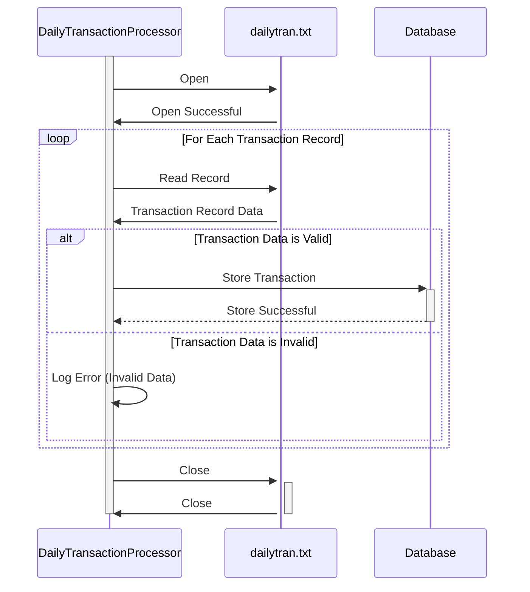

Gerado em: 2 de outubro de 2024

**Título do Documento:** Sistema de Processamento Diário de Transações - Especificação

**Descrição Resumida:**
Este documento descreve as especificações para um sistema projetado para processar registros de transações diárias de lojas de varejo. O sistema visa fornecer insights sobre tendências de vendas, gerenciamento de estoque, comportamento do cliente e eficiência operacional.

**Histórias do Usuário:**
Como analista de dados, preciso de um sistema para processar registros de transações diárias para que eu possa analisar padrões de vendas, gerenciar o estoque de forma eficaz, entender o comportamento do cliente e otimizar as operações da loja.

**Épico Relacionado:**
4 - Processamento de Transações

**Requisitos Técnicos:**
- **`Process Daily Transaction File`**: Este método lê o arquivo de log de transações diárias (`dailytran.txt`) e processa cada registro.
  - Entrada: Dados de transação do arquivo `dailytran.txt`.
  - Processamento: O método analisa cada linha do arquivo, extraindo dados como tipo de transação, localização da loja, registro de data e hora e informações do cliente. Ele valida os dados extraídos com base em regras predefinidas.
  - Saída: Os dados de transação validados são armazenados em um banco de dados para posterior análise e geração de relatórios.

**Modelos Relacionados**
- `Transaction`
  - `TransactionId` `{String}`: Identificador exclusivo para cada transação.
  - `TransactionType` `{String}`: Tipo de transação (`Purchase` ou `Return`).
  - `StoreName` `{String}`: Nome da loja onde a transação ocorreu.
  - `StoreLocation` `{String}`: Endereço da loja onde a transação ocorreu.
  - `Timestamp` `{DateTime}`: Data e hora da transação.
  - `CustomerId` `{String}`: Identificador exclusivo para o cliente (se disponível).
  - `ProductId` `{String}`: Identificador exclusivo para o produto envolvido na transação.
  - `Quantity` `{Integer}`: Quantidade do produto envolvido na transação.
  - `Price` `{Decimal}`: Preço do produto.
  - `TotalAmount` `{Decimal}`: Valor total da transação.

**Configurações:**
- `dailytran.txt`
  - `TransactionType`: `{Purchase or Return}`
	- Descrição: Indica se a transação foi uma compra ou uma devolução.
  - `StoreName`: `{Store Name}`
	- Descrição: O nome da loja onde a transação ocorreu.
  - `StoreLocation`: `{Store Location}`
	- Descrição: O endereço da loja onde a transação ocorreu.
  - `Timestamp`: `{Date and Time}`
	- Descrição: A data e hora em que a transação ocorreu.

**Melhorias de Código:**
- Implementar um mecanismo de tratamento de erros mais robusto para capturar e registrar dados inválidos ou erros de formato de arquivo.
- Adicionar documentação detalhada ao código para melhorar a legibilidade e a manutenção.
- Considere implementar uma estrutura de logging para capturar eventos do sistema e erros para fins de depuração e auditoria.
- Explorar técnicas de otimização de desempenho, como processamento paralelo ou operações assíncronas, para lidar com arquivos de transações grandes com eficiência.

**Melhorias de Segurança:**
- Restringir as permissões de acesso ao arquivo apenas para pessoal autorizado.
- Criptografar dados confidenciais, como informações do cliente e detalhes da transação, tanto em trânsito quanto em repouso.
- Implementar uma trilha de auditoria para rastrear todas as atividades do sistema, incluindo acesso a dados e modificações.
- Revisar e atualizar regularmente as medidas de segurança para enfrentar ameaças e vulnerabilidades emergentes.

**Diagrama Conceitual:**

--Made by "Smart Engineering" (by Compass.UOL)--