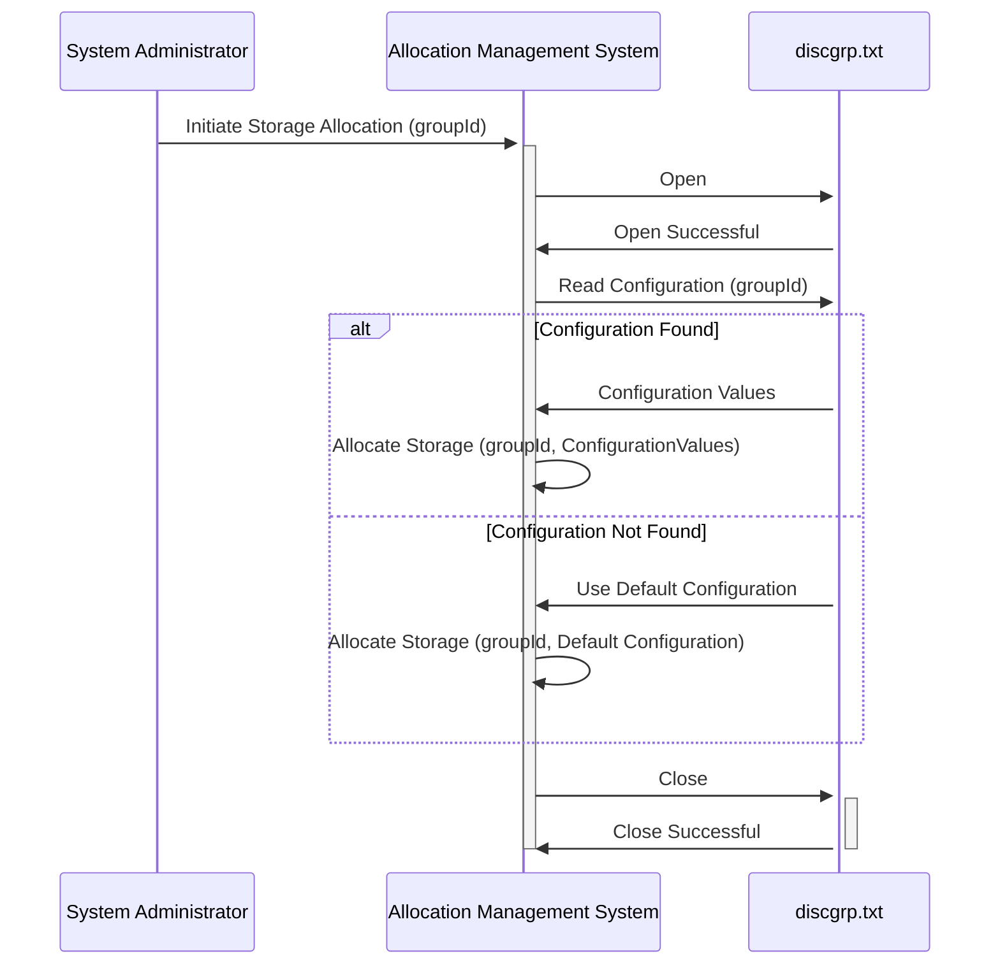

Gerado em: 2 de outubro de 2024

**Título do Documento:** Sistema de Gerenciamento de Alocação de Grupo de Discos

**Descrição Resumida:**
Este documento descreve um sistema para gerenciar alocações de grupos de discos com base em um arquivo de configuração. Ele mapeia identificadores de grupo de dados para parâmetros de armazenamento específicos, garantindo organização eficiente dos dados e potencial personalização.

**Histórias do Usuário:**
Como administrador do sistema, preciso de uma maneira de definir como diferentes tipos de dados são armazenados no disco para que eu possa otimizar o desempenho e gerenciar a capacidade de armazenamento com eficácia.

**Epic Relacionado:** 
10 - Gerenciamento de Arquivos de Dados

**Requisitos Técnicos:**

- **Ler Arquivo de Configuração do Grupo de Discos:** Esta função lê e analisa o arquivo de configuração `discgrp.txt`.
  - Entrada: Caminho para o arquivo `discgrp.txt`.
  - Validação:
    - Verifique se o arquivo existe e está acessível.
    - Valide o formato de cada linha (por exemplo, delimitadores corretos, número esperado de campos).
  - Resultado `Dictionary<string, string[]>`: Um dicionário onde a chave é o identificador do grupo (por exemplo, "A000000000010001", "ZEROAPR", "DEFAULT") e o valor é uma matriz de valores de configuração associados a esse grupo.
- **Alocar Armazenamento:** Esta função simula a alocação de armazenamento para um determinado grupo com base em sua configuração.
  - Entrada: 
    - `groupId` `String`: O identificador do grupo para o qual o armazenamento precisa ser alocado.
    - `configuration` `string[]`: Uma matriz de valores de configuração para o grupo, obtida do arquivo de configuração analisado.
  - Processamento:
    - Registre o `groupId` e a `configuration` sendo usados para alocação.
    - **(Implementação adicional necessária):**  Interaja com o sistema de gerenciamento de armazenamento para alocar fisicamente o armazenamento com base nos valores de `configuration`.
  - Saída: 
    - **(Implementação adicional necessária):**  Um status de sucesso ou falha indicando o resultado da alocação de armazenamento. 

**Modelos Relacionados**

- **DiskGroupAllocation:**
  - `GroupId` `string`: Identificador exclusivo para um grupo de dados.
  - `ConfigurationValues` `string[]`: Matriz de valores de configuração associados ao grupo.

**Configurações:**

- `discgrp.txt`:
  - Cada linha no arquivo segue o formato: `{GroupId}{ConfigurationValues}`
    - `GroupId`: Uma string que representa o identificador exclusivo de um grupo de dados.
    - `ConfigurationValues`: Uma string (potencialmente estruturada) contendo valores que definem os parâmetros de armazenamento para o grupo.

**Melhorias de Código:**

- **Validação de Configuração:** Implemente uma validação mais robusta para os `ConfigurationValues` para garantir que eles estejam em conformidade com o formato e intervalos esperados.
- **Tratamento de Erros:** Implemente tratamento de erros abrangente para gerenciar situações como:
    - Arquivo não encontrado ou inacessível.
    - Formato de arquivo inválido.
    - Falhas na alocação de armazenamento.
- **Registro em Log:** Aprimore o registro em log para incluir timestamps, níveis de severidade e informações mais detalhadas sobre o processo de alocação. 
- **Flexibilidade de Configuração:** Considere oferecer suporte a diferentes formatos de arquivo de configuração (por exemplo, JSON, YAML) para melhor legibilidade e estrutura.
- **Alocação Dinâmica:** Explore a viabilidade de ajustar dinamicamente a alocação de armazenamento com base em padrões de uso em tempo real. 

**Melhorias de Segurança:**

- **Controle de Acesso:** Restrinja o acesso ao arquivo `discgrp.txt` e ao sistema de gerenciamento de alocação apenas ao pessoal autorizado.
- **Backup de Configuração:** Implemente um mecanismo para fazer backup regularmente do arquivo `discgrp.txt` para garantir a recuperabilidade em caso de modificações acidentais ou maliciosas. 
- **Limpeza de Entrada:** Limpe qualquer entrada fornecida pelo usuário para evitar ataques de injeção, embora isso seja menos crítico se o sistema não estiver diretamente exposto à entrada do usuário.

**Diagrama Conceitual:**

--Made by "Smart Engineering" (by Compass.UOL)--