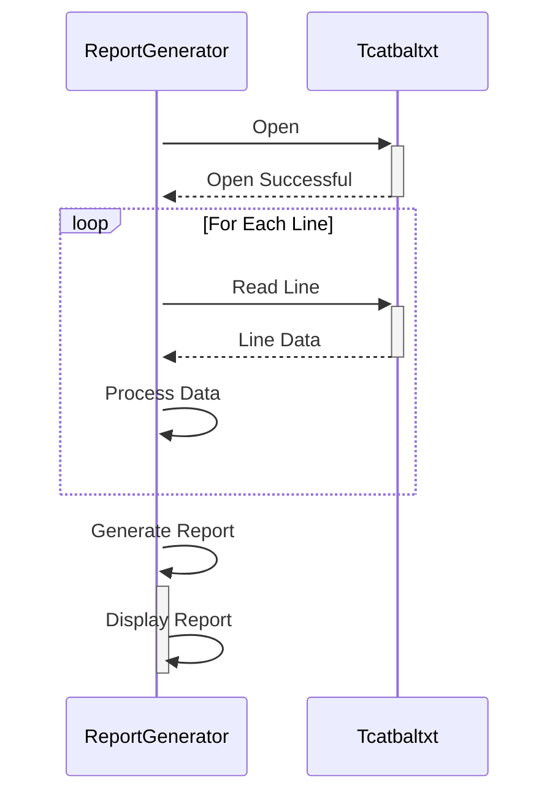

Gerado em: 2 de outubro de 2024

**Título do Documento: Gerador de Relatório de Saldo de Categoria de Transação**

**Descrição Resumida:**
Este programa processa um arquivo de saldo de categoria de transação (`tcatbal.txt`) para gerar um relatório que resume os saldos para várias categorias financeiras.

**Histórias do Usuário:**
Como analista de dados, preciso de uma maneira de visualizar rapidamente o saldo de cada categoria de transação para que eu possa usar essas informações para relatórios financeiros e análise.

**Épico Relacionado:**
10 - Gerenciamento de Arquivos de Dados

**Requisitos Técnicos:**

- **Ler Arquivo de Saldo de Categoria de Transação:** Esta função lê e analisa o arquivo `tcatbal.txt`, extraindo informações para cada categoria de transação.
  - Entrada: Lê dados do arquivo `tcatbal.txt`.
  - Processamento: O arquivo deve ser lido linha por linha. Cada linha representa uma categoria de transação e contém os seguintes campos:
    - `categoryID`: Um número inteiro de 10 dígitos que representa o identificador exclusivo para a categoria de transação.
    - `unknownField`: Um campo de 4 dígitos com uma finalidade desconhecida (sempre contém "1000").
    - `balance`: Um número inteiro de 10 dígitos que representa o saldo da categoria.
    - `unknownData`: Um campo de 30 dígitos com uma finalidade desconhecida (sempre contém "000000000000000000000000000000").
  - Saída: Uma lista ou matriz de objetos de categoria de transação, cada um contendo o `categoryID` e o `balance` extraídos.

- **Gerar Relatório de Saldo:** Esta função recebe os dados da categoria de transação processados e gera um relatório formatado.
  - Entrada: Recebe a lista de objetos de categoria de transação da função "Ler Arquivo de Saldo de Categoria de Transação".
  - Processamento: Itera pela lista de objetos de categoria de transação. Para cada categoria, ele formata o `categoryID` e o `balance` em um formato legível (por exemplo, tabular, separado por vírgulas).
  - Saída: Gera o relatório formatado, que pode ser exibido na tela, gravado em um arquivo ou enviado para outro sistema.

**Modelos Relacionados**

- `TransactionCategory`: Representa uma única categoria de transação com seu saldo.
  - `categoryID` `Integer`: Identificador exclusivo para a categoria de transação.
  - `balance` `Integer`: Saldo atual da categoria de transação.

**Configurações:**

- `tcatbal.txt`
  - N/A
	- Descrição: O caminho do arquivo para `tcatbal.txt` pode ser codificado no programa ou passado como um parâmetro. O formato do arquivo é de largura fixa, com cada linha representando uma categoria de transação e seu saldo.

**Melhorias de Código:**

- **Tratamento de Erros:** Implemente um tratamento de erros robusto para lidar com cenários como arquivo não encontrado, formato de arquivo inválido ou incompatibilidades de tipo de dados. Isso pode incluir erros de log, exibindo mensagens amigáveis ao usuário e fornecendo opções para tentar novamente ou corrigir a entrada.
- **Validação de Dados:** Valide os dados extraídos para garantir a integridade dos dados. Por exemplo, verifique se há saldos negativos, IDs de categoria vazios ou caracteres inválidos nos campos de dados.
- **Configuração:** Se o caminho ou formato do arquivo estiver sujeito a alterações, considere usar um arquivo de configuração ou variáveis de ambiente para externalizar essas configurações. Isso torna o aplicativo mais flexível e fácil de implantar em diferentes ambientes.
- **Estrutura do Código:** Refatore o código para seguir os princípios de design modular. Separe a leitura de arquivo, análise de dados, geração de relatório e lógica de tratamento de erros em funções ou classes independentes para melhor manutenção e testabilidade.
- **Documentação:** Adicione comentários claros e concisos para explicar o propósito das diferentes seções de código, funções e variáveis. Isso melhora a legibilidade do código e torna mais fácil para outras pessoas entenderem e manterem o código.

**Melhorias de Segurança:**

- **Controle de Acesso a Arquivos:** Implemente mecanismos apropriados de controle de acesso a arquivos para restringir o acesso não autorizado ao arquivo `tcatbal.txt`. Isso é crucial se o arquivo contiver informações financeiras confidenciais.
- **Limpeza de Entrada:** Limpe qualquer entrada fornecida pelo usuário para evitar ataques de injeção. Embora este programa específico não pareça receber entrada direta do usuário, é uma boa prática de segurança implementá-la, especialmente se o programa estiver integrado a outros sistemas que podem fornecer entrada.
- **Log e Auditoria:** Implemente o log para registrar tentativas de acesso a arquivos, gerações de relatórios bem-sucedidas e quaisquer erros encontrados. Isso pode ajudar a rastrear atividades suspeitas e garantir a responsabilidade.

**Diagrama Conceitual:**

--Made by "Smart Engineering" (by Compass.UOL)--