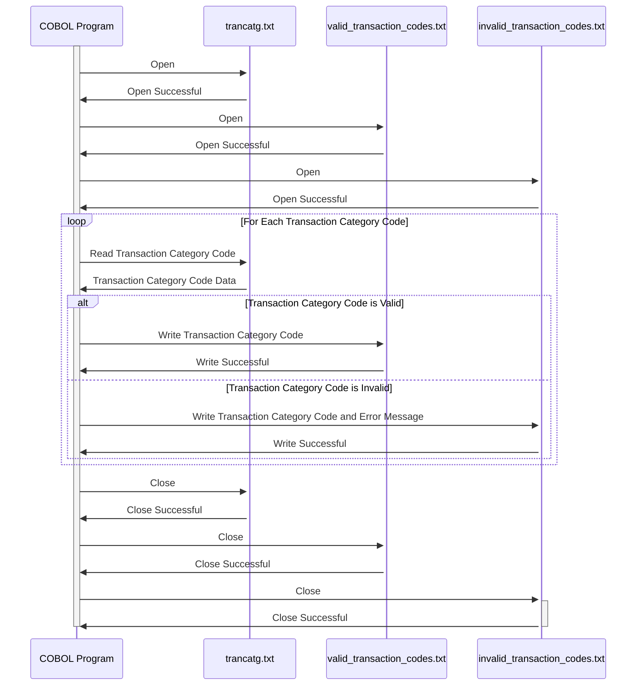

Gerado em: 2 de outubro de 2024

**Título do Documento:** Processamento de Transações com Cartão de Crédito - Validação e Processamento de Código de Categoria de Transação

**Descrição Resumida:**
Este documento descreve um programa que valida e processa códigos de categoria de transação do arquivo `trancatg.txt`. O programa garante que cada código esteja formatado corretamente e gera um relatório de códigos válidos e inválidos.

**Casos de Uso:**
Como analista de dados, preciso garantir que apenas códigos de categoria de transação válidos sejam usados no sistema para que eu possa gerar relatórios precisos e analisar padrões de gastos de forma eficaz.

**Épico Relacionado:** 4 - Processamento de Transações

**Requisitos Técnicos:**

- **Validação e Processamento de Código de Categoria de Transação:** Este processo lê o arquivo `trancatg.txt` e valida cada código de categoria de transação.
  - Entrada: Lê códigos de categoria de transação do arquivo `trancatg.txt`.
  - Validação: Valida se o código da transação possui exatamente 6 dígitos e é numérico.
  - Saída de Códigos Válidos: Grava códigos de categoria de transação válidos e suas descrições em `valid_transaction_codes.txt`.
  - Saída de Códigos Inválidos: Grava códigos de categoria de transação inválidos e mensagens de erro em `invalid_transaction_codes.txt`.

**Modelos Relacionados**
- TransactionCategory: Representa um código de categoria de transação e sua descrição.
  - Code `String`: O código de seis dígitos para a categoria de transação.
  - Description `String`: Uma descrição da categoria de transação.

**Configurações:**
- `trancatg.txt`
  - Estrutura: Cada linha no arquivo representa uma categoria de transação, com o código e a descrição separados por pelo menos um espaço.
    - Exemplo: `010001 Regular Sales Draft`
- Arquivos de saída
  - `valid_transaction_codes.txt`: Armazena códigos de transação válidos e suas descrições.
  - `invalid_transaction_codes.txt`: Armazena códigos de transação inválidos e mensagens de erro correspondentes. 

**Melhorias de Código:**
- Implementar um mecanismo de registro para registrar os detalhes de execução do programa, incluindo horários de início e término, o número de registros processados e quaisquer erros encontrados.
- Adicionar tratamento de erros para lidar com situações como o arquivo de entrada ausente ou inacessível. 
- Criar um arquivo de configuração para armazenar os caminhos dos arquivos de entrada e saída, tornando mais fácil modificar essas configurações sem alterar o código do programa.

**Melhorias de Segurança:**
- Limitar o acesso ao arquivo `trancatg.txt` e aos arquivos de saída apenas ao pessoal autorizado.
- Implementar um processo de revisão para quaisquer alterações feitas no arquivo `trancatg.txt` para evitar modificações não autorizadas ou acidentais. 

**Diagrama Conceitual:**

--Made by "Smart Engineering" (by Compass.UOL)--