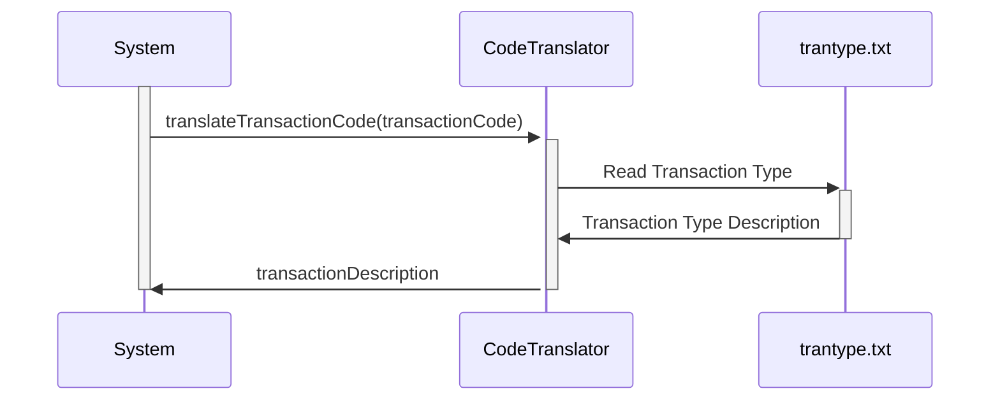

-- CONTENT IN PORTUGUESE (PT-BR) --
Gerado em: 2 de outubro de 2024

**Título do Documento:** Tradutor de Código de Tipo de Transação

**Descrição Resumida:**
Este documento descreve a funcionalidade de um programa projetado para traduzir códigos numéricos de transação em descrições intuitivas. Este programa visa melhorar a clareza e transparência dos dados de transação para vários usuários, incluindo clientes, analistas e representantes de atendimento ao cliente.

**Histórias do Usuário:**
Como analista de dados, preciso de uma maneira fácil de entender o significado dos códigos de transação para que eu possa analisar os dados de transação com eficácia.

**Épico Relacionado:** 4 - Processamento de Transações

**Requisitos Técnicos:**

- `translateTransactionCode`: Esta função recebe um código de transação como entrada e retorna sua descrição.
  - Entrada: `transactionCode` `Integer`: O código numérico que representa um tipo específico de transação.
  - Processamento: Pesquisa o `transactionCode` no arquivo `trantype.txt`.
  - Saída:  `transactionDescription` `String`: A descrição associada ao código fornecido. Se não encontrado, retorna `"Not Found"`.

**Modelos Relacionados**
- Transação: Representa uma transação financeira.
  - Código `Integer`: O código numérico do tipo de transação.
  - Descrição `String`: A descrição intuitiva do tipo de transação.

**Configurações:**
- `trantype.txt`
  - `01`: `"Purchase"`
	- Descrição: Representa uma transação de compra.
  - `02`: `"Payment"`
	- Descrição: Representa uma transação de pagamento.
  - `03`: `"Credit"`
	- Descrição: Representa uma transação de crédito.
  - `04`: `"Authorization"`
	- Descrição: Representa uma transação de autorização.
  - `05`: `"Refund"`
	- Descrição: Representa uma transação de reembolso.
  - `06`: `"Reversal"`
	- Descrição: Representa uma transação de estorno.
  - `07`: `"Adjustment"`
	- Descrição: Representa uma transação de ajuste.

**Melhorias de Código:**
- Implementar um mecanismo de pesquisa mais robusto, como o uso de uma tabela hash ou um algoritmo de pesquisa binária, para melhorar o desempenho, especialmente para tabelas de código maiores.
- Lidar com casos em que o código de entrada não é encontrado na tabela de forma mais elegante. Em vez de simplesmente retornar uma string vazia, considere retornar uma mensagem de erro ou uma descrição padrão.
- Adicionar registro ou tratamento de exceções para registrar quaisquer erros encontrados durante o processo de tradução. Isso pode ser útil para depurar e monitorar a integridade do programa.
- Considere o uso de um banco de dados ou um formato de dados mais estruturado para armazenar os mapeamentos de código de transação, especialmente se a lista de códigos for grande ou sujeita a atualizações frequentes. Isso pode facilitar o gerenciamento e a manutenção da tabela de códigos.

**Melhorias de Segurança:**
- Implementar medidas de controle de acesso para restringir o acesso não autorizado à tabela de códigos de transação ou ao programa de tradução. Isso pode envolver o uso de mecanismos de autenticação e autorização para verificar as identidades e permissões do usuário.
- Se os códigos de transação ou descrições forem considerados informações confidenciais, considere criptografar os dados em repouso e em trânsito. Isso pode ajudar a proteger os dados contra acesso não autorizado e divulgação.

**Diagrama Conceitual:**

--Made by "Smart Engineering" (by Compass.UOL)--