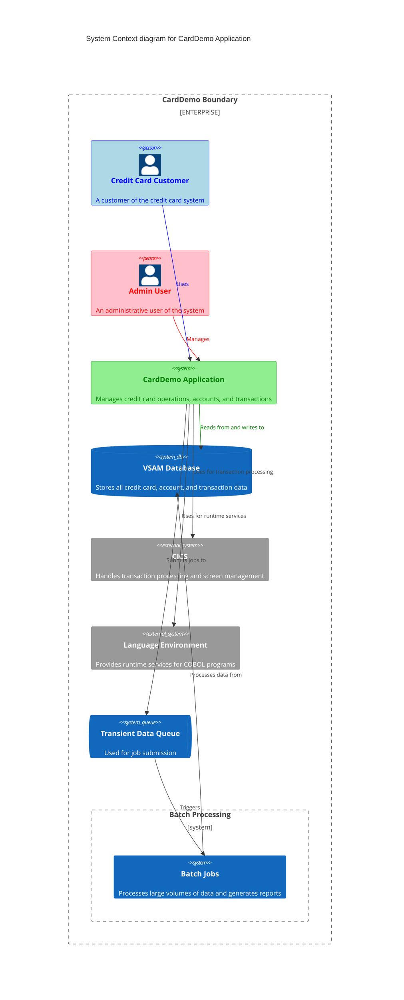

Gerado em: 1 de outubro de 2024

# Aplicativo CardDemo: Um sistema abrangente de gerenciamento de cartão de crédito implementado em COBOL para ambientes de mainframe.

# Resumo:
O aplicativo CardDemo é um sistema mainframe baseado em COBOL projetado para gerenciar operações de cartão de crédito. Ele fornece funcionalidades para gerenciamento de contas, processamento de transações, autenticação de usuário e geração de relatórios. O sistema utiliza CICS para processamento de transações e VSAM para armazenamento de dados. Ele apresenta um design modular com componentes separados para diferentes aspectos do gerenciamento de cartão de crédito, incluindo visualização e atualização de contas, listagem e processamento de transações, gerenciamento de usuários e geração de relatórios.

# Funcionalidades principais
1. Autenticação e autorização de usuário
2. Gerenciamento de contas (visualizar, atualizar)
3. Operações com cartão de crédito (listar, adicionar, atualizar)
4. Processamento e visualização de transações
5. Geração de relatórios
6. Funções administrativas (gerenciamento de usuários)

# Tecnologia utilizada:
- Linguagem de programação: COBOL
- Processamento de transações: CICS (Customer Information Control System)
- Banco de dados: VSAM (Virtual Storage Access Method)
- Tratamento de telas: BMS (Basic Mapping Support)
- Submissão de trabalhos: CICS Transient Data Queue (TDQ)
- Utilitários de data: serviços do ambiente de linguagem (LE)

# Diagrama

--Made by "Smart Engineering" (by Compass.UOL)--