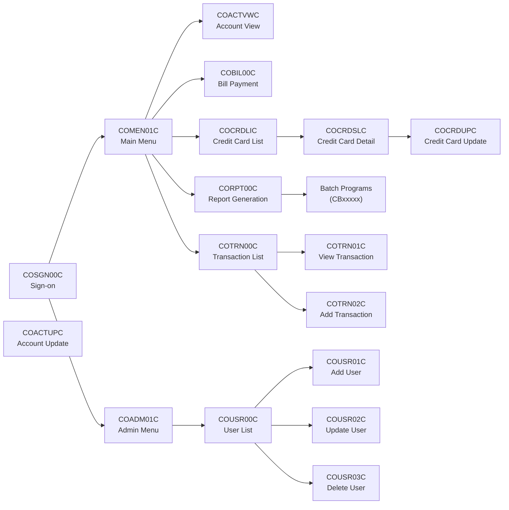

--CONTENT TO TRANSLATE--
Gerado em: 1º de outubro de 2024

# Título: CardDemo: Um Aplicativo COBOL Baseado em CICS para Gestão de Cartões de Crédito

# Sumário:
O aplicativo CardDemo é um sistema legado escrito em COBOL, projetado para gerenciar transações com cartão de crédito e dados relacionados. Ele opera em um ambiente CICS (Customer Information Control System), típico de sistemas de mainframe IBM. O aplicativo utiliza arquivos VSAM (Virtual Storage Access Method) para armazenamento persistente de dados e BMS (Basic Mapping Support) para interações de tela com usuários por meio de terminais 3270.

O sistema fornece funcionalidades para gerenciamento de contas, processamento de transações, autenticação de usuário e geração de relatórios. Essas funcionalidades são implementadas por meio de uma série de programas COBOL interconectados, cada um responsável por tarefas específicas, como visualizar detalhes da conta, processar pagamentos, adicionar novos usuários, gerar relatórios e muito mais.

# Descrição:
O aplicativo CardDemo é um sistema monolítico onde diferentes módulos são fortemente acoplados. Mudanças em um módulo podem ter um impacto cascata em outras partes do aplicativo. Por exemplo, modificações na estrutura de um arquivo VSAM exigiriam alterações em todos os programas que leem ou gravam nesse arquivo. Da mesma forma, alterações na área de comunicação comum (COMMAREA) afetariam todos os programas que dependem dela para troca de dados.

# Diagrama

--Made by "Smart Engineering" (by Compass.UOL)--