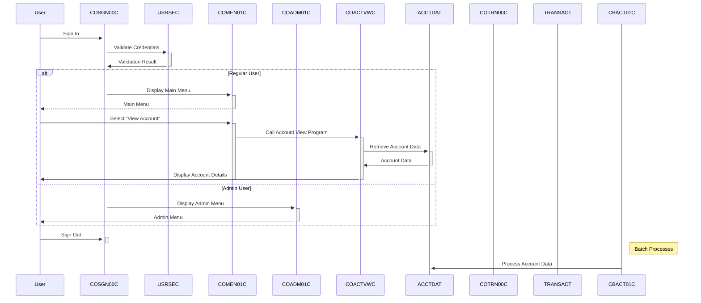

Gerado em: 1º de outubro de 2024

# Título: CardDemo: Um Sistema de Gerenciamento de Cartão de Crédito Baseado em COBOL

# Sumário:
O aplicativo CardDemo é um sistema legado implementado em COBOL, projetado para gerenciar vários aspectos das operações de cartão de crédito. Ele utiliza o CICS para processamento de transações e o VSAM para armazenamento de dados. O aplicativo possui uma interface orientada por menus, permitindo que os usuários executem ações como consultas de contas, visualização de transações, gerenciamento de cartão de crédito e administração de usuários. Processos em lote são empregados para tarefas como cálculo de juros e geração de relatórios.

# Fluxo de trabalho:
1. **Autenticação do Usuário (COSGN00C):** Um usuário fornece credenciais (ID de usuário e senha). O sistema valida as credenciais em relação ao arquivo `USRSEC`.
2. **Exibição do Menu:** Com base na função do usuário (Regular ou Admin), o menu principal (COMEN01C) ou o menu de administração (COADM01C) é exibido.
3. **Seleção do Usuário:** O usuário escolhe uma opção do menu, que corresponde a uma funcionalidade específica (por exemplo, visualização de conta, lista de transações, adicionar usuário).
4. **Execução do Programa:** A opção de menu selecionada aciona a execução de um programa COBOL correspondente (por exemplo, COACTVWC para visualização de conta, COTRN00C para lista de transações).
5. **Acesso a Dados:** O programa interage com arquivos VSAM (por exemplo, `ACCTDAT`, `CARDDAT`, `TRANSACT`) para recuperar ou atualizar dados conforme necessário.
6. **Exibição na Tela:** O programa apresenta resultados ou solicita entrada usando mapas BMS do CICS, interagindo com o usuário por meio de uma interface semelhante a um terminal.
7. **Processamento em Lote:** Programas em lote separados (por exemplo, CBACT01C, CBTRN02C) lidam com operações em massa como cálculo de juros, lançamento de transações e geração de relatórios.

# Diagrama

--Made by "Smart Engineering" (by Compass.UOL)--