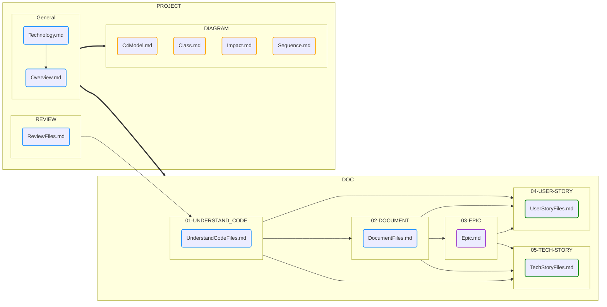

# **AI-Cockpit - Engenharia Inteligente**

## Fluxo de Criação

 
 

## **Resumo do Projeto**

A Ferramenta de Engenharia Inteligente foi projetada para gerar uma variedade de documentos que fornecem uma revisão extensa e holística de um projeto. Esta documentação é estruturada para fornecer às partes interessadas técnicas e não técnicas uma ampla compreensão da arquitetura, dependências e fluxos de trabalho do projeto. Cada saída é organizada em pastas e arquivos dedicados, oferecendo diferentes níveis de insights, desde visões gerais de alto nível até diagramas técnicos detalhados.

### **Estrutura de Pastas e Arquivos**

- **Pasta REVIEW**:  
  A pasta `REVIEW` contém vários documentos, cada um oferecendo um resumo de diferentes arquivos dentro do projeto. O objetivo é fornecer uma visão panorâmica da estrutura do projeto, destacando os componentes-chave e suas funções. Esses documentos são úteis para as partes interessadas que exigem uma compreensão geral do escopo do projeto sem se aprofundar nos detalhes técnicos.

- **Pasta DIAGRAM**:  
  A pasta `DIAGRAM` inclui quatro diagramas essenciais que representam visualmente aspectos-chave do projeto. Esses diagramas ajudam a desmistificar processos e dependências complexas, oferecendo insights mais fáceis de compreender por meio da representação visual:
  
    - **Sequence.md**:  
      Este documento explica a sequência de operações dentro do fluxo de trabalho do projeto. Ele detalha a interação entre diferentes componentes, serviços ou sistemas, demonstrando como os dados fluem e os processos são executados passo a passo. Isso é particularmente útil para entender como várias partes do projeto interagem ao longo do tempo.

    - **Impact.md**:  
      O documento `Impact.md` fornece um mergulho mais profundo nas dependências do projeto. Ele destaca os elementos acoplados dentro do sistema, mostrando como as mudanças em uma área podem impactar outras. Isso é valioso para engenheiros e gerentes de projeto que precisam entender os efeitos em cadeia das modificações na base de código.

    - **Class.md**:  
      Este documento contém um diagrama de classes de macro nível que descreve a estrutura geral do projeto. Embora não mostre todas as classes ou componentes da solução, ele se concentra nos elementos mais críticos que definem a arquitetura do projeto. Isso é útil para desenvolvedores que precisam entender o design geral antes de mergulhar em módulos individuais.

    - **C4Model.md**:  
      O arquivo `C4Model.md` fornece uma visão geral de alto nível do sistema usando a abordagem do modelo C4. Inclui visualizações de Contexto, Contêiner, Componente e Código para explicar como o sistema interage com entidades externas, sua arquitetura interna e como o sistema é dividido em componentes menores. Isso é ideal para partes interessadas técnicas e não técnicas que precisam de uma visão geral da arquitetura.

- **Overview.md**:  
  O documento `Overview.md` fornece uma visão geral abrangente de todo o projeto. Ele resume o propósito, escopo e elementos-chave do projeto, servindo como uma introdução de alto nível. Este documento é frequentemente usado por membros da equipe que são novos no projeto ou por partes interessadas externas que exigem uma compreensão geral sem precisar se aprofundar nas especificidades técnicas.

- **Technology.md**:  
  Este documento lista todas as tecnologias utilizadas no projeto, incluindo linguagens de programação, frameworks, bancos de dados e serviços externos. Ele oferece uma referência rápida para desenvolvedores e gerentes de projeto avaliarem a pilha tecnológica e garantir o alinhamento com os padrões ou requisitos organizacionais.

## **01-Understand_Code**

A seção "Compreender o Código" fornece insights detalhados sobre a base de código, detalhando cada arquivo no projeto. Esta seção é particularmente útil para desenvolvedores que estão se integrando ou para equipes que realizam revisões de código. O objetivo, as principais funcionalidades e as interações de cada arquivo com outras partes do sistema são descritos aqui. Ele serve como um guia para qualquer pessoa que busca entender o papel de arquivos específicos dentro do sistema maior.

Os insights incluem:
- **Objetivo do arquivo**: Explica por que o arquivo existe e qual problema ele resolve.
- **Funções ou classes principais**: Destaca os segmentos de código mais importantes, como funções principais ou classes que impulsionam a funcionalidade do arquivo.
- **Dependências**: Identifica outros arquivos, bibliotecas ou serviços dos quais este arquivo depende, fornecendo um contexto para entender sua posição dentro do projeto.

## **02-Document**

Esta seção fornece orientação sobre a estrutura do documento, configurações e as regras de negócios que cada arquivo deve seguir. É crucial para manter a consistência na documentação do projeto, garantindo que cada arquivo siga os mesmos padrões. Esta documentação de suporte também ajuda a equipe a manter a clareza à medida que o projeto evolui, tornando mais fácil integrar novos membros da equipe ou garantir a conformidade com as políticas de documentação.

Os seguintes aspectos são abordados:
- **Estrutura do documento**: garante que cada documento siga um formato uniforme, tornando a documentação do projeto mais fácil de navegar.
- **Diretrizes de configuração**: fornece detalhes sobre como os arquivos devem ser configurados, especialmente se contiverem informações dinâmicas ou específicas do ambiente.
- **Regras de negócios**: esclarece a lógica de negócios e as regras que regem o conteúdo de cada arquivo, ajudando a alinhar a documentação com os objetivos do projeto.

## **03-Epic**

Esta seção lista todas as histórias de macro nível no projeto, frequentemente chamadas de "épicas". Essas épicas representam grandes conjuntos de trabalho que são centrais para o desenvolvimento e modernização do projeto. Cada épica abrange várias histórias de usuário e tarefas técnicas, fornecendo uma visão estratégica do progresso do desenvolvimento do projeto. A documentação aqui serve como um roteiro para as partes interessadas acompanharem os principais marcos do projeto.

A `Visão Geral das Épicas` é particularmente útil para:
- **Gerentes de projeto**: para acompanhar o progresso de iniciativas-chave.
- **Partes interessadas**: para entender os objetivos gerais e como eles estão sendo alcançados.
- **Equipes de desenvolvimento**: para alinhar seu trabalho com os objetivos maiores do projeto.

## **04-User Stories**

As Histórias de Usuário fornecem uma lista detalhada dos requisitos funcionais da perspectiva dos usuários finais. Esta seção divide as histórias de usuário por arquivo, ajudando a mapear a funcionalidade da base de código para as necessidades reais do usuário. No futuro, essas histórias serão condensadas e organizadas por fluxos de trabalho de negócios, tornando mais fácil ver como várias necessidades do usuário são atendidas em diferentes partes do projeto.

A seção `Histórias de Usuário` é vital para:
- **Gerentes de produto**: para garantir que o projeto esteja entregando valor aos usuários.
- **Desenvolvedores**: para entender o raciocínio por trás de recursos específicos e como eles devem ser implementados.
- **Equipes de QA**: para criar casos de teste com base em cenários do mundo real.

## **05-Tech Stories**

Semelhante às Histórias de Usuário, as Histórias Técnicas fornecem uma perspectiva mais técnica do projeto. Enquanto as Histórias de Usuário se concentram no "o quê" da funcionalidade, as Histórias Técnicas mergulham no "como". Essas histórias detalham os requisitos técnicos, configurações e funcionamento interno do sistema, oferecendo aos desenvolvedores uma compreensão mais clara das tarefas em questão.

A seção `Histórias Técnicas` aborda:
- **Detalhes técnicos de implementação**: fornece especificações sobre como os recursos devem ser tecnicamente implementados.
- **Requisitos de configuração**: descreve quaisquer configurações especiais que precisam ser definidas para que o sistema funcione corretamente.
- **Dependências e interações**: explica como diferentes partes do sistema interagem em um nível técnico, fornecendo uma visão holística da arquitetura do sistema.

---

Esta versão expandida do README oferece uma explicação mais aprofundada de cada seção, fornecendo maior contexto e clareza para usuários técnicos e não técnicos. Seu objetivo é orientar o público pelos resultados da Ferramenta de Engenharia Inteligente de forma estruturada e compreensível.

--Made by "Smart Engineering" (by Compass.UOL)--